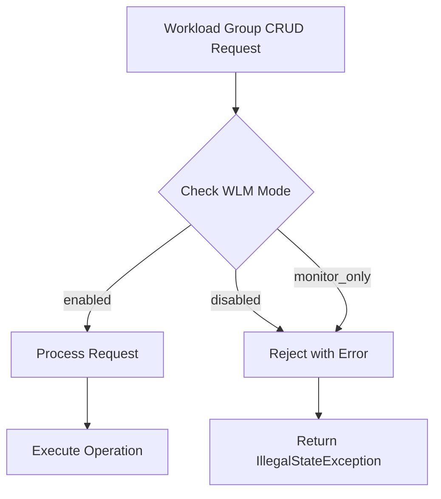

---
tags:
  - domain/core
  - component/server
  - search
---
# Workload Management

## Summary

This release includes improvements to Workload Management (WLM) focusing on code quality, naming consistency, and operational safety. Key changes include renaming test utilities and internal references from "QueryGroup" to "WorkloadGroup" for consistency, adding WLM mode validation to prevent workload group CRUD operations when WLM is disabled, and improving logging messages to dynamically reflect the actual resiliency mode.

## Details

### What's New in v3.2.0

#### WLM Mode Validation for CRUD Operations

A new validation mechanism prevents workload group Create, Update, and Delete operations when WLM mode is set to `disabled` or `monitor_only`. This ensures administrators cannot accidentally create or modify workload groups when the feature is not actively enforcing resource limits.



#### New Components

| Component | Description |
|-----------|-------------|
| `WlmClusterSettingValuesProvider` | Central provider for maintaining and supplying current WLM cluster settings values. Listens for setting updates and provides the latest values to REST handlers. |

#### Technical Changes

The `WlmClusterSettingValuesProvider` class:
- Maintains a volatile `WlmMode` field updated via cluster settings listener
- Provides `ensureWlmEnabled()` method that throws `IllegalStateException` when WLM is not enabled
- Injected into `RestCreateWorkloadGroupAction`, `RestUpdateWorkloadGroupAction`, and `RestDeleteWorkloadGroupAction`

The validation is performed in `prepareRequest()` before processing any CRUD operation:

```java
@Override
protected RestChannelConsumer prepareRequest(RestRequest request, NodeClient client) throws IOException {
    nonPluginSettingValuesProvider.ensureWlmEnabled(getName());
    // ... rest of request processing
}
```

#### Naming Consistency Updates

- Renamed `WorkloadGroupTestUtil` to `WorkloadManagementTestUtil` for broader applicability
- Updated all remaining "QueryGroup" references in code comments, Javadocs, and identifiers to "WorkloadGroup"

#### Logging Improvements

The rejection reason logging in `WorkloadGroupService.rejectIfNeeded()` now dynamically includes the actual resiliency mode (`SOFT` or `ENFORCED`) from the WorkloadGroup object, instead of hardcoding "ENFORCED".

### Usage Example

**Attempting CRUD when WLM is disabled:**
```bash
# Set WLM mode to disabled
PUT _cluster/settings
{
  "persistent": {
    "wlm.workload_group.mode": "disabled"
  }
}

# Attempt to create workload group - will fail
PUT _wlm/workload_group
{
  "name": "analytics",
  "resiliency_mode": "enforced",
  "resource_limits": {
    "cpu": 0.4,
    "memory": 0.2
  }
}
# Response: IllegalStateException - Cannot create workload group because 
# workload management mode is disabled or monitor_only.
```

**Enable WLM before CRUD operations:**
```bash
PUT _cluster/settings
{
  "persistent": {
    "wlm.workload_group.mode": "enabled"
  }
}
```

### Migration Notes

If you have automation scripts that create or modify workload groups, ensure that WLM mode is set to `enabled` before executing those operations. Scripts that previously worked with WLM in `disabled` or `monitor_only` mode will now fail with an error.

## Limitations

- GET operations for workload groups are still allowed when WLM is disabled (read-only access)
- The validation only applies to REST API operations; internal cluster state changes are not affected

## References

### Documentation
- [Workload Management Documentation](https://docs.opensearch.org/3.0/tuning-your-cluster/availability-and-recovery/workload-management/wlm-feature-overview/)
- [Workload Group Lifecycle API](https://docs.opensearch.org/3.0/tuning-your-cluster/availability-and-recovery/workload-management/workload-group-lifecycle-api/)

### Pull Requests
| PR | Description |
|----|-------------|
| [#18652](https://github.com/opensearch-project/OpenSearch/pull/18652) | Add WLM mode validation for workload group CRUD requests |
| [#18709](https://github.com/opensearch-project/OpenSearch/pull/18709) | Rename WorkloadGroupTestUtil to WorkloadManagementTestUtil |
| [#18711](https://github.com/opensearch-project/OpenSearch/pull/18711) | Rename QueryGroup to WorkloadGroup in comments and Javadocs |
| [#18712](https://github.com/opensearch-project/OpenSearch/pull/18712) | Modify logging message in WorkloadGroupService to show actual resiliency mode |

## Related Feature Report

- [Full feature documentation](../../../../features/opensearch/opensearch-workload-management.md)
