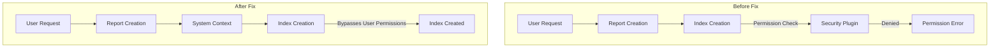

# Reporting Plugin

## Summary

OpenSearch v3.2.0 includes two bug fixes for the Reporting plugin that address permission issues when creating report indices and URL parsing problems when generating reports from Discover with security tenants enabled.

## Details

### What's New in v3.2.0

Two critical bug fixes improve the reliability of report generation:

1. **System Index Creation Permission Fix**: Report definitions and instances indices are now created in the system context, eliminating permission errors for users without explicit index creation privileges.

2. **Tenant URL Parsing Fix**: Fixed URL parsing logic to correctly extract saved search IDs when security tenant parameters are present in the URL.

### Technical Changes

#### Architecture Changes



#### Bug Fix 1: System Context for Index Creation (PR #1108)

The fix wraps index creation operations in a system context using `threadContext.stashContext()`:

```kotlin
// Before: Direct index creation (subject to user permissions)
val actionFuture = client.admin().indices().create(request)

// After: Index creation in system context (bypasses user permissions)
client.threadPool().threadContext.stashContext().use {
    val actionFuture = client.admin().indices().create(request)
    // ...
}
```

**Affected Files:**
- `ReportDefinitionsIndex.kt` - Report definitions system index
- `ReportInstancesIndex.kt` - Report instances system index

**Root Cause:** When a user without `indices:admin/create` permission tried to generate their first report, the plugin attempted to create the system indices (`.opendistro-reports-definitions`, `.opendistro-reports-instances`) using the user's security context, resulting in permission denied errors.

#### Bug Fix 2: Tenant URL Parsing (PR #599)

The fix removes security tenant parameters from the URL before extracting the saved search ID:

```javascript
// Before: Regex matched 'discover' instead of the UUID
const getUuidFromUrl = () => window.location.href.match(/([0-9a-zA-Z-]+)\?/);

// After: Remove tenant parameter first
const getUuidFromUrl = () => {
  let href = window.location.href;
  href = href.replace(/[?&]security_tenant=[^&#]*/g, '');
  return href.match(/([0-9a-zA-Z-]+)\?/);
};
```

**Root Cause:** URLs like `discover?security_tenant=global#/view/3ba638e0-b894-11e8-a6d9-e546fe2bba5f` were incorrectly parsed, extracting `discover` instead of the actual saved search ID `3ba638e0-b894-11e8-a6d9-e546fe2bba5f`.

### Migration Notes

No migration required. These are transparent bug fixes that improve existing functionality.

## Limitations

- The system context fix only applies to index creation; other operations still respect user permissions
- The URL parsing fix specifically handles the `security_tenant` parameter; other query parameters may still interfere

## References

### Documentation
- [Reporting Documentation](https://docs.opensearch.org/3.0/reporting/): Official OpenSearch Reporting documentation

### Pull Requests
| PR | Description |
|----|-------------|
| [#1108](https://github.com/opensearch-project/reporting/pull/1108) | Create report definitions and instances indices in system context |
| [#599](https://github.com/opensearch-project/dashboards-reporting/pull/599) | Fix tenant issue when redirecting from Discover |

### Issues (Design / RFC)
- [Issue #998](https://github.com/opensearch-project/reporting/issues/998): Can't create reporting indices due to permission issue
- [Issue #535](https://github.com/opensearch-project/dashboards-reporting/issues/535): Saved search id parsing logic does not consider tenant in URL

## Related Feature Report

- [Full feature documentation](../../../features/reporting/reporting-plugin.md)
