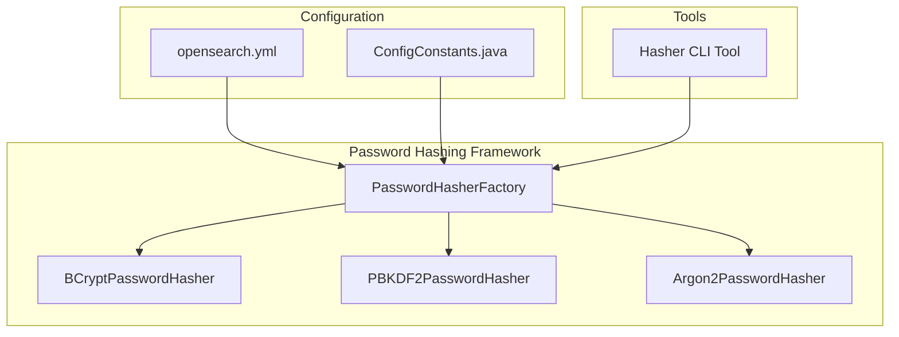

---
tags:
  - security
---

# Argon2 Password Hashing

## Summary

OpenSearch v3.2.0 introduces support for the Argon2 password hashing algorithm in the Security plugin. Argon2 is a modern, memory-hard password hashing algorithm that won the Password Hashing Competition in 2015. This addition provides administrators with a third option for password hashing alongside the existing BCrypt (default) and PBKDF2 algorithms, offering enhanced security for environments requiring stronger protection against GPU-based and ASIC-based attacks.

## Details

### What's New in v3.2.0

This release adds comprehensive Argon2 support with full configurability of all algorithm parameters:

- **Memory**: Amount of memory used during hashing (default: 64 MiB / 65536 KiB)
- **Iterations**: Number of passes over the memory (default: 3)
- **Parallelism**: Degree of parallelism (default: 1)
- **Length**: Output hash length in bytes (default: 32)
- **Type**: Algorithm variant - argon2id (default), argon2i, or argon2d
- **Version**: Algorithm version - 16 or 19 (default)

### Technical Changes

#### Architecture Changes



#### New Components

| Component | Description |
|-----------|-------------|
| `Argon2PasswordHasher` | Core implementation using password4j library |
| `Argon2CustomConfigHashingTests` | Integration tests for custom configurations |
| `Argon2DefaultConfigHashingTests` | Integration tests for default configurations |
| `Argon2PasswordHasherTests` | Unit tests for the hasher |

#### New Configuration

| Setting | Description | Default |
|---------|-------------|---------|
| `plugins.security.password.hashing.algorithm` | Hashing algorithm selection | `bcrypt` |
| `plugins.security.password.hashing.argon2.memory` | Memory in KiB | `65536` |
| `plugins.security.password.hashing.argon2.iterations` | Number of iterations | `3` |
| `plugins.security.password.hashing.argon2.parallelism` | Parallel threads | `1` |
| `plugins.security.password.hashing.argon2.length` | Output length in bytes | `32` |
| `plugins.security.password.hashing.argon2.type` | Variant (argon2id/argon2i/argon2d) | `argon2id` |
| `plugins.security.password.hashing.argon2.version` | Algorithm version (16 or 19) | `19` |

### Usage Example

#### Configuration in opensearch.yml

```yaml
plugins.security.password.hashing.algorithm: argon2
plugins.security.password.hashing.argon2.memory: 65536
plugins.security.password.hashing.argon2.iterations: 3
plugins.security.password.hashing.argon2.parallelism: 1
plugins.security.password.hashing.argon2.length: 32
plugins.security.password.hashing.argon2.type: argon2id
plugins.security.password.hashing.argon2.version: 19
```

#### Using the Hasher CLI Tool

```bash
# Generate Argon2 hash with default settings
./plugins/opensearch-security/tools/hash.sh -p "mypassword" -a Argon2

# Generate Argon2 hash with custom settings
./plugins/opensearch-security/tools/hash.sh -p "mypassword" -a Argon2 \
  -m 47104 -i 1 -par 2 -l 64 -t argon2d -v 19
```

#### Internal Users Configuration

```yaml
admin:
  hash: "$argon2id$v=19$m=65536,t=3,p=1$c29tZXNhbHQ$Kd/lnpB1yuLHOY3qaqb1+T05DtEJFqS1U6tuJZWo8dg"
  reserved: false
  backend_roles: []
  description: "Admin user with Argon2 hashed password"
```

### Migration Notes

1. **Rehashing Required**: If changing from BCrypt or PBKDF2 to Argon2, all existing password hashes must be regenerated
2. **Memory Considerations**: Argon2 is memory-intensive by design; ensure nodes have sufficient RAM
3. **Performance Impact**: Higher memory/iteration settings increase security but also authentication latency
4. **Backward Compatibility**: Existing BCrypt and PBKDF2 hashes continue to work; the algorithm setting only affects new hash generation

## Limitations

- All nodes in a cluster must use the same password hashing configuration
- Changing algorithm settings requires rehashing all passwords
- Higher memory settings may impact authentication performance under heavy load

## References

### Documentation
- [Security Settings Documentation](https://docs.opensearch.org/3.0/install-and-configure/configuring-opensearch/security-settings/): Password hashing configuration

### Pull Requests
| PR | Description |
|----|-------------|
| [#5441](https://github.com/opensearch-project/security/pull/5441) | Adds Argon2 support for password hashing |

### Issues (Design / RFC)
- [Issue #4592](https://github.com/opensearch-project/security/issues/4592): Feature request for Argon2 support
- [Issue #4590](https://github.com/opensearch-project/security/issues/4590): Related BCrypt configuration feature

## Related Feature Report

- [Full feature documentation](../../../features/security/argon2-password-hashing.md)
