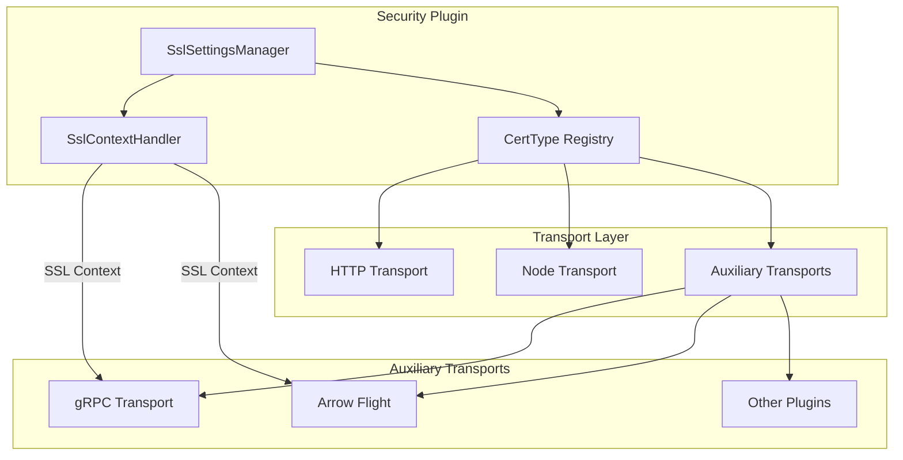

---
tags:
  - domain/security
  - component/server
  - security
---
# Auxiliary Transport SSL

## Summary

OpenSearch v3.2.0 introduces TLS support for auxiliary transports in the Security plugin. This feature enables independent SSL/TLS configuration for pluggable auxiliary transports like gRPC, allowing each transport to have its own certificate settings, client authentication mode, and cipher suites. This is essential for securing the new gRPC transport layer that reached GA in v3.2.0.

## Details

### What's New in v3.2.0

The Security plugin now provides TLS support for auxiliary transports through a new configuration namespace. Previously, auxiliary transports shared a single SSL configuration, but this release enables per-transport SSL settings identified by the transport's unique key.

### Technical Changes

#### Architecture Changes



#### New Components

| Component | Description |
|-----------|-------------|
| `CertType` class | Refactored from enum to class to support dynamic auxiliary transport registration |
| `NodeCertTypeRegistry` | Write-only registry for tracking discovered certificate types on a node |
| `SecureAuxTransportSettingsProvider` | Interface implementation providing SSL context and parameters to auxiliary transports |
| `LegacyCertType` enum | Backward compatibility enum for node-to-node transport serialization |

#### New Configuration

Configuration settings follow the pattern `plugins.security.ssl.aux.<transport-id>.<setting>`:

| Setting | Description | Default |
|---------|-------------|---------|
| `plugins.security.ssl.aux.<id>.enabled` | Enable TLS for the auxiliary transport | `false` |
| `plugins.security.ssl.aux.<id>.pemkey_filepath` | Path to private key file (PKCS #8) | - |
| `plugins.security.ssl.aux.<id>.pemcert_filepath` | Path to X.509 certificate chain (PEM) | - |
| `plugins.security.ssl.aux.<id>.pemtrustedcas_filepath` | Path to root CA certificates (PEM) | - |
| `plugins.security.ssl.aux.<id>.clientauth_mode` | Client authentication mode: `NONE`, `OPTIONAL`, `REQUIRE` | `OPTIONAL` |
| `plugins.security.ssl.aux.<id>.enabled_ciphers` | Allowed TLS cipher suites | Default secure ciphers |
| `plugins.security.ssl.aux.<id>.enabled_protocols` | Allowed TLS protocols | `TLSv1.3`, `TLSv1.2` |
| `plugins.security.ssl.aux.<id>.keystore_filepath` | Path to keystore file (JKS/PKCS12) | - |
| `plugins.security.ssl.aux.<id>.truststore_filepath` | Path to truststore file (JKS/PKCS12) | - |

For the secure gRPC transport, use `experimental-secure-transport-grpc` as the transport ID.

### Usage Example

```yaml
# Enable secure gRPC auxiliary transport
aux.transport.types: experimental-secure-transport-grpc
aux.transport.experimental-secure-transport-grpc.port: '9400-9500'

# Configure TLS for gRPC transport
plugins.security.ssl.aux.experimental-secure-transport-grpc.enabled: true
plugins.security.ssl.aux.experimental-secure-transport-grpc.pemcert_filepath: esnode.pem
plugins.security.ssl.aux.experimental-secure-transport-grpc.pemkey_filepath: esnode-key.pem
plugins.security.ssl.aux.experimental-secure-transport-grpc.pemtrustedcas_filepath: root-ca.pem
plugins.security.ssl.aux.experimental-secure-transport-grpc.clientauth_mode: REQUIRE
```

### Testing with gRPC

```bash
# Test plaintext connection (should fail with TLS enabled)
grpcurl -plaintext localhost:9400 list

# Test TLS without client certificate (works with clientauth_mode: NONE or OPTIONAL)
grpcurl -insecure localhost:9400 list

# Test TLS with client certificate (required when clientauth_mode: REQUIRE)
grpcurl -insecure -cert esnode.pem -key esnode-key.pem localhost:9400 list
```

### Migration Notes

- No migration required for existing deployments
- Auxiliary transport SSL is opt-in via the `enabled` setting
- Each auxiliary transport requires its own certificate configuration
- The feature provides TLS encryption only; no authorization or user authentication is performed on auxiliary transport connections

## Limitations

- **No authorization**: Only TLS encryption is provided. No role-based access control or user authentication is enforced on auxiliary transport connections
- **Certificate-based access only**: Access control is limited to `clientauth_mode` settings (allow/deny based on certificate presence and trust)
- **JDK SSL provider only**: Uses JDK SSL provider; OpenSSL provider is not supported for auxiliary transports

## References

### Documentation
- [Documentation: Configuring TLS certificates](https://docs.opensearch.org/3.2/security/configuration/tls/): Official TLS configuration guide

### Blog Posts
- [gRPC Transport GA](https://opensearch.org/blog/introducing-opensearch-3-2-next-generation-search-and-anayltics-with-enchanced-ai-capabilities/): OpenSearch 3.2 release announcement

### Pull Requests
| PR | Description |
|----|-------------|
| [#5375](https://github.com/opensearch-project/security/pull/5375) | Add support for configuring auxiliary transports for SSL only |

### Issues (Design / RFC)
- [Issue #17795](https://github.com/opensearch-project/OpenSearch/issues/17795): Feature request for separation of auxiliary transport SSL configurations

## Related Feature Report

- Full feature documentation
