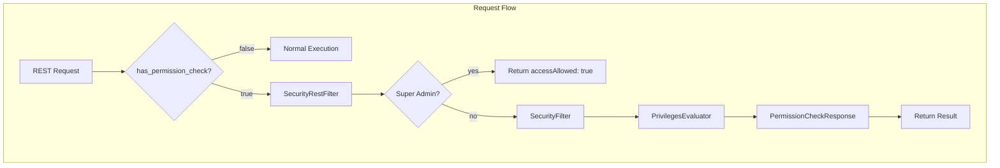

---
tags:
  - domain/security
  - component/server
  - search
  - security
---
# Permission Validation

## Summary

OpenSearch v3.2.0 introduces a permission validation feature that allows users to check whether they have sufficient permissions to execute an API request without actually executing it. By adding the `has_permission_check=true` query parameter to any REST endpoint, users can safely preview whether an action would be allowed or denied, along with a list of any missing privileges.

This feature enables risk-free permission testing, reduces user disruption during role configuration, and provides faster validation of security configurations.

## Details

### What's New in v3.2.0

The permission validation feature adds a new query parameter `has_permission_check` that can be appended to any existing REST API endpoint. When set to `true`, the request goes through the normal authentication and authorization flow but stops before executing the actual operation, returning a permission check response instead.

### Technical Changes

#### Architecture Changes



#### New Components

| Component | Description |
|-----------|-------------|
| `PermissionCheckResponse` | Response class that returns `accessAllowed` boolean and `missingPrivileges` array |
| `HAS_PERMISSION_CHECK_PARAM` | Query parameter constant (`has_permission_check`) |

#### Request Flow

1. User sends a request with `?has_permission_check=true`
2. `SecurityRestFilter` detects the parameter and sets a thread context header
3. For super admins, immediately returns `accessAllowed: true` with empty `missingPrivileges`
4. For regular users, the request proceeds through normal privilege evaluation
5. `SecurityFilter` intercepts after privilege evaluation and returns the result without executing the operation

### Usage Example

Check if the current user can access cluster health:

```bash
GET /_cluster/health?has_permission_check=true
```

Response when access is allowed:

```json
{
  "accessAllowed": true,
  "missingPrivileges": []
}
```

Response when access is denied:

```json
{
  "accessAllowed": false,
  "missingPrivileges": ["cluster:monitor/health"]
}
```

This works with any REST endpoint:

```bash
# Check write permission
PUT /my_index/_doc/1?has_permission_check=true
{
  "title": "Test Document"
}

# Check index creation permission
PUT /new_index?has_permission_check=true

# Check bulk operation permission
POST /_bulk?has_permission_check=true
{"index": {"_index": "test"}}
{"field": "value"}
```

### Migration Notes

This is a new feature with no migration required. The feature is available immediately after upgrading to v3.2.0.

## Limitations

- The permission check only validates authorization, not request validity (e.g., malformed JSON will still be rejected before permission check)
- Super admins always receive `accessAllowed: true` as they bypass normal privilege evaluation
- The feature checks permissions at the time of the request; cached permissions may not reflect very recent role changes

## References

### Documentation
- [Permissions Documentation](https://docs.opensearch.org/3.2/security/access-control/permissions/): Official documentation on permissions and the `perform_permission_check` parameter

### Pull Requests
| PR | Description |
|----|-------------|
| [#5496](https://github.com/opensearch-project/security/pull/5496) | Add url query param (has_permission_check=true) to check if a user has access to call an API |

### Issues (Design / RFC)
- [Issue #5468](https://github.com/opensearch-project/security/issues/5468): Security Permissions Simulation feature request

## Related Feature Report

- [Full feature documentation](../../../../features/security/security-permission-validation.md)
