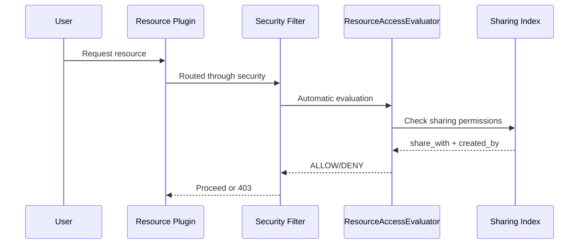
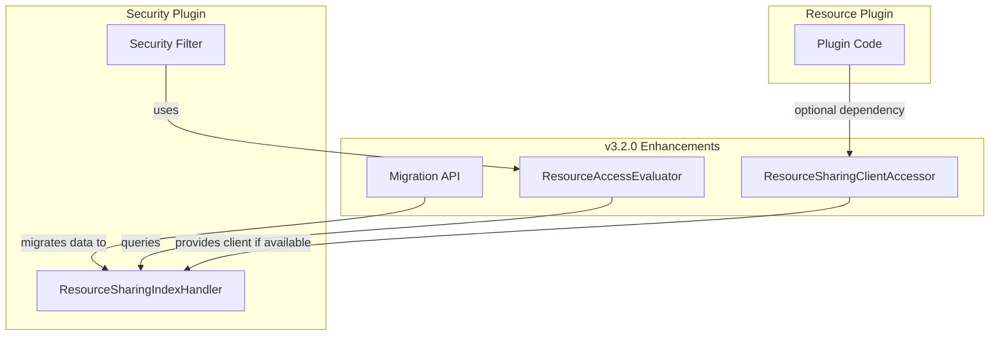

---
tags:
  - domain/security
  - component/server
  - indexing
  - ml
  - security
---
# Resource Sharing

## Summary

OpenSearch v3.2.0 enhances the Resource Access Control Framework with three key improvements: a Migration API for transitioning existing clusters from legacy backend-role visibility, a Resource Access Evaluator for automatic access authorization without explicit plugin calls, and a fix for the client accessor pattern to support optional security plugin installation.

These changes make the resource sharing feature more production-ready by simplifying plugin integration and enabling seamless migration from the legacy `filter_by_backend_role` model.

## Details

### What's New in v3.2.0

#### 1. Migration API

A new REST API endpoint enables cluster administrators to migrate existing resource-sharing information from plugin indices to security plugin managed backing indices:

```
POST /_plugins/_security/api/resources/migrate
```

This API is essential for clusters upgrading from the legacy backend-role-based access model to the new owner-controlled sharing model.

#### 2. Resource Access Evaluator

The `ResourceAccessEvaluator` provides standalone resource access authorization that integrates directly with the Security Filter. Plugins no longer need to explicitly call `verifyAccess` - access evaluation happens automatically.



#### 3. Client Accessor Pattern Restoration

Fixes `ClassNotFoundException` when the security plugin SPI is not on the classpath. The `ResourceSharingClientAccessor` singleton pattern ensures plugins can compile and run regardless of whether the security plugin is installed.

### Technical Changes

#### New Components

| Component | Description |
|-----------|-------------|
| `ResourceAccessEvaluator` | Evaluates access permissions automatically via Security Filter |
| Migration REST API | `/_plugins/_security/api/resources/migrate` endpoint |
| `ResourceSharingClientAccessor` | Restored singleton pattern for optional security plugin |

#### Architecture Enhancement



### Usage Example

#### Migration API

```bash
# Migrate existing resource sharing data to security plugin indices
curl -X POST "https://localhost:9200/_plugins/_security/api/resources/migrate" \
  -H "Content-Type: application/json" \
  --cert admin.pem --key admin-key.pem
```

#### Automatic Access Evaluation (No Plugin Code Changes Required)

With v3.2.0, plugins that implement `ResourceSharingExtension` automatically benefit from access evaluation. The previous explicit `verifyAccess` call is no longer required:

```java
// Before v3.2.0 - explicit verification required
client.verifyResourceAccess(resourceId, indexName, listener);

// v3.2.0+ - automatic evaluation via Security Filter
// No explicit call needed - access is evaluated automatically
```

### Migration Notes

1. **Enable the feature**: Set `plugins.security.experimental.resource_sharing.enabled: true`
2. **Run migration**: Call the Migration API to transfer existing sharing data
3. **Update plugins**: Plugins can remove explicit `verifyAccess` calls (optional, for cleaner code)
4. **Test access**: Verify resource access works as expected after migration

## Limitations

- Feature remains **experimental** and disabled by default
- Migration API requires cluster admin privileges
- Initial plugin support limited to Anomaly Detection and ML Commons

## References

### Blog Posts
- [Blog: Introducing Resource Sharing](https://opensearch.org/blog/introducing-resource-sharing-a-new-access-control-model-for-opensearch/): Feature overview

### Pull Requests
| PR | Description |
|----|-------------|
| [#5389](https://github.com/opensearch-project/security/pull/5389) | Migration API for existing sharing info |
| [#5408](https://github.com/opensearch-project/security/pull/5408) | Resource Access Evaluator for standalone authorization |
| [#5541](https://github.com/opensearch-project/security/pull/5541) | Client accessor pattern fix for optional security plugin |

### Issues (Design / RFC)
- [Issue #5391](https://github.com/opensearch-project/security/issues/5391): Migration API tracking issue
- [Issue #5442](https://github.com/opensearch-project/security/issues/5442): Resource Access Evaluator tracking issue

## Related Feature Report

- [Full feature documentation](../../../../features/security/security-resource-access-control-framework.md)
