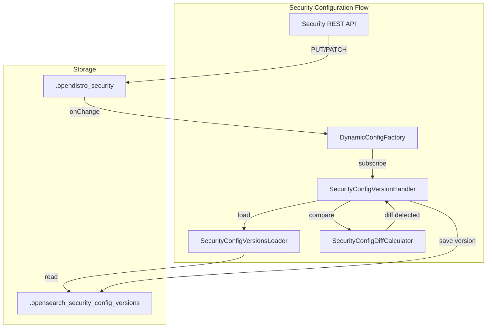

---
tags:
  - domain/security
  - component/server
  - indexing
  - security
---
# Security Configuration Management

## Summary

This release introduces an experimental versioned security configuration management feature that enables tracking, rollback, and roll-forward capabilities for OpenSearch security configurations. The feature stores complete security configuration snapshots in a dedicated system index, allowing administrators to view configuration history and potentially restore previous states.

## Details

### What's New in v3.2.0

A comprehensive versioning system for the OpenSearch security index has been implemented. This system automatically creates version snapshots whenever security configurations change, providing a complete audit trail of security changes.

### Technical Changes

#### Architecture Changes



#### New Components

| Component | Description |
|-----------|-------------|
| `SecurityConfigVersionHandler` | Manages version creation and storage on configuration changes |
| `SecurityConfigVersionsLoader` | Loads version documents from the system index |
| `SecurityConfigDiffCalculator` | Computes differences between configuration versions using JSON diff |
| `SecurityConfigVersionDocument` | Document structure for storing versioned configurations |

#### New Configuration

| Setting | Description | Default |
|---------|-------------|---------|
| `plugins.security.configurations_versions.enabled` | Enable/disable versioning feature | `false` |
| `plugins.security.config_versions_index_name` | Name of the versions index | `.opensearch_security_config_versions` |
| `plugins.security.config_version.retention_count` | Maximum versions to retain | `10` |

### Version Index Structure

The `.opensearch_security_config_versions` index stores configuration snapshots:

```json
{
  "versions": [
    {
      "version_id": "v1",
      "timestamp": "2025-05-22T08:46:11.887620466Z",
      "modified_by": "system",
      "security_configs": {
        "rolesmapping": {
          "lastUpdated": "2025-05-22T08:46:11.887620466Z",
          "configData": {
            "all_access": {
              "backend_roles": ["admin"],
              "description": "Maps admin to all_access"
            }
          }
        }
      }
    }
  ]
}
```

### Usage Example

Enable the feature in `opensearch.yml`:

```yaml
plugins.security.configurations_versions.enabled: true
plugins.security.config_version.retention_count: 10
```

When security configurations change via REST API:

```bash
# Create a user - triggers version update
curl -XPUT https://localhost:9200/_plugins/_security/api/internalusers/testuser \
  -u 'admin:password' --insecure \
  -H 'Content-Type: application/json' \
  -d '{
    "password": "SecurePassword123!",
    "backend_roles": ["admin"]
  }'
```

Log output shows version creation:

```
Detected changes in security configuration: [{"op":"add","path":"/internalusers/testuser",...}]
Successfully saved version v2 to .opensearch_security_config_versions
```

### Key Behaviors

- **Cluster Manager Only**: Version updates only occur on the elected cluster manager node
- **Change Detection**: No version created if configuration hasn't changed
- **Automatic Retention**: Old versions are automatically pruned based on retention count
- **Optimistic Concurrency**: Uses sequence numbers to handle concurrent updates

## Limitations

- **Experimental Feature**: Disabled by default, requires explicit enablement
- **No Rollback API**: This release provides versioning infrastructure only; rollback/roll-forward APIs are planned for future releases
- **Storage Overhead**: Each version stores complete configuration snapshots
- **Cluster Manager Dependency**: Version tracking requires an elected cluster manager

## References

### Documentation
- [Security Configuration Documentation](https://docs.opensearch.org/3.0/security/configuration/index/)

### Pull Requests
| PR | Description |
|----|-------------|
| [#5357](https://github.com/opensearch-project/security/pull/5357) | Introduced new experimental versioned security configuration management feature |

### Issues (Design / RFC)
- [Issue #5093](https://github.com/opensearch-project/security/issues/5093): Create a mechanism for tracking patches to the security index

## Related Feature Report

- Full feature documentation
