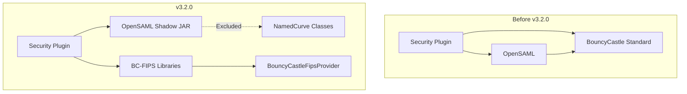

---
tags:
  - domain/security
  - component/server
  - security
---
# Security FIPS Compliance

## Summary

OpenSearch Security plugin v3.2.0 introduces full FIPS 140-2 compliance by replacing the standard BouncyCastle cryptographic library with BC-FIPS (BouncyCastle FIPS) and isolating OpenSAML dependencies into a shadow JAR configuration. This enables OpenSearch to run in FIPS-enforced environments required by government and regulated industries.

## Details

### What's New in v3.2.0

This release completes the transition to FIPS-compliant cryptographic libraries through two key changes:

1. **OpenSAML Shadow JAR Isolation**: Moved OpenSAML dependencies to a separate shadow JAR to avoid conflicts with FIPS libraries
2. **BouncyCastle FIPS Replacement**: Replaced standard BouncyCastle (`bcprov-jdk18on`, `bcpkix-jdk18on`, `bcutil-jdk18on`) with BC-FIPS equivalents (`bc-fips`, `bcpkix-fips`, `bcutil-fips`)

### Technical Changes

#### Architecture Changes



#### New Components

| Component | Description |
|-----------|-------------|
| `libs/opensaml` | New Gradle subproject containing OpenSAML shadow JAR configuration |
| `BouncyCastleFipsProvider` | FIPS-compliant security provider replacing `BouncyCastleProvider` |

#### Dependency Changes

| Old Dependency | New Dependency | Version |
|----------------|----------------|---------|
| `bcprov-jdk18on:1.81` | `bc-fips` | 2.0.0 |
| `bcpkix-jdk18on:1.81` | `bcpkix-fips` | 2.0.7 |
| `bcutil-jdk18on:1.81` | `bcutil-fips` | 2.0.3 |

#### Shadow JAR Configuration

The OpenSAML shadow JAR excludes classes that conflict with FIPS mode:

```groovy
tasks.shadowJar {
    mergeServiceFiles()
    exclude 'org/bouncycastle/**'
    exclude 'META-INF/versions/**/org/bouncycastle/**'
    exclude 'META-INF/services/org.opensaml.security.crypto.ec.NamedCurve'
}
```

### Code Changes

The security provider initialization was updated to use FIPS-compliant classes:

```java
// Before
private static final Provider DEFAULT_SECURITY_PROVIDER = new BouncyCastleProvider();

// After
private static final Provider DEFAULT_SECURITY_PROVIDER = new BouncyCastleFipsProvider();
```

OpenSAML initialization now configures FIPS-compatible key derivation:

```java
System.setProperty(
    DefaultSecurityConfigurationBootstrap.CONFIG_PROPERTY_ECDH_DEFAULT_KDF,
    DefaultSecurityConfigurationBootstrap.PBKDF2
);
```

### Migration Notes

For users upgrading to v3.2.0:

1. **No configuration changes required** - The FIPS libraries are now the default
2. **SAML authentication** continues to work without modification
3. **Certificate handling** uses the same APIs with FIPS-compliant implementations

## Limitations

- OpenSAML versions past 4.0 have inherent FIPS compatibility issues; the shadow JAR approach works around this by excluding problematic classes
- The `NamedCurve` service is excluded from OpenSAML, which may affect certain elliptic curve operations within SAML processing

## References

### Pull Requests
| PR | Description |
|----|-------------|
| [#5404](https://github.com/opensearch-project/security/pull/5404) | Moved OpenSAML jars to Shadow Jar configuration for FIPS compatibility |
| [#5439](https://github.com/opensearch-project/security/pull/5439) | Replaced standard BouncyCastle with BC-FIPS |

### Issues (Design / RFC)
- [Issue #5438](https://github.com/opensearch-project/security/issues/5438): Complete transition to FIPS distribution of BouncyCastle
- [Issue #4915](https://github.com/opensearch-project/security/issues/4915): OpenSAML incompatibility with BC-FIPS
- [Issue #3420](https://github.com/opensearch-project/security/issues/3420): RFC for FIPS 140-2 enforced mode support

## Related Feature Report

- Full feature documentation
