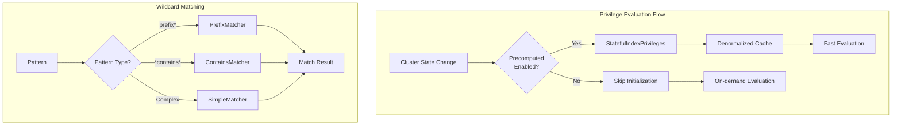

---
tags:
  - domain/security
  - component/server
  - indexing
  - performance
  - security
---
# Security Performance Optimization

## Summary

OpenSearch v3.2.0 introduces two performance optimizations to the security layer: a configurable setting to disable precomputed privilege data structures and optimized wildcard matching for common patterns. These changes address performance issues in clusters with many roles and repeated index patterns, where privilege evaluation initialization could consume significant resources.

## Details

### What's New in v3.2.0

#### 1. Precomputed Privileges Toggle

A new setting `plugins.security.privileges_evaluation.precomputed_privileges.enabled` allows administrators to disable the creation of denormalized privilege data structures. This is useful when the initialization process takes excessive time or resources, negatively affecting cluster performance.

#### 2. Optimized Wildcard Matching

The `WildcardMatcher` class now includes specialized implementations for common patterns:
- **Prefix patterns** (`prefix*`): Uses `String.startsWith()` for ~30% faster matching
- **Contains patterns** (`*contains*`): Uses `String.contains()` for efficient substring matching

### Technical Changes

#### Architecture Changes



#### New Configuration

| Setting | Description | Default |
|---------|-------------|---------|
| `plugins.security.privileges_evaluation.precomputed_privileges.enabled` | Enable/disable precomputed privilege data structures | `true` |

#### New Components

| Component | Description |
|-----------|-------------|
| `WildcardMatcher.PrefixMatcher` | Optimized matcher for `prefix*` patterns using `String.startsWith()` |
| `WildcardMatcher.ContainsMatcher` | Optimized matcher for `*contains*` patterns using `String.contains()` |
| `AbstractSimpleWildcardMatcher` | Base class for simple wildcard matchers with shared equals/hashCode |

### Usage Example

```yaml
# opensearch.yml - Disable precomputed privileges for clusters with
# many roles and repeated index patterns causing slow initialization
plugins.security.privileges_evaluation.precomputed_privileges.enabled: false
```

```java
// Wildcard matching is automatically optimized
// "logs-*" uses PrefixMatcher internally
WildcardMatcher matcher = WildcardMatcher.from("logs-*");
matcher.test("logs-2024-01-01");  // Uses String.startsWith()

// "*error*" uses ContainsMatcher internally  
WildcardMatcher containsMatcher = WildcardMatcher.from("*error*");
containsMatcher.test("application-error-log");  // Uses String.contains()
```

### Migration Notes

- The precomputed privileges setting is enabled by default for backward compatibility
- Disabling precomputed privileges trades initialization time for reduced action throughput
- Wildcard matching optimizations are automatic and require no configuration changes

## Limitations

- Disabling precomputed privileges reduces action throughput during privilege evaluation
- The setting is node-scoped and requires a node restart to change
- Wildcard optimizations only apply to simple prefix and contains patterns; complex patterns still use the general algorithm

## References

### Blog Posts
- [Blog: Performance optimizations for the OpenSearch security layer](https://opensearch.org/blog/performance-optimizations-for-the-opensearch-security-layer/)

### Pull Requests
| PR | Description |
|----|-------------|
| [#5465](https://github.com/opensearch-project/security/pull/5465) | Introduced setting for disabling denormalized privilege data structures |
| [#5470](https://github.com/opensearch-project/security/pull/5470) | Optimizations and simplifications for WildcardMatcher |

### Issues (Design / RFC)
- [Issue #5464](https://github.com/opensearch-project/security/issues/5464): ActionPrivileges initialization performance issue
- [Issue #3870](https://github.com/opensearch-project/security/issues/3870): Optimized privilege evaluation project

## Related Feature Report

- Full feature documentation
