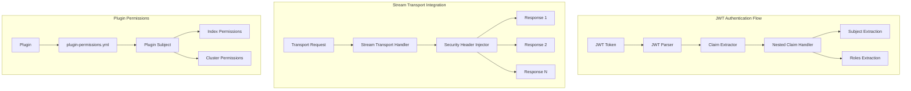

---
tags:
  - domain/security
  - component/server
  - indexing
  - security
---
# Security Plugin Enhancements

## Summary

OpenSearch v3.2.0 brings significant enhancements to the Security plugin, including improved JWT authentication with nested claim support, stream transport integration, plugin permission declarations, tenancy access control, and numerous bug fixes for mixed cluster configurations and demo certificate handling.

## Details

### What's New in v3.2.0

This release includes 3 enhancements and 13 bug fixes across the Security plugin, focusing on authentication flexibility, transport layer security, and operational stability.

### Technical Changes

#### Architecture Changes



#### New Components

| Component | Description |
|-----------|-------------|
| Nested Claim Handler | Extracts subject and roles from nested JWT claims |
| Stream Transport Security | Injects security headers for multiple responses in stream transport |
| Plugin Permissions Framework | Allows plugins to declare required permissions via YAML |
| Tenancy Access Serializer | Serializes tenancy access level in thread context |
| JWTClaimsBuilder | Flexible claims builder for different token types |

#### New Configuration

| Setting | Description | Default |
|---------|-------------|---------|
| `subject_key` | Path to subject in JWT (supports nested paths) | `sub` |
| `jwt_clock_skew_tolerance_seconds` | Clock skew tolerance for JWT validation | `30` |

### Usage Example

#### Nested JWT Claims Configuration

```yaml
# config.yml - JWT authentication with nested claims
authc:
  jwt_auth_domain:
    http_enabled: true
    transport_enabled: true
    order: 0
    http_authenticator:
      type: jwt
      challenge: false
      config:
        signing_key: "base64-encoded-key"
        jwt_header: "Authorization"
        jwt_url_parameter: null
        # Support for nested subject claim
        subject_key: "attributes.sub"
        roles_key: "attributes.roles"
        jwt_clock_skew_tolerance_seconds: 30
```

#### Supported JWT Structures

```json
// Standard top-level subject
{
    "sub": "user@example.com",
    "roles": "admin,user"
}

// Nested subject under attributes
{
    "attributes": {
        "sub": "user@example.com",
        "roles": "admin,user"
    }
}

// Separate nested structures
{
    "user_info": {
        "sub": "user@example.com"
    },
    "attributes": {
        "roles": "admin,user"
    }
}
```

#### Plugin Permissions Declaration

```yaml
# plugin-permissions.yml (on plugin classpath)
index_permissions:
  - index_patterns:
      - "security_auditlog*"
    allowed_actions:
      - "indices:admin/create"
      - "indices:data/write/*"

cluster_permissions:
  - "cluster:monitor/state"
```

### Migration Notes

1. **JWT Clock Skew**: The `jwt_clock_skew_tolerance_seconds` setting now properly applies to `HTTPJwtAuthenticator`. Previously, this setting was ignored, causing authentication failures with minor clock differences.

2. **Demo Certificates**: The demo installer now always copies certificates to the config folder, even if security settings already exist in `opensearch.yml`. This fixes issues in Helm/Kubernetes deployments where pods restart.

3. **Mixed Cluster Upgrades**: Config updates from older nodes in mixed clusters now gracefully handle deprecated config types instead of throwing `NullPointerException`.

## Limitations

- Nested claim extraction requires explicit configuration of the claim path
- Stream transport security integration is currently limited to node-to-node communication
- Plugin permissions are evaluated at plugin load time and cannot be dynamically updated

## References

### Documentation
- [Authentication Backends Documentation](https://docs.opensearch.org/3.0/security/authentication-backends/authc-index/)
- [OpenSearch Core PR #18722](https://github.com/opensearch-project/OpenSearch/pull/18722): Stream transport introduction

### Pull Requests
| PR | Description |
|----|-------------|
| [#5341](https://github.com/opensearch-project/security/pull/5341) | Plugin permission declaration mechanism |
| [#5467](https://github.com/opensearch-project/security/pull/5467) | Nested JWT claim support for subject |
| [#5530](https://github.com/opensearch-project/security/pull/5530) | Stream transport integration |
| [#5423](https://github.com/opensearch-project/security/pull/5423) | Subject interface compilation fix |
| [#5432](https://github.com/opensearch-project/security/pull/5432) | SecureHttpTransportParameters provider |
| [#5445](https://github.com/opensearch-project/security/pull/5445) | Cluster permission detection fix |
| [#5456](https://github.com/opensearch-project/security/pull/5456) | Mixed cluster config update fix |
| [#5506](https://github.com/opensearch-project/security/pull/5506) | JWT clock skew tolerance fix |
| [#5517](https://github.com/opensearch-project/security/pull/5517) | Demo certificate installation fix |
| [#5436](https://github.com/opensearch-project/security/pull/5436) | JWT Vendor refactoring |
| [#5519](https://github.com/opensearch-project/security/pull/5519) | Tenancy access serialization |

### Issues (Design / RFC)
- [Issue #5430](https://github.com/opensearch-project/security/issues/5430): Nested JWT claims feature request
- [Issue #5505](https://github.com/opensearch-project/security/issues/5505): JWT clock skew tolerance bug
- [Issue #5044](https://github.com/opensearch-project/security/issues/5044): Demo certificate installation issue
- [Issue #5365](https://github.com/opensearch-project/security/issues/5365): Mixed cluster config update bug
- [Issue #4439](https://github.com/opensearch-project/security/issues/4439): Plugin permission declaration

## Related Feature Report

- Security Plugin
