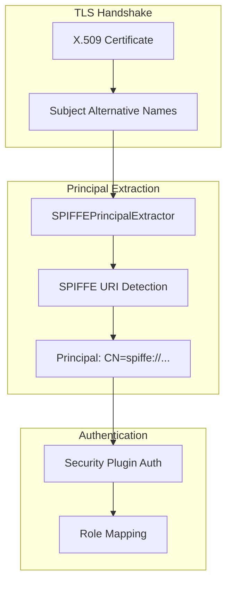

# SPIFFE X.509 SVID Support

## Summary

OpenSearch v3.2.0 introduces support for SPIFFE (Secure Production Identity Framework for Everyone) X.509 SVID (SPIFFE Verifiable Identity Document) authentication. This feature enables cluster operators to use existing SPIFFE-based workload identities for node and admin authentication, eliminating the need to set up dedicated PKI infrastructure for OpenSearch.

## Details

### What's New in v3.2.0

A new `SPIFFEPrincipalExtractor` class has been added to the Security plugin that extracts SPIFFE URIs from X.509 certificate Subject Alternative Names (SANs) for use as authentication principals.

### Technical Changes

#### Architecture Changes



#### New Components

| Component | Description |
|-----------|-------------|
| `SPIFFEPrincipalExtractor` | Implementation of `PrincipalExtractor` that extracts SPIFFE URIs from certificate SANs |
| `SPIFFEPrincipalExtractorTest` | Unit tests covering various edge cases |

#### New Configuration

| Setting | Description | Default |
|---------|-------------|---------|
| `plugins.security.ssl.transport.principal_extractor_class` | Class to use for extracting principals from certificates | (default extractor) |

To enable SPIFFE authentication, configure:

```yaml
plugins.security.ssl.transport.principal_extractor_class: org.opensearch.security.ssl.transport.SPIFFEPrincipalExtractor
```

### Usage Example

#### Certificate Requirements

The X.509 certificate must contain a SPIFFE URI in the Subject Alternative Name (SAN) extension:

```
X509v3 Subject Alternative Name:
    URI:spiffe://example.org/workload/opensearch-node-1
```

#### Configuration

1. Configure the principal extractor in `opensearch.yml`:

```yaml
plugins.security.ssl.transport.principal_extractor_class: org.opensearch.security.ssl.transport.SPIFFEPrincipalExtractor
```

2. Map the SPIFFE identity to roles in `roles_mapping.yml`:

```yaml
admin:
  users:
    - "CN=spiffe://example.org/workload/opensearch-admin"

node:
  users:
    - "CN=spiffe://example.org/workload/opensearch-node-*"
```

#### How It Works

1. During TLS handshake, the certificate is presented
2. `SPIFFEPrincipalExtractor` parses the certificate's SANs
3. Looks for URI type SANs (type 6) starting with `spiffe://`
4. Returns the principal as `CN=spiffe://...`
5. The Security plugin uses this principal for authentication and role mapping

### Migration Notes

- No migration required - this is an additive feature
- Existing configurations continue to work unchanged
- To adopt SPIFFE authentication:
  1. Ensure certificates contain SPIFFE URIs in SANs
  2. Configure the principal extractor class
  3. Update role mappings to use SPIFFE-based principals

## Limitations

- Only extracts the first SPIFFE URI found in the certificate SANs
- Returns `null` if no SPIFFE URI is present (falls back to default behavior)
- Requires certificates to follow the [X509-SVID specification](https://github.com/spiffe/spiffe/blob/main/standards/X509-SVID.md)

## Related PRs

| PR | Description |
|----|-------------|
| [#5521](https://github.com/opensearch-project/security/pull/5521) | Add SPIFFEPrincipalExtractor |

## References

- [SPIFFE Official Website](https://spiffe.io/)
- [X509-SVID Specification](https://github.com/spiffe/spiffe/blob/main/standards/X509-SVID.md)
- [OpenSearch TLS Configuration](https://docs.opensearch.org/3.0/security/configuration/tls/)
- [Client Certificate Authentication](https://docs.opensearch.org/3.0/security/authentication-backends/client-auth/)

## Related Feature Report

- [Full feature documentation](../../../../features/security/spiffe-x.509-svid-support.md)
