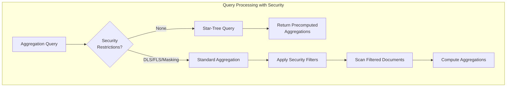

---
tags:
  - domain/security
  - component/server
  - indexing
  - performance
  - search
  - security
---
# Star Tree Security Integration

## Summary

This enhancement restricts star-tree index query optimization for users with Document-Level Security (DLS), Field-Level Security (FLS), or Field Masking restrictions. When these security restrictions are applied, queries automatically fall back to standard aggregation behavior to ensure data access controls are properly enforced.

## Details

### What's New in v3.2.0

Star-tree indexes precompute aggregations during indexing for faster query performance. However, these precomputed results don't account for security restrictions that filter documents or mask fields at query time. This release adds security-aware handling that disables star-tree optimization when DLS/FLS/Field Masking is active.

### Technical Changes

#### Architecture Changes



#### Implementation

The security plugin's `DlsFlsValveImpl.handleSearchContext()` method now checks for star-tree query context and disables it when restrictions apply:

```java
// Restrict access for star tree index if there are any DLS/FLS/field masking restrictions
if (searchContext.getQueryShardContext().getStarTreeQueryContext() != null) {
    boolean flsUnrestricted = config.getFieldPrivileges().isUnrestricted(privilegesEvaluationContext, index);
    boolean fieldMaskingUnrestricted = config.getFieldMasking().isUnrestricted(privilegesEvaluationContext, index);
    if (!dlsRestriction.isUnrestricted() || !flsUnrestricted || !fieldMaskingUnrestricted) {
        searchContext.getQueryShardContext().setStarTreeQueryContext(null);
    }
}
```

#### Security Restriction Types

| Restriction | Effect on Star-Tree |
|-------------|---------------------|
| Document-Level Security (DLS) | Disabled - precomputed aggregations include all documents |
| Field-Level Security (FLS) | Disabled - aggregations may include restricted fields |
| Field Masking | Disabled - masked field values differ from indexed values |

### Usage Example

```yaml
# Role with DLS restriction - star-tree will be disabled
startree_dls_role:
  index_permissions:
    - index_patterns:
        - "sales_index"
      dls: '{"term": {"department": "engineering"}}'
      allowed_actions:
        - "indices:data/read/search*"

# Role with FLS restriction - star-tree will be disabled
startree_fls_role:
  index_permissions:
    - index_patterns:
        - "sales_index"
      fls:
        - "department"
        - "region"
        - "sales_amount"
        # sensitive_data field excluded
      allowed_actions:
        - "indices:data/read/search*"

# Role with field masking - star-tree will be disabled
startree_masked_role:
  index_permissions:
    - index_patterns:
        - "sales_index"
      masked_fields:
        - "sensitive_data"
      allowed_actions:
        - "indices:data/read/search*"
```

### Migration Notes

No migration required. The behavior change is automatic:
- Users without DLS/FLS/Field Masking continue to benefit from star-tree optimization
- Users with restrictions automatically fall back to standard aggregations with proper security filtering

### Monitoring

Use the star-tree search statistics to monitor the impact:

```
GET /_stats/search?pretty
```

Check `startree_query_total` - queries from restricted users will not increment this counter.

## Limitations

- Performance impact: Users with DLS/FLS/Field Masking will not benefit from star-tree query acceleration
- No partial optimization: Even if only one field is masked, the entire star-tree optimization is disabled

## References

### Documentation
- [Star-tree index documentation](https://docs.opensearch.org/3.0/search-plugins/star-tree-index/): Official star-tree documentation
- [Document-level security](https://docs.opensearch.org/3.0/security/access-control/document-level-security/): DLS configuration
- [Field-level security](https://docs.opensearch.org/3.0/security/access-control/field-level-security/): FLS configuration
- [Field masking](https://docs.opensearch.org/3.0/security/access-control/field-masking/): Field masking configuration

### Pull Requests
| PR | Description |
|----|-------------|
| [#5492](https://github.com/opensearch-project/security/pull/5492) | Restricting star tree index for users with DLS/FLS/FieldMasking restrictions |

## Related Feature Report

- Star Tree Index feature documentation
