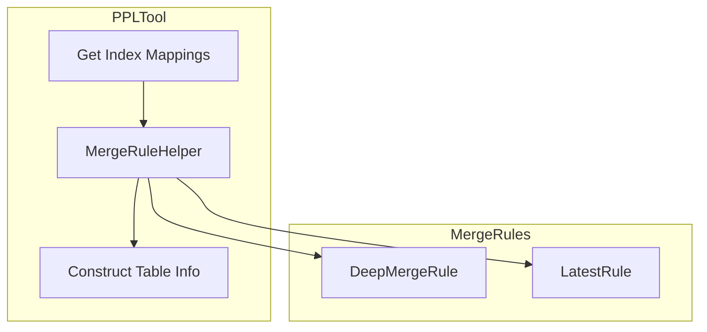

---
tags:
  - indexing
  - ml
  - security
---

# Skills Plugin Enhancements

## Summary

OpenSearch v3.2.0 brings several enhancements to the Skills plugin, including improved index schema merging for PPLTool when using index patterns, error message masking for security, and standardized parameter handling across all tools. These changes improve the reliability and security of agent-based workflows.

## Details

### What's New in v3.2.0

#### Index Schema Merging for PPLTool

Previously, when using index patterns (e.g., `logs-*`) with PPLTool, only the first matching index's mapping was used. This caused issues when different indexes had different field schemas.

In v3.2.0, PPLTool now merges schema metadata from all matching indexes:
- For nested/struct types: properties are merged recursively
- For normal types with the same key: the latest value is used
- For different keys: both are preserved

This ensures the LLM receives a complete view of all available fields across the index pattern.

#### Error Message Masking

PPLTool now masks sensitive information in error messages from SageMaker endpoints:
- AWS account numbers are redacted
- SageMaker endpoint ARNs are replaced with `<SAGEMAKER_ENDPOINT>`
- CloudWatch URLs are removed from error messages

This prevents accidental exposure of infrastructure details in error responses.

#### Standardized Parameter Handling

All Tool implementations now use the new `extractInputParameters` utility from ML Commons:
- `AbstractRetrieverTool`
- `CreateAlertTool`
- `CreateAnomalyDetectorTool`
- `DynamicTool`
- `LogPatternTool`
- `PPLTool`
- `RAGTool`
- `SearchAlertsTool`
- `SearchAnomalyDetectorsTool`
- `SearchAnomalyResultsTool`
- `SearchMonitorsTool`
- `WebSearchTool`

This change aligns with the ML Commons PR #4053 that introduced unified tool parameter handling and output filtering.

### Technical Changes

#### New Components

| Component | Description |
|-----------|-------------|
| `MergeRule` | Interface for index schema merge strategies |
| `DeepMergeRule` | Merges nested/struct objects by recursively merging properties |
| `LatestRule` | Fallback rule that keeps the latest value for conflicting keys |
| `MergeRuleHelper` | Helper class that applies merge rules to index mappings |

#### Architecture



### Usage Example

When querying across multiple indexes with different schemas:

```json
{
  "type": "PPLTool",
  "parameters": {
    "model_id": "<llm_model_id>",
    "index": "logs-*",
    "question": "Show me error counts by service"
  }
}
```

The merged schema will include fields from all matching indexes, enabling the LLM to generate accurate PPL queries.

### Migration Notes

No migration required. These changes are backward compatible.

## Limitations

- Schema merging may produce large field lists for index patterns matching many indexes with diverse schemas
- Error masking only applies to SageMaker-related errors in PPLTool

## References

### Documentation
- [PPL Tool Documentation](https://docs.opensearch.org/3.0/ml-commons-plugin/agents-tools/tools/ppl-tool/): Official PPL tool reference
- [ML Commons PR #4053](https://github.com/opensearch-project/ml-commons/pull/4053): Unified tool parameter handling

### Pull Requests
| PR | Description |
|----|-------------|
| [#596](https://github.com/opensearch-project/skills/pull/596) | Merge index schema meta for PPLTool |
| [#609](https://github.com/opensearch-project/skills/pull/609) | Mask error message in PPLTool |
| [#618](https://github.com/opensearch-project/skills/pull/618) | Update parameter handling of tools |
| [#601](https://github.com/opensearch-project/skills/pull/601) | Update maven snapshot publish endpoint |
| [#615](https://github.com/opensearch-project/skills/pull/615) | Bump gradle, java, lombok and fix AD configrequest change |
| [#605](https://github.com/opensearch-project/skills/pull/605) | Bump version to 3.2.0.0 |

### Issues (Design / RFC)
- [Issue #617](https://github.com/opensearch-project/skills/issues/617): Parameter handling failures after ML Commons update

## Related Feature Report

- [Full feature documentation](../../../../features/skills/skills-tools.md)
