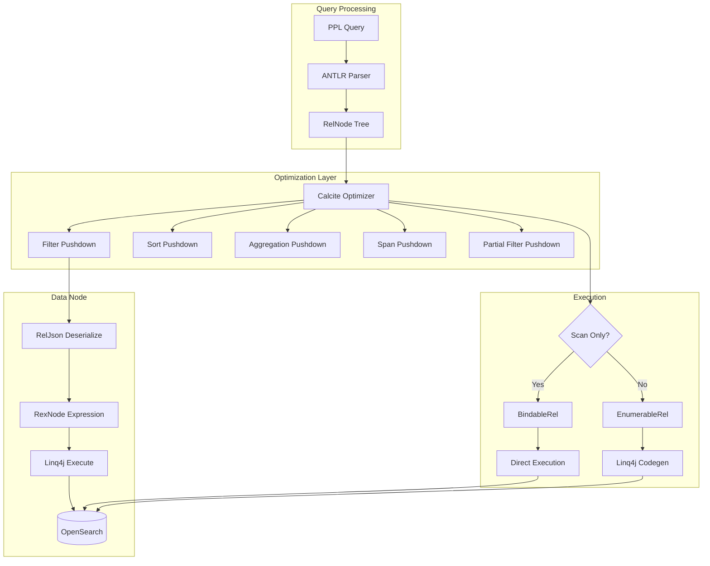

---
tags:
  - performance
  - search
  - security
  - sql
---

# SQL/PPL Engine Enhancements

## Summary

OpenSearch v3.2.0 delivers significant performance and functionality improvements to the SQL/PPL engine, focusing on the Apache Calcite-based query optimizer. Key enhancements include expanded pushdown capabilities (sort, aggregation with scripts, partial filter, span, relevance queries), secure filter script serialization using RelJson, performance optimizations that skip codegen for simple queries (~30% improvement), and disabling v2 fallback by default for more consistent query behavior.

## Details

### What's New in v3.2.0

This release focuses on three major areas:

1. **Expanded Pushdown Support**: More query operations can now be pushed down to OpenSearch, reducing data transfer and improving performance
2. **Security Improvements**: Filter script pushdown now uses RelJson serialization instead of arbitrary Java code
3. **Performance Optimizations**: Simple queries skip unnecessary code generation and compilation

### Technical Changes

#### Architecture Changes



#### New Pushdown Capabilities

| Pushdown Type | Description | PR |
|---------------|-------------|-----|
| Sort | Push sort operations to OpenSearch | [#3620](https://github.com/opensearch-project/sql/pull/3620) |
| Aggregation with Scripts | Support script-based aggregations | [#3916](https://github.com/opensearch-project/sql/pull/3916) |
| Partial Filter | Push down parts of complex filters | [#3850](https://github.com/opensearch-project/sql/pull/3850) |
| Span | Push span operations to OpenSearch | [#3823](https://github.com/opensearch-project/sql/pull/3823) |
| Relevance Query | Push match, match_phrase, etc. | [#3834](https://github.com/opensearch-project/sql/pull/3834) |
| Sarg Value | Push Search Argument filters | [#3840](https://github.com/opensearch-project/sql/pull/3840) |
| Physical Sort for Join | Speed up SortMergeJoin | [#3864](https://github.com/opensearch-project/sql/pull/3864) |
| QUERY_SIZE_LIMIT | Push query size limits | [#3880](https://github.com/opensearch-project/sql/pull/3880) |

#### New Configuration

| Setting | Description | Default |
|---------|-------------|---------|
| `plugins.calcite.fallback.allowed` | Allow fallback to v2 engine on failure | `false` |

#### Security Enhancement: RelJson Serialization

The filter script pushdown mechanism was redesigned for security. Instead of sending arbitrary Java code strings to data nodes, the system now:

1. Serializes optimized RexNode expressions to JSON on the coordinator
2. Transports the JSON representation to data nodes
3. Deserializes and translates to Linq4j expressions on data nodes
4. Compiles and executes safely with limited function scope

This prevents potential code injection attacks while maintaining pushdown performance benefits.

#### Performance Optimization: Skip Codegen

For simple or fully pushdown-compatible queries (e.g., `source=t`, `source=t | where a=1`), the engine now uses `BindableRel` instead of `EnumerableRel`, bypassing code generation and JIT compilation entirely. This improves execution time by approximately 30% for simple queries.

### Usage Example

```bash
# Sort pushdown - sorting happens in OpenSearch
POST /_plugins/_ppl
{
  "query": "source=logs | sort timestamp | head 100"
}

# Aggregation with script pushdown
POST /_plugins/_ppl
{
  "query": "source=sales | stats sum(price * quantity) as total by category"
}

# Partial filter pushdown - pushable parts go to OpenSearch
POST /_plugins/_ppl
{
  "query": "source=logs | where status=200 AND custom_function(field) > 10"
}

# Relevance query pushdown
POST /_plugins/_ppl
{
  "query": "source=docs | where match(content, 'opensearch')"
}
```

### Bug Fixes

| Issue | Fix | PR |
|-------|-----|-----|
| Null order in sort | Correct null ordering with Calcite | [#3835](https://github.com/opensearch-project/sql/pull/3835) |
| Date/time timezone | Default to UTC across PPL and SQL | [#3854](https://github.com/opensearch-project/sql/pull/3854) |
| count() aggregation | Fix count-only aggregation pushdown | [#3891](https://github.com/opensearch-project/sql/pull/3891) |
| Sarg with nullAs TRUE | Fix incorrect pushdown | [#3882](https://github.com/opensearch-project/sql/pull/3882) |
| Relevance query optimization | Fix over-optimization in ReduceExpressionsRule | [#3851](https://github.com/opensearch-project/sql/pull/3851) |
| LIKE to wildcard | Convert LIKE to wildcard query for pushdown | [#3915](https://github.com/opensearch-project/sql/pull/3915) |
| PIT permissions | Fix create PIT permissions issue | [#3921](https://github.com/opensearch-project/sql/pull/3921) |
| Sum precision | Increase precision of sum return type | [#3974](https://github.com/opensearch-project/sql/pull/3974) |
| Byte as Long | Treat byte numbers as Long in doc values | [#3928](https://github.com/opensearch-project/sql/pull/3928) |
| JSONException | Return 400 instead of 500 for JSON errors | [#3833](https://github.com/opensearch-project/sql/pull/3833) |

### Migration Notes

- **Fallback Disabled**: The v2 fallback is now disabled by default (`plugins.calcite.fallback.allowed=false`). Queries that previously fell back to v2 will now fail if not supported by the Calcite engine. To re-enable fallback temporarily:
  ```bash
  PUT _cluster/settings
  {
    "transient": {
      "plugins.calcite.fallback.allowed": true
    }
  }
  ```

## Limitations

- Some complex expressions may not be fully pushable (partial pushdown applies)
- Script-based aggregations require compatible field types
- Relevance query pushdown limited to supported functions

## References

### Documentation
- [SQL Settings Documentation](https://docs.opensearch.org/3.0/search-plugins/sql/settings/): Configuration reference
- [SQL Limitations](https://docs.opensearch.org/3.0/search-plugins/sql/limitation/): Engine limitations

### Pull Requests
| PR | Description |
|----|-------------|
| [#3620](https://github.com/opensearch-project/sql/pull/3620) | Support Sort pushdown |
| [#3916](https://github.com/opensearch-project/sql/pull/3916) | Support aggregation push down with scripts |
| [#3850](https://github.com/opensearch-project/sql/pull/3850) | Support partial filter push down |
| [#3834](https://github.com/opensearch-project/sql/pull/3834) | Support relevance query functions pushdown |
| [#3859](https://github.com/opensearch-project/sql/pull/3859) | Filter script pushdown with RelJson serialization |
| [#3853](https://github.com/opensearch-project/sql/pull/3853) | Skip codegen for Scan only plan (~30% improvement) |
| [#3952](https://github.com/opensearch-project/sql/pull/3952) | Disable v2 fallback by default |
| [#3823](https://github.com/opensearch-project/sql/pull/3823) | Support span push down |
| [#3840](https://github.com/opensearch-project/sql/pull/3840) | Support filter push down for Sarg value |
| [#3864](https://github.com/opensearch-project/sql/pull/3864) | Support pushdown physical sort for SortMergeJoin |
| [#3880](https://github.com/opensearch-project/sql/pull/3880) | Push down QUERY_SIZE_LIMIT |
| [#3914](https://github.com/opensearch-project/sql/pull/3914) | Support function argument coercion |
| [#3919](https://github.com/opensearch-project/sql/pull/3919) | Support casting to IP with Calcite |
| [#3821](https://github.com/opensearch-project/sql/pull/3821) | Add compare_ip operator UDFs |
| [#3940](https://github.com/opensearch-project/sql/pull/3940) | Append limit operator for QUERY_SIZE_LIMIT |

### Issues (Design / RFC)
- [Issue #3470](https://github.com/opensearch-project/sql/issues/3470): Partial filter pushdown request
- [Issue #3380](https://github.com/opensearch-project/sql/issues/3380): Sort pushdown request
- [Issue #3379](https://github.com/opensearch-project/sql/issues/3379): Filter script pushdown security

## Related Feature Report

- [Full Calcite Query Engine documentation](../../../features/sql/sql-calcite-query-engine.md)
