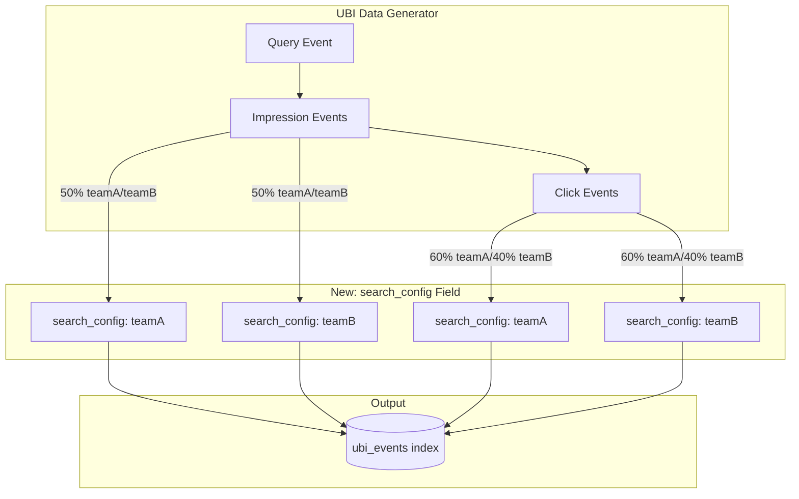

---
tags:
  - domain/infra
  - component/server
  - indexing
  - search
---
# User Behavior Insights Data Generator

## Summary

This enhancement adds a `search_config` field to the UBI data generator, enabling A/B testing simulation by storing Team Draft Interleaving (TDI) configuration information per event. This allows users to generate synthetic UBI data that includes search configuration metadata, facilitating testing and visualization of A/B testing scenarios.

## Details

### What's New in v3.2.0

The UBI data generator now includes a `search_config` field in the `event_attributes.object` structure for generated events. This field randomly assigns either "teamA" or "teamB" to each event, simulating an A/B testing environment where different search configurations are being compared.

### Technical Changes

#### Data Flow



#### New Event Attribute

| Field | Location | Description | Values |
|-------|----------|-------------|--------|
| `search_config` | `event_attributes.object.search_config` | Identifies which search configuration produced the result | `"teamA"` or `"teamB"` |

#### Distribution Logic

- **Impression events**: 50% probability for each team (teamA/teamB)
- **Click events**: 60% probability for teamA, 40% for teamB (simulating different click-through rates)

### Usage Example

Generated UBI event with the new `search_config` field:

```json
{
  "application": "esci_ubi_sample",
  "action_name": "impression",
  "query_id": "550e8400-e29b-41d4-a716-446655440000",
  "session_id": "6ba7b810-9dad-11d1-80b4-00c04fd430c8",
  "client_id": "6ba7b811-9dad-11d1-80b4-00c04fd430c8",
  "timestamp": "2024-06-01T10:30:00.000Z",
  "user_query": "laptop",
  "event_attributes": {
    "object": {
      "object_id": "B08N5WRWNW",
      "object_id_field": "product_id",
      "search_config": "teamA"
    },
    "position": {
      "ordinal": 0
    }
  }
}
```

### Use Cases

This enhancement supports:

1. **A/B Testing Simulation**: Generate synthetic data to test A/B testing dashboards and visualizations
2. **Team Draft Interleaving (TDI) Testing**: Simulate TDI scenarios where results from different search algorithms are interleaved
3. **Search Relevance Workbench Integration**: Prepare test data for the Search Relevance Workbench's A/B testing features

## Limitations

- The `search_config` values are currently hardcoded to "teamA" and "teamB"
- Distribution probabilities (50/50 for impressions, 60/40 for clicks) are fixed and not configurable via command-line arguments

## References

### Documentation
- [User Behavior Insights Documentation](https://docs.opensearch.org/3.0/search-plugins/ubi/index/): Official UBI documentation
- [Chorus OpenSearch Edition PR #159](https://github.com/o19s/chorus-opensearch-edition/pull/159): Related implementation in Chorus
- [UBI Data Generator](https://github.com/opensearch-project/user-behavior-insights/tree/main/ubi-data-generator): Source code for the data generator

### Pull Requests
| PR | Description |
|----|-------------|
| [#102](https://github.com/opensearch-project/user-behavior-insights/pull/102) | Adding a field to store the A/B TDI configs per event in the data generator |

### Issues (Design / RFC)
- [RFC: Team Draft Interleaving for A/B Testing](https://github.com/opensearch-project/OpenSearch/issues/18383): Original RFC for TDI A/B testing in OpenSearch

## Related Feature Report

- Full feature documentation
