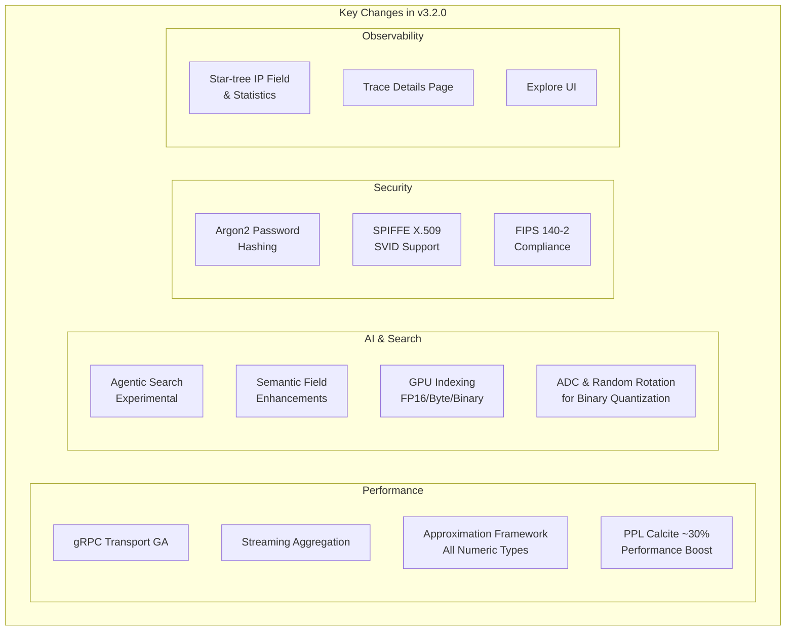

---
tags:
  - indexing
  - k-nn
  - neural-search
  - observability
  - performance
  - search
  - security
  - sql
---

# OpenSearch v3.2.0 Release Summary

## Summary

OpenSearch 3.2.0 delivers major advancements in search performance, AI capabilities, and security. Key highlights include gRPC Transport reaching GA status, expanded GPU support for vector search, experimental Agentic Search for natural language queries, streaming aggregation for memory-efficient high-cardinality workloads, and enhanced semantic field configuration. The release also brings significant PPL/SQL engine improvements, new security features including Argon2 password hashing and SPIFFE authentication, and comprehensive infrastructure updates across the ecosystem.

## Highlights

## New Features

| Feature | Description | Report |
|---------|-------------|--------|
| gRPC Transport GA | Production-ready gRPC transport with plugin extensibility and proper status codes | Details |
| Agentic Search | [Experimental] Natural language search with LLM-powered query translation | Details |
| Streaming Aggregation | Memory-efficient aggregation via segment-level streaming to coordinator | Details |
| GPU Indexing (FP16/Byte/Binary) | Extended GPU acceleration for additional vector types | Details |
| ADC & Random Rotation | Improved recall for binary quantized indices | Details |
| Argon2 Password Hashing | Modern memory-hard password hashing algorithm | Details |
| SPIFFE X.509 SVID Support | Workload identity authentication via SPIFFE | Details |
| Semantic Version Field Type | New `version` field type for semantic versioning | Details |
| Combined Fields Query | BM25F scoring for multi-field text search | Details |
| Execute Tool API | Direct tool execution without agent orchestration | Details |
| Memory Container APIs | AI-oriented persistent memory for agents | Details |
| Job Scheduler REST APIs | List jobs and locks via REST endpoints | Details |
| Explore UI | New data exploration plugin with auto-visualization | Details |
| Trace Details Page | Dedicated trace investigation with Gantt chart | Details |
| Flow Framework Utilities | JsonToJson Recommender and Transformer | Details |

## Improvements

| Area | Description | Report |
|------|-------------|--------|
| Semantic Field | knn_vector config, batch size, prune strategies, chunking, embedding reuse | Details |
| Hybrid Query | Upper bound for min-max normalization, inner hits with collapse | Details |
| Approximation Framework | Extended to all numeric types (int, float, double, half_float, unsigned_long) | Details |
| PPL/SQL Engine | Expanded pushdown, RelJson security, ~30% performance improvement | Details |
| Star-tree Index | IP field search support and query statistics | Details |
| Security Performance | Precomputed privileges toggle, optimized wildcard matching | Details |
| FIPS Compliance | BC-FIPS libraries, OpenSAML shadow JAR isolation | Details |
| Anomaly Detection | Support for >1 hour intervals, centralized resource access control | Details |
| ML Commons Connectors | Pre/post-process validation, improved URI validation | Details |
| Search Relevance Workbench | New default UI, dashboard visualization, task scheduling | Details |
| Query Insights | MDS support for inflight queries, 30s default auto-refresh | Details |
| Lucene-on-Faiss | ADC support for memory-optimized binary quantized search | Details |

## Bug Fixes

| Fix | Description | PR |
|-----|-------------|-----|
| SecureRandom Blocking | Fix startup freeze on low-entropy systems | [#18xxx](https://github.com/opensearch-project/OpenSearch/pull/18xxx) |
| HTTP/2 Reactor-Netty | Fix communication when secure transport enabled | Details |
| Replication Lag | Fix segment replication lag computation | Details |
| Search Scoring | Fix max_score null when sorting by _score | Details |
| Field Mapping | Fix ignore_malformed override and scaled_float | Details |
| Query String | Fix field alias, COMPLEMENT flag, regex handling | Details |
| Alerting MGet | Fix MGet bug, randomize fan-out distribution | Details |
| Flow Framework | Memory fixes, error handling, race condition fix | Details |
| Neural Search Collapse | Fix collapse bug with knn query deduplication | [#1413](https://github.com/opensearch-project/neural-search/pull/1413) |
| CVE-2025-48734 | commons-beanutils security fix | Details |

## Breaking Changes

| Change | Migration | Report |
|--------|-----------|--------|
| PPL v2 Fallback Disabled | Set `plugins.calcite.fallback.allowed=true` to re-enable | Details |
| gRPC Package Rename | Update imports from `org.opensearch.plugin.transport.grpc` to `org.opensearch.transport.grpc` | Details |

## Experimental Features

| Feature | Description | Enable Setting |
|---------|-------------|----------------|
| Agentic Search | Natural language query translation | `plugins.neural_search.agentic_search_enabled` |
| Streaming Aggregation | Memory-efficient high-cardinality aggregations | `opensearch.experimental.feature.transport.stream.enabled` |
| Clusterless Mode | Startup without cluster coordination | Experimental flag |
| Security Config Management | Versioned security configuration | Experimental flag |
| Agentic Memory | AI-oriented memory containers | `plugins.ml_commons.agentic_memory.enabled` |

## Infrastructure Updates

Notable infrastructure changes across the ecosystem:

- **Gradle**: Upgraded to 8.14/8.14.3 across 17+ repositories
- **JDK**: CI support for JDK 24
- **Lucene**: Updated to 10.2.2
- **Log4j**: Updated to 2.25.1
- **BouncyCastle**: Replaced with BC-FIPS for FIPS compliance
- **Maven**: Snapshot publishing endpoint migration

## Dependencies

Notable dependency updates from the official release notes:

- Lucene 10.2.2
- Log4j 2.25.1
- BouncyCastle (BC-FIPS)
- OkHttp 5.1.0
- commons-beanutils 1.11.0 (CVE fix)
- commons-lang3 3.18.0 (CVE fix)

## References

- [Official Release Notes](https://github.com/opensearch-project/opensearch-build/blob/main/release-notes/opensearch-release-notes-3.2.0.md)
- [OpenSearch Core Release Notes](https://github.com/opensearch-project/OpenSearch/blob/main/release-notes/opensearch.release-notes-3.2.0.md)
- [OpenSearch Dashboards Release Notes](https://github.com/opensearch-project/OpenSearch-Dashboards/blob/main/release-notes/opensearch-dashboards.release-notes-3.2.0.md)
- [Release Artifacts](https://opensearch.org/artifacts/by-version/#release-3-2-0)
- [Feature Reports](features/)
