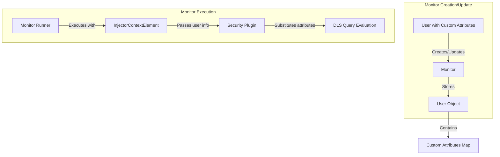

---
tags:
  - ml
  - observability
  - search
  - security
---

# Alerting User Custom Attributes

## Summary

This release adds support for leveraging user custom attributes in Alerting monitors. When a monitor is created or updated, the user's custom attributes are now saved with the monitor and passed to the Security plugin during monitor execution. This enables Document-Level Security (DLS) and Field-Level Security (FLS) queries that rely on parameter substitution with custom attributes to work correctly when monitors execute queries.

## Details

### What's New in v3.3.0

Prior to this change, Alerting monitors failed when users had roles with DLS queries using parameter substitution (e.g., `${attr.internal.team}`). The monitor queries would fail because the custom attributes were not available during execution, resulting in malformed queries.

This enhancement:
1. Saves user custom attributes when a monitor is created or updated
2. Passes custom attributes to the Security plugin during monitor execution via `InjectorContextElement`
3. Enables DLS/FLS queries with parameter substitution to work correctly

### Technical Changes

#### Architecture Changes



#### Data Model Changes

| Change | Before | After |
|--------|--------|-------|
| User custom attributes type | `List<String>` (attribute names only) | `Map<String, String>` (key-value pairs) |
| Field name | `customAttNames` | `customAttributes` |

#### Modified Components

| Component | Description |
|-----------|-------------|
| `TransportIndexMonitorAction` | Now stores `user.customAttributes` instead of `user.customAttNames` |
| `TransportIndexWorkflowAction` | Updated to use `customAttributes` map |
| `BucketLevelMonitorRunner` | Passes `monitor.user` to `InjectorContextElement` |
| `QueryLevelMonitorRunner` | Passes `monitor.user` to `InjectorContextElement` |

#### New Configuration

| Setting | Description | Default |
|---------|-------------|---------|
| `plugins.security.user_attribute_serialization.enabled` | Enables user attribute serialization for alerting | `true` (in integration tests) |

### Usage Example

When a user with custom attributes creates a monitor:

```json
// User has custom attribute: team=red
// Role has DLS query with parameter substitution:
{
  "term": { "team": "${attr.internal.team}" }
}

// Monitor query (match all)
POST _plugins/_alerting/monitors
{
  "type": "monitor",
  "name": "team-data-monitor",
  "monitor_type": "query_level_monitor",
  "inputs": [{
    "search": {
      "indices": ["team-data-*"],
      "query": {
        "query": { "match_all": {} }
      }
    }
  }],
  "triggers": [...]
}

// During execution, DLS query becomes:
{
  "term": { "team": "red" }
}
```

### Migration Notes

- Existing monitors will continue to work
- Monitors created by users with custom attributes will now properly respect DLS/FLS rules during execution
- No manual migration required

## Limitations

- Requires `plugins.security.user_attribute_serialization.enabled` to be set to `true` in the Security plugin
- Custom attributes must be defined for the user in the Security plugin configuration

## References

### Documentation
- [Alerting Security Documentation](https://docs.opensearch.org/3.0/observing-your-data/alerting/security/): How monitors access data with user permissions
- [Document-Level Security](https://docs.opensearch.org/3.0/security/access-control/document-level-security/): Parameter substitution in DLS queries

### Pull Requests
| PR | Description |
|----|-------------|
| [#1917](https://github.com/opensearch-project/alerting/pull/1917) | Adds support for leveraging user custom attributes in Alerting monitors |
| [#827](https://github.com/opensearch-project/common-utils/pull/827) | Common-utils changes for custom attributes support |
| [#5560](https://github.com/opensearch-project/security/pull/5560) | Security plugin changes for user attribute serialization |

### Issues (Design / RFC)
- [Issue #1829](https://github.com/opensearch-project/alerting/issues/1829): Bug report - Alerting does not work when user has role with parameter substitution in DLS

## Related Feature Report

- [Full feature documentation](../../../../features/alerting/alerting.md)
