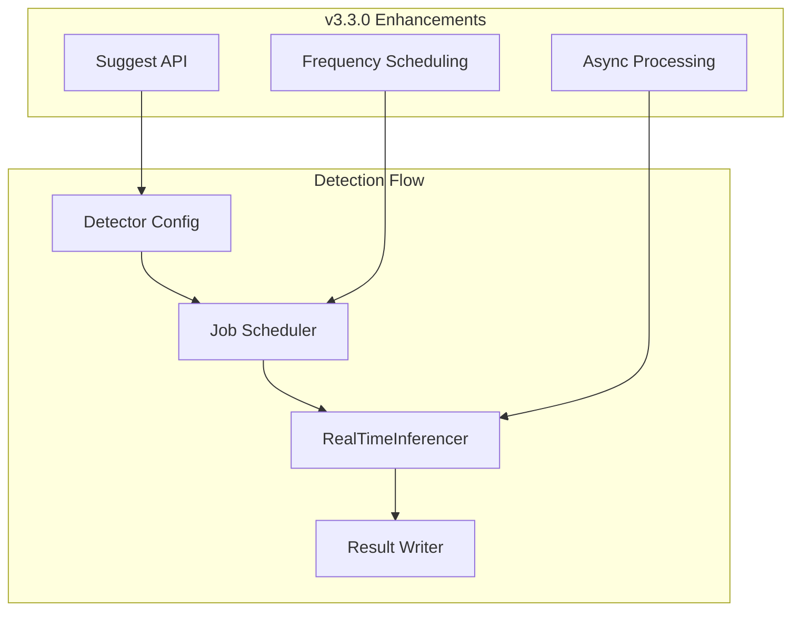

# Anomaly Detection Enhancements

## Summary

OpenSearch v3.3.0 introduces significant enhancements to the Anomaly Detection plugin, including a new Suggest API for automated detector configuration, frequency-based scheduling for real-time detection, and various bug fixes for improved stability. These changes enable more flexible detection intervals and provide AI-assisted configuration recommendations.

## Details

### What's New in v3.3.0

#### Frequency Scheduling for Real-time Detection

A new `frequency` parameter allows detectors to run at intervals different from the data aggregation interval. This enables scenarios where data is aggregated over longer periods but detection runs more frequently to catch anomalies sooner.

Key changes:
- Added `Config.frequency` field with validation (must be a multiple of interval, bounded by `MAX_FREQUENCY_MULTIPLE`)
- Frequency defaults to the detection interval if not specified
- Reworked `RealTimeInferencer` for async processing with listeners
- Feature backfill fills gaps between last model input and current sample when within bounds
- Batch result indexing via `saveAllResults` and `ResultWriteWorker.putAll` for handling multiple data points

#### Suggest API for Anomaly Detection

A new Suggest API provides automated recommendations for detector configuration, similar to the existing forecasting suggest functionality. This helps users configure optimal detection parameters based on their data characteristics.

- New endpoint: `POST /_plugins/_anomaly_detection/detectors/_suggest/{suggestType}`
- Analyzes data patterns to recommend interval, frequency, and other settings
- Integrated with OpenSearch Dashboards for assisted detector setup

### Technical Changes

#### Architecture Changes



#### New Configuration

| Setting | Description | Default |
|---------|-------------|---------|
| `frequency` | Detection execution frequency (must be multiple of interval) | Same as `detection_interval` |
| `history` | Historical data window for model training | Auto-calculated |

#### API Changes

| Endpoint | Method | Description |
|----------|--------|-------------|
| `/_plugins/_anomaly_detection/detectors/_suggest/{suggestType}` | POST | Get configuration suggestions |
| `/_plugins/_anomaly_detection/detectors/_suggest/{suggestType}/{dataSourceId}` | POST | Get suggestions for specific data source |

### Usage Example

#### Using the Suggest API

```json
POST /_plugins/_anomaly_detection/detectors/_suggest/interval
{
  "indices": ["server-metrics-*"],
  "time_field": "timestamp",
  "feature_attributes": [
    {
      "feature_name": "avg_cpu",
      "feature_enabled": true,
      "aggregation_query": {
        "avg_cpu": {
          "avg": {
            "field": "cpu_usage"
          }
        }
      }
    }
  ]
}
```

#### Creating a Detector with Frequency

```json
POST /_plugins/_anomaly_detection/detectors
{
  "name": "high-frequency-detector",
  "time_field": "timestamp",
  "indices": ["server-metrics-*"],
  "feature_attributes": [
    {
      "feature_name": "avg_cpu",
      "feature_enabled": true,
      "aggregation_query": {
        "avg_cpu": { "avg": { "field": "cpu_usage" } }
      }
    }
  ],
  "detection_interval": {
    "period": { "interval": 10, "unit": "Minutes" }
  },
  "frequency": {
    "period": { "interval": 5, "unit": "Minutes" }
  }
}
```

### Dashboards UI Enhancements

The Anomaly Detection Dashboards plugin includes corresponding UI updates:

- **Suggest Parameters Button**: Calls the Suggest API to auto-populate operational settings
- **Operation Settings Panel**: Moved from "Define detector" to "Configure Model" page for better workflow
- **Frequency and History Fields**: New fields in the Operation Settings section
- **Stopped Detector Error Display**: Shows error messages when detectors are stopped

### Bug Fixes

- **STOPPED State Race Condition**: Fixed race condition during rapid start/stop sequences where delayed threads could incorrectly overwrite state to `RUNNING`
- **Frequency Optional**: Made frequency optional to avoid requiring it for forecasting where no use case exists
- **Flaky Integration Tests**: Fixed `RealTimeFrequencySmokeIT` and `AnomalyDetectorRestApiIT` for improved test stability
- **Protected Resource Types**: Added new node setting for protected types to fix test failures after security plugin changes
- **Long-running Test Exclusion**: Excluded long-running tests from `integTestRemote` to prevent timeout failures

## Limitations

- Frequency must be a multiple of the detection interval
- Frequency is bounded by `MAX_FREQUENCY_MULTIPLE` to prevent excessive execution
- Suggest API recommendations are based on data analysis and may need manual adjustment for specific use cases

## References

### Documentation
- [Anomaly Detection Documentation](https://docs.opensearch.org/3.0/observing-your-data/ad/index/): Official documentation
- [Anomaly Detection API](https://docs.opensearch.org/3.0/observing-your-data/ad/api/): API reference
- [Anomaly Detector Suggestions](https://docs.opensearch.org/3.0/dashboards/dashboards-assistant/suggest-anomaly-detector/): AI-assisted detector suggestions

### Pull Requests
| PR | Repository | Description |
|----|------------|-------------|
| [#1562](https://github.com/opensearch-project/anomaly-detection/pull/1562) | anomaly-detection | Add frequency scheduling in real time |
| [#1563](https://github.com/opensearch-project/anomaly-detection/pull/1563) | anomaly-detection | Adding AD suggest API |
| [#1098](https://github.com/opensearch-project/anomaly-detection-dashboards-plugin/pull/1098) | anomaly-detection-dashboards-plugin | Add Suggest parameters button + move operational settings to Configure Model |
| [#1565](https://github.com/opensearch-project/anomaly-detection/pull/1565) | anomaly-detection | Make frequency optional; fix STOPPED state; add ecommerce tests |
| [#1571](https://github.com/opensearch-project/anomaly-detection/pull/1571) | anomaly-detection | Fix flaky ITs |
| [#1572](https://github.com/opensearch-project/anomaly-detection/pull/1572) | anomaly-detection | Fix tests by adding the new node setting for protected types |
| [#1579](https://github.com/opensearch-project/anomaly-detection/pull/1579) | anomaly-detection | Exclude long-running tests from integTestRemote |

## Related Feature Report

- [Full feature documentation](../../../features/anomaly-detection/anomaly-detection.md)
