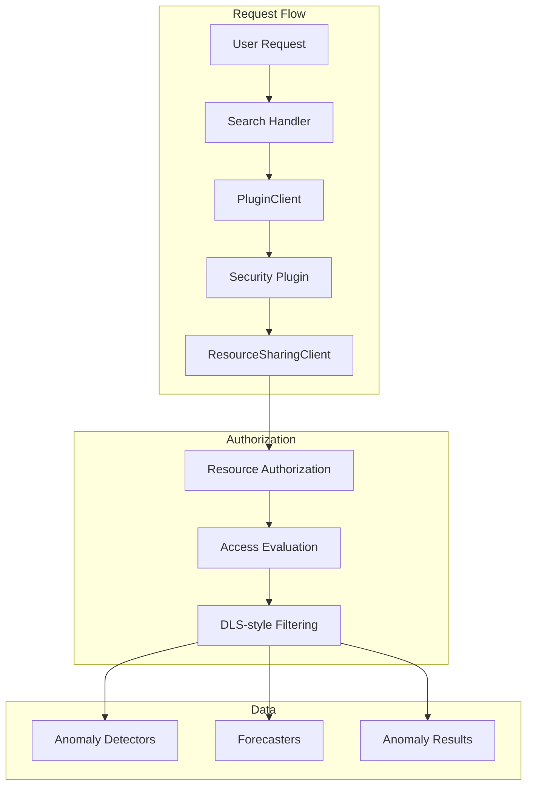

# Anomaly Detection Resource Authorization

## Summary

This bugfix updates the Anomaly Detection plugin to properly consume the new resource authorization framework introduced in OpenSearch 3.3. The search handler now uses `PluginClient` to enable DLS-style filtering for protected resources, ensuring that users can only access anomaly detectors and forecasters they have permission to view or modify.

## Details

### What's New in v3.3.0

The Anomaly Detection plugin now integrates with the Security plugin's resource sharing and access control framework. This enables fine-grained, owner-controlled sharing of anomaly detectors and forecasters, replacing the legacy backend-role-based visibility model.

### Technical Changes

#### Architecture Changes



#### New Components

| Component | Description |
|-----------|-------------|
| `PluginClient` | Executes transport actions as the plugin's system subject for resource authorization |
| `AD_RESOURCE_TYPE` | Resource type identifier (`anomaly-detector`) for resource-access-control |
| `FORECAST_RESOURCE_TYPE` | Resource type identifier (`forecaster`) for resource-access-control |
| `plugin-additional-permissions.yml` | Defines permissions required by the plugin for security authentication |
| `resource-action-groups.yml` | Defines action groups (access levels) for resource sharing |

#### New Configuration

| Setting | Description | Default |
|---------|-------------|---------|
| `plugins.security.experimental.resource_sharing.enabled` | Enables resource sharing globally | `false` |
| `plugins.security.experimental.resource_sharing.protected_types` | Resource types using resource-level authorization | `[]` |

#### API Changes

The `IndexAnomalyDetectorRequest` and `IndexForecasterRequest` classes now implement the `DocRequest` interface, providing:
- `index()`: Returns the config index name
- `id()`: Returns the detector/forecaster ID

### Usage Example

Enable resource sharing for anomaly detectors:

```yaml
# opensearch.yml
plugins.security.experimental.resource_sharing.enabled: true
plugins.security.experimental.resource_sharing.protected_types: ["anomaly-detector", "forecaster"]
```

### Migration Notes

When resource sharing is enabled:
1. Existing detectors remain accessible to their creators
2. The legacy `filter_by_backend_roles` setting is superseded by resource-level authorization
3. Owners can share detectors with specific users or roles using the Security API

## Limitations

- Resource sharing is an experimental feature in v3.3.0
- Settings require cluster restart to change (dynamic settings available in v3.4.0)
- Migration API may be needed for existing resources

## References

### Documentation
- [Anomaly Detection Security](https://docs.opensearch.org/3.0/observing-your-data/ad/security/): Official documentation

### Blog Posts
- [Introducing Resource Sharing](https://opensearch.org/blog/introducing-resource-sharing-a-new-access-control-model-for-opensearch/): Blog post on the new access control model

### Pull Requests
| PR | Description |
|----|-------------|
| [#1546](https://github.com/opensearch-project/anomaly-detection/pull/1546) | Updates search handler to consume resource authz and updates resource authz related tests |

### Issues (Design / RFC)
- [Security Issue #5608](https://github.com/opensearch-project/security/issues/5608): Feature proposal for resource action groups

## Related Feature Report

- [Full feature documentation](../../../features/anomaly-detection/anomaly-detection.md)
