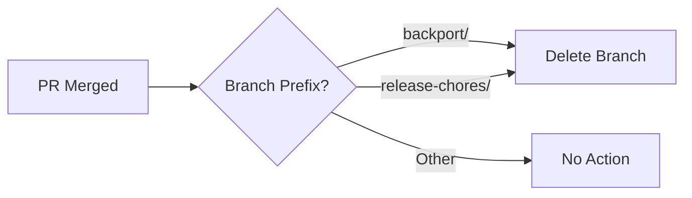

# CI/CD Workflow Updates

## Summary

This release updates the `delete_backport_branch` workflow in the security and ml-commons plugins to automatically delete `release-chores/` branches after merge, in addition to the existing `backport/` branch cleanup. The workflow implementation is also modernized by replacing the deprecated `SvanBoxel/delete-merged-branch` action with the official `actions/github-script` action.

## Details

### What's New in v3.3.0

The `delete_backport_branch` workflow is enhanced to handle two types of automatically-created branches:

1. **backport/** branches - Created by the backport automation for cherry-picking changes to release branches
2. **release-chores/** branches - Created automatically for individual release notes

Previously, only `backport/` branches were automatically deleted after merge, leaving `release-chores/` branches to accumulate in the repository.

### Technical Changes

#### Workflow Condition Update

The workflow trigger condition is updated to match both branch prefixes:

```yaml
# Before
if: startsWith(github.event.pull_request.head.ref,'backport/')

# After
if: startsWith(github.event.pull_request.head.ref,'backport/') || startsWith(github.event.pull_request.head.ref,'release-chores/')
```

#### Action Modernization

The deprecated `SvanBoxel/delete-merged-branch` action is replaced with `actions/github-script@v7`:

```yaml
# Before
- name: Delete merged branch
  uses: SvanBoxel/delete-merged-branch@main
  env:
    GITHUB_TOKEN: ${{ secrets.GITHUB_TOKEN }}

# After
- name: Delete merged branch
  uses: actions/github-script@v7
  with:
    script: |
      github.rest.git.deleteRef({
        owner: context.repo.owner,
        repo: context.repo.repo,
        ref: `heads/${context.payload.pull_request.head.ref}`,
      })
```

#### Permissions Update

Explicit permissions are added to the workflow job:

| Repository | Permission |
|------------|------------|
| security | `contents: write` |
| ml-commons | `pull-requests: write` |

### Usage Example

The workflow triggers automatically when a PR is merged. No manual intervention is required.



## Limitations

- The workflow only runs on PR merge events
- Branch deletion requires appropriate permissions (contents:write or pull-requests:write)
- The ml-commons PR (#4090) is still open and not yet merged

## References

### Documentation
- [security PR #5548](https://github.com/opensearch-project/security/pull/5548): Main implementation for security plugin
- [ml-commons PR #4090](https://github.com/opensearch-project/ml-commons/pull/4090): Implementation for ml-commons plugin
- [actions/github-script](https://github.com/actions/github-script): Official GitHub Action for running scripts

### Pull Requests
| PR | Repository | Description | Status |
|----|------------|-------------|--------|
| [#5548](https://github.com/opensearch-project/security/pull/5548) | security | Update delete_backport_branch workflow | Merged |
| [#4090](https://github.com/opensearch-project/ml-commons/pull/4090) | ml-commons | Update delete_backport_branch workflow | Open |

## Related Feature Report

- [Full feature documentation](../../../../features/ci/cd-build-improvements.md)
