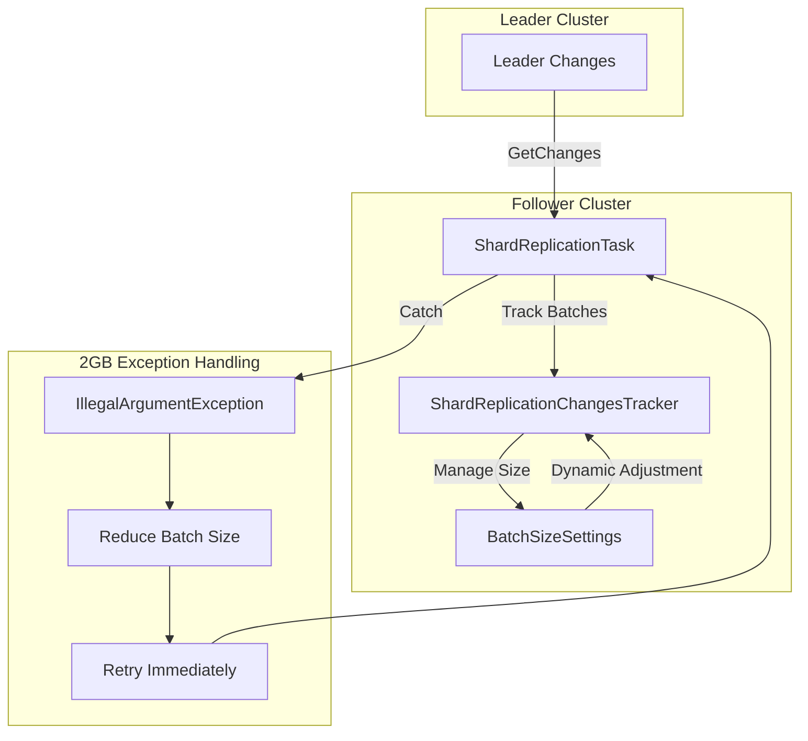

# Cross-Cluster Replication Fixes

## Summary

This release fixes a critical bug where replication of large documents could breach the 2GB size limit of `ReleasableBytesStreamOutput`, causing replication failures. The fix introduces dynamic batch size adjustment and a new index-level batch size setting for fine-grained control.

## Details

### What's New in v3.3.0

The fix addresses a scenario where the follower cluster fetches data from the leader node and the total size of operations exceeds the 2GB limit of `ReleasableBytesStreamOutput`. Previously, this would cause an `IllegalArgumentException` and the replication would retry indefinitely with the same batch size, always failing.

### Technical Changes

#### Architecture Changes



#### New Components

| Component | Description |
|-----------|-------------|
| `BatchSizeSettings` | Helper class to manage batch size settings with fallback from index-level to cluster-level |
| `MIN_OPS_BATCH_SIZE` | Constant defining minimum batch size (16 operations) |

#### New Configuration

| Setting | Description | Default |
|---------|-------------|---------|
| `index.plugins.replication.follower.ops_batch_size` | Index-level batch size setting for fine-grained control per index | 50000 |
| `plugins.replication.follower.index.ops_batch_size` | Cluster-level batch size setting (existing) | 50000 |

#### API Changes

No API changes. The fix is transparent to users and operates automatically.

### Usage Example

#### Setting Index-Level Batch Size

For indexes with large documents, you can configure a smaller batch size:

```bash
PUT follower-index/_settings
{
  "index.plugins.replication.follower.ops_batch_size": 10000
}
```

#### Cluster-Level Setting (Existing)

```bash
PUT _cluster/settings
{
  "persistent": {
    "plugins.replication.follower.index.ops_batch_size": 25000
  }
}
```

### Migration Notes

No migration required. The fix is backward compatible and automatically handles 2GB limit exceptions by:

1. Detecting the specific `ReleasableBytesStreamOutput cannot hold more than 2GB` exception
2. Reducing the batch size by half (minimum 16 operations)
3. Retrying immediately without delay
4. Resetting to original batch size after successful operations

## Limitations

- Dynamic batch size reduction is per-node and not persisted; if the node restarts, the dynamic adjustment is lost
- The minimum batch size is 16 operations, which may still exceed 2GB for extremely large documents
- Index-level settings take precedence over cluster-level settings

## References

### Documentation
- [Replication settings documentation](https://docs.opensearch.org/3.0/tuning-your-cluster/replication-plugin/settings/)
- [Cross-cluster replication documentation](https://docs.opensearch.org/3.0/tuning-your-cluster/replication-plugin/index/)

### Pull Requests
| PR | Description |
|----|-------------|
| [#1580](https://github.com/opensearch-project/cross-cluster-replication/pull/1580) | Fix: Replication of large documents breaches the size limit (2GB) of ReleasableBytesStreamOutput |

### Issues (Design / RFC)
- [Issue #1568](https://github.com/opensearch-project/cross-cluster-replication/issues/1568): Bug report for 2GB limit breach

## Related Feature Report

- [Full feature documentation](../../../../features/cross-cluster-replication/cross-cluster-replication.md)
