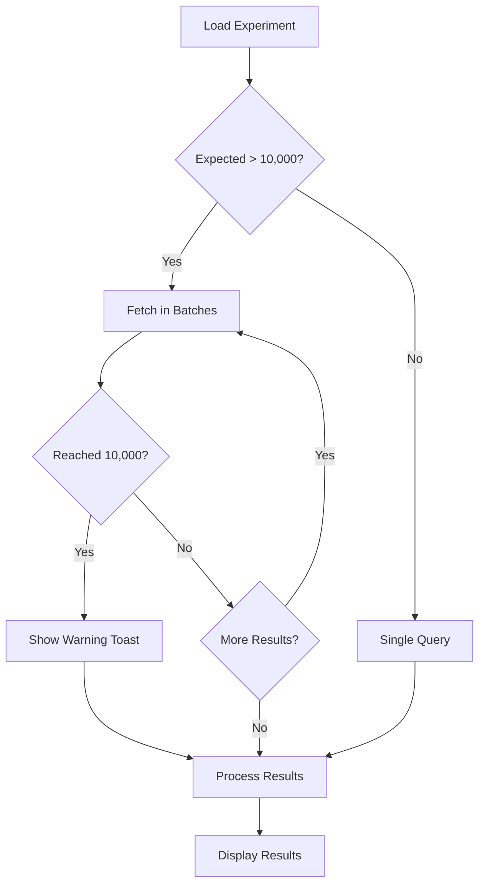

---
tags:
  - dashboards
  - indexing
  - performance
  - search
---

# Search Comparison Dashboards

## Summary

This release brings usability improvements to the Search Comparison Dashboards in OpenSearch Dashboards. The changes include improved color coding for search result comparisons, fixes for the pairwise comparison view to display more than 10 results, and handling of large experiment results in the hybrid optimizer.

## Details

### What's New in v3.3.0

Three enhancements improve the search comparison experience:

1. **Improved Color Coding**: The color scheme for search result comparisons has been simplified to be less misleading. Red/green colors that incorrectly implied quality improvements/declines have been replaced with neutral colors.

2. **Pairwise Comparison Fix**: The query set comparison view now correctly displays more than 10 results when the K value exceeds 10.

3. **Large Experiment Results Handling**: The hybrid optimizer experiment view now handles large result sets (up to 10,000 results) with pagination and user warnings.

### Technical Changes

#### Color Coding Improvements (PR #632)

The visual comparison component was updated to use a simplified, neutral color scheme:

| Element | Old Color | New Color |
|---------|-----------|-----------|
| Common results | Blue (#93C5FD) | Green (#d8f9d5) |
| Left-only results | Yellow | Blue (#859fd1) |
| Right-only results | Purple | Lime (#abeb14) |
| Rank changes | Red/Green | Unified green |

The style selector dropdown was removed, leaving only one consistent visualization style.

#### Pairwise Comparison Size Fix (PR #637)

Added explicit `size` parameter to search queries in the pairwise experiment view:

```typescript
const query1 = {
  index: searchConfigurations[0].index,
  size: snapshot1.length,  // New: matches document IDs count
  query: {
    terms: {
      _id: snapshot1,
    },
  },
};
```

This ensures all requested documents are returned, not just the default 10.

#### Large Experiment Results (PR #645)

The hybrid optimizer experiment view now handles OpenSearch's `max_result_window` limit (10,000):

- Calculates expected result size based on query set size
- Uses pagination for large result sets
- Displays warning when results are truncated due to the limit



### Usage Example

The pairwise comparison now correctly handles larger result sets:

```json
// Query with K=25 now returns all 25 results per query
{
  "index": "my-index",
  "size": 25,
  "query": {
    "terms": {
      "_id": ["doc1", "doc2", ..., "doc25"]
    }
  }
}
```

### Migration Notes

No migration required. The changes are backward compatible and automatically apply to existing experiments.

## Limitations

- Hybrid optimizer experiments with more than 10,000 evaluation results will only display the first 10,000 due to OpenSearch's `max_result_window` limit
- A warning toast is displayed when results are truncated

## References

### Documentation
- [Documentation](https://docs.opensearch.org/3.3/search-plugins/search-relevance/comparing-search-results/): Comparing search results

### Pull Requests
| PR | Description |
|----|-------------|
| [#632](https://github.com/opensearch-project/dashboards-search-relevance/pull/632) | Improve color coding for search result comparison |
| [#637](https://github.com/opensearch-project/dashboards-search-relevance/pull/637) | Allow more than 10 results in pairwise comparison view |
| [#645](https://github.com/opensearch-project/dashboards-search-relevance/pull/645) | Show first 10,000 experiment results |

### Issues (Design / RFC)
- [Issue #157](https://github.com/opensearch-project/search-relevance/issues/157): No evaluation results loaded for extensive experiments

## Related Feature Report

- [Full feature documentation](../../../../features/dashboards-search-relevance/search-comparison.md)
