# Flow Framework Fixes

## Summary

This release fixes integration test failures in Flow Framework when running with tenant awareness enabled. The fix ensures ML Commons indices are pre-created before running tenant-aware integration tests, addressing a compatibility issue introduced by changes in ML Commons that assume indices are pre-populated in multi-tenant environments.

## Details

### What's New in v3.3.0

The fix addresses failing tenant-aware integration tests caused by ML Commons no longer automatically creating indices when tenant awareness is enabled. In production multi-tenant environments, external setup scripts are expected to create these indices, but integration tests require them to be created programmatically.

### Technical Changes

#### Problem Background

When tenant awareness is enabled in OpenSearch:
1. ML Commons assumes indices are pre-populated by external setup scripts
2. Flow Framework's tenant-aware integration tests validate tenant ID handling with ML Commons
3. Tests were failing because required ML Commons indices (like the config index) didn't exist

```mermaid
flowchart TB
    subgraph "Before Fix"
        TA1[Tenant Awareness Enabled]
        MLC1[ML Commons]
        FF1[Flow Framework Tests]
        FAIL[Tests Fail - Missing Indices]
        
        TA1 --> MLC1
        MLC1 -->|No Auto-Create| FF1
        FF1 --> FAIL
    end
    
    subgraph "After Fix"
        TA2[Tenant Awareness Enabled]
        PRE[Pre-create ML Indices]
        MLC2[ML Commons]
        FF2[Flow Framework Tests]
        PASS[Tests Pass]
        
        TA2 --> PRE
        PRE --> MLC2
        MLC2 --> FF2
        FF2 --> PASS
    end
```



#### New Components

| Component | Description |
|-----------|-------------|
| `createMLCommonsIndices()` | New helper method in `FlowFrameworkTenantAwareRestTestCase` that iterates through `MLIndex` enum and creates each index with default settings |

#### Implementation Details

The fix adds a new method `createMLCommonsIndices()` to the base test class that:
1. Iterates through all `MLIndex` enum values from ML Commons
2. Creates each index using its defined mapping
3. Handles `resource_already_exists_exception` gracefully to allow idempotent execution

```java
protected static void createMLCommonsIndices() throws Exception {
    for (MLIndex mlIndex : MLIndex.values()) {
        String requestPath = "/" + mlIndex.getIndexName();
        String requestBody = "{\"mappings\":" + mlIndex.getMapping() + "}";
        try {
            TestHelpers.makeRequest(client(), "PUT", requestPath, null, requestBody, null);
        } catch (ResponseException e) {
            if (e.getMessage().contains("resource_already_exists_exception")) {
                continue;
            }
            throw e;
        }
    }
}
```

#### Modified Test Classes

| Test Class | Change |
|------------|--------|
| `RestWorkflowProvisionTenantAwareIT` | Added `createMLCommonsIndices()` call before `createFlowFrameworkIndices()` |
| `RestWorkflowStateTenantAwareIT` | Added `createMLCommonsIndices()` call before `createFlowFrameworkIndices()` |
| `RestWorkflowTenantAwareIT` | Added `createMLCommonsIndices()` call before `createFlowFrameworkIndices()` |

#### Build Configuration

Added `json-schema-validator` as a `compileOnly` dependency to access `MLIndex` class mappings at test runtime:

```gradle
compileOnly('com.networknt:json-schema-validator:1.4.0') {
    exclude group: 'com.fasterxml.jackson.core', module: 'jackson-databind'
    exclude group: 'com.fasterxml.jackson.dataformat', module: 'jackson-dataformat-yaml'
    exclude group: 'org.yml', module: 'snakeyaml'
    exclude group: 'org.slf4j', module: 'slf4j-api'
}
```

### Usage Example

The fix is automatically applied when running tenant-aware integration tests. No user action is required.

```bash
# Run tenant-aware integration tests (fix is applied automatically)
./gradlew integTestTenantAware
```

### Migration Notes

No migration required. This is an internal test infrastructure fix that does not affect production deployments.

## Limitations

- This fix only applies to integration test environments
- Production multi-tenant deployments still require external index setup scripts
- The fix assumes ML Commons is available and the `MLIndex` enum is accessible

## References

### Documentation
- [Flow Framework Documentation](https://docs.opensearch.org/3.0/automating-configurations/index/)
- [ML Commons PR #4089](https://github.com/opensearch-project/ml-commons/pull/4089): Related ML Commons change that assumes pre-populated indices

### Pull Requests
| PR | Description |
|----|-------------|
| [#1217](https://github.com/opensearch-project/flow-framework/pull/1217) | Pre-create ML Commons indices for Tenant Aware tests |

### Issues (Design / RFC)
- [Issue #1216](https://github.com/opensearch-project/flow-framework/issues/1216): Tenant Aware Integ Tests failing because indices aren't being created
- [ML Commons Issue #3860](https://github.com/opensearch-project/ml-commons/issues/3860): Related ML Commons issue

## Related Feature Report

- [Full feature documentation](../../../../features/flow-framework/flow-framework.md)
