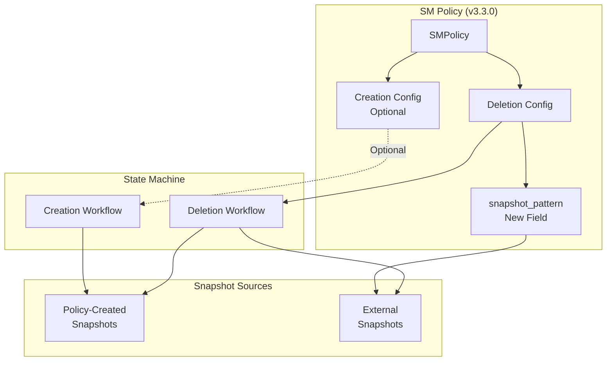

# Snapshot Management Enhancements

## Summary

OpenSearch v3.3.0 introduces significant enhancements to Snapshot Management (SM), enabling deletion-only policies and snapshot pattern support. These changes allow users to manage externally created snapshots and create cleanup-only workflows without requiring automatic snapshot creation.

## Details

### What's New in v3.3.0

#### 1. Optional Creation Workflow

The `creation` field in SM policies is now optional, enabling deletion-only policies. Previously, SM policies required both creation and deletion configurations. Now users can create policies that only delete snapshots based on retention conditions.

**Key Changes:**
- Made `creation` field optional in `SMPolicy`
- Added version compatibility checks (`Version.V_3_3_0`) for backward compatibility
- Updated JSON parsing and serialization to handle nullable creation workflows

#### 2. Snapshot Pattern Support

A new `snapshot_pattern` field in the deletion configuration allows SM policies to include externally created snapshots in deletion workflows.

**Key Changes:**
- Added `snapshotPattern` field to `SMPolicy.Deletion`
- Enhanced deletion states to combine policy-created and pattern-matched snapshots
- Applied deletion conditions (`max_age`, `min_count`) across all matching snapshots

#### 3. ISM Snapshot Action Fix

The ISM snapshot action now excludes global state by default, preventing potential security issues when restoring snapshots.

### Technical Changes

#### Architecture Changes



#### New Configuration

| Setting | Description | Default |
|---------|-------------|---------|
| `deletion.snapshot_pattern` | Glob pattern to match external snapshots for deletion | `null` |

#### API Changes

**Deletion-Only Policy Example:**
```json
POST _plugins/_sm/policies/cleanup-policy
{
  "description": "Deletion-only SM policy",
  "deletion": {
    "schedule": {
      "cron": {
        "expression": "0 2 * * *",
        "timezone": "UTC"
      }
    },
    "condition": {
      "max_age": "14d",
      "min_count": 2
    },
    "snapshot_pattern": "external-backup-*"
  },
  "snapshot_config": {
    "repository": "my-repo"
  }
}
```

**Policy with Snapshot Pattern:**
```json
POST _plugins/_sm/policies/combined-policy
{
  "description": "SM policy with snapshot pattern",
  "creation": {
    "schedule": {
      "cron": {
        "expression": "0 1 * * *",
        "timezone": "UTC"
      }
    }
  },
  "deletion": {
    "schedule": {
      "cron": {
        "expression": "0 2 * * *",
        "timezone": "UTC"
      }
    },
    "condition": {
      "max_age": "30d",
      "min_count": 3
    },
    "snapshot_pattern": "external-*"
  },
  "snapshot_config": {
    "repository": "my-repo"
  }
}
```

### Use Cases Enabled

1. **Cleanup-only workflows**: Delete old snapshots without automatic creation
2. **External snapshot management**: Include snapshots created by external tools in retention policies
3. **Flexible policy configurations**: Support creation-only, deletion-only, or combined workflows

### Migration Notes

- Existing policies with required creation fields continue to work unchanged
- Version checks ensure proper serialization/deserialization across different versions
- No breaking changes to existing APIs or data structures
- No data migration required

## Limitations

- Deletion-only policies require a schedule to be explicitly provided (cannot inherit from creation)
- Snapshot patterns use simple glob matching, not full regex support
- Pattern-matched snapshots are combined with policy snapshots for deletion condition evaluation

## References

### Documentation
- [Snapshot Management Documentation](https://docs.opensearch.org/3.0/tuning-your-cluster/availability-and-recovery/snapshots/snapshot-management/)
- [Snapshot Management API](https://docs.opensearch.org/3.0/tuning-your-cluster/availability-and-recovery/snapshots/sm-api/)

### Pull Requests
| PR | Description |
|----|-------------|
| [#1452](https://github.com/opensearch-project/index-management/pull/1452) | Add support in SM Plugin to delete snapshots created manually |
| [#1480](https://github.com/opensearch-project/index-management/pull/1480) | Do not include global state in snapshot step |

### Issues (Design / RFC)
- [Issue #867](https://github.com/opensearch-project/index-management/issues/867): Feature request for deletion-only SM policies
- [Issue #1479](https://github.com/opensearch-project/index-management/issues/1479): Bug report for ISM snapshot global state

## Related Feature Report

- [Full feature documentation](../../../features/index-management/snapshot-management.md)
