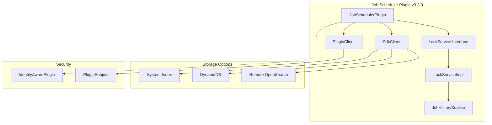

---
tags:
  - domain/data
  - component/server
  - indexing
  - observability
  - security
---
# Job Scheduler Enhancements

## Summary

OpenSearch v3.3.0 introduces significant enhancements to the Job Scheduler plugin, including a new Job History Service for tracking job execution history, improved security integration through the IdentityAwarePlugin extension, and support for remote metadata storage via the SdkClient. These changes improve observability, security, and deployment flexibility for scheduled jobs.

## Details

### What's New in v3.3.0

#### Job History Service

A new Job History Service enables tracking of job execution history, storing records in a dedicated system index (`.opendistro-job-scheduler-history`). This feature helps with troubleshooting by allowing users to see past execution history of all jobs.

Each history record contains:
- Job index name (which plugin is running the job)
- Job ID (specific job identifier)
- Start time
- End time
- Job completion status

The feature is controlled by a new setting `plugins.jobscheduler.history.enabled`.

#### LockService Interface Refactoring

The `LockService` class has been converted to an interface (`LockService`) with a concrete implementation (`LockServiceImpl`). This architectural change:
- Enables better dependency injection via Guice
- Allows for alternative implementations
- Improves testability

A new Guice module binds the `LockService` interface to `LockServiceImpl` for seamless integration with dependent plugins.

#### IdentityAwarePlugin Integration

The plugin now implements `IdentityAwarePlugin`, enabling proper security context handling:
- Introduces `PluginClient` that wraps the OpenSearch client
- Executes transport actions as the plugin's system subject
- Removes direct `ThreadContext.stashContext()` usage for cleaner security integration

#### Remote Metadata Client Support

Integration with `opensearch-remote-metadata-sdk` enables configurable metadata storage:
- Default: Local system index (existing behavior)
- Optional: Amazon DynamoDB
- Optional: Remote OpenSearch clusters

New configuration settings:
| Setting | Description |
|---------|-------------|
| `plugins.jobscheduler.remote_metadata_type` | Storage type (e.g., `AWS_DYNAMO_DB`) |
| `plugins.jobscheduler.remote_metadata_endpoint` | Remote endpoint URL |
| `plugins.jobscheduler.remote_metadata_region` | AWS region |
| `plugins.jobscheduler.remote_metadata_service_name` | Service name |
| `plugins.jobscheduler.tenant_aware` | Enable multi-tenancy |

### Technical Changes

#### Architecture Changes



#### New Components

| Component | Description |
|-----------|-------------|
| `JobHistoryService` | Records job execution history with start/end times |
| `StatusHistoryModel` | Data model for job history records |
| `PluginClient` | Client wrapper for executing actions as plugin subject |
| `LockService` (interface) | Interface for distributed locking |
| `LockServiceImpl` | Concrete implementation of LockService |
| `JobSchedulerGuiceModule` | Guice module for dependency injection |

#### New Configuration

| Setting | Description | Default |
|---------|-------------|---------|
| `plugins.jobscheduler.history.enabled` | Enable job history tracking | `false` |
| `plugins.jobscheduler.remote_metadata_type` | Remote metadata storage type | (empty) |
| `plugins.jobscheduler.remote_metadata_endpoint` | Remote metadata endpoint | (empty) |
| `plugins.jobscheduler.remote_metadata_region` | Remote metadata region | (empty) |
| `plugins.jobscheduler.remote_metadata_service_name` | Remote metadata service name | (empty) |
| `plugins.jobscheduler.tenant_aware` | Enable multi-tenancy | `false` |

#### System Indexes

| Index | Description |
|-------|-------------|
| `.opendistro-job-scheduler-lock` | Stores lock documents (existing) |
| `.opendistro-job-scheduler-history` | Stores job execution history (new) |

### Usage Example

#### Enabling Job History

```yaml
# opensearch.yml
plugins.jobscheduler.history.enabled: true
```

#### Configuring Remote Metadata Storage (DynamoDB)

```yaml
# opensearch.yml
plugins.jobscheduler.tenant_aware: true
plugins.jobscheduler.remote_metadata_type: AWS_DYNAMO_DB
plugins.jobscheduler.remote_metadata_endpoint: https://dynamodb.us-east-1.amazonaws.com
plugins.jobscheduler.remote_metadata_region: us-east-1
plugins.jobscheduler.remote_metadata_service_name: es
```

### Migration Notes

- The `LockService` class is now an interface; plugins using `LockService` directly should continue to work via Guice injection
- The new Guice module (`JobSchedulerGuiceModule`) automatically binds `LockService` to `LockServiceImpl`
- Job history is disabled by default; enable via `plugins.jobscheduler.history.enabled`
- Remote metadata storage requires pre-created tables/indexes when multi-tenancy is enabled

## Limitations

- Job history records are stored indefinitely; manual cleanup may be required
- Remote metadata storage (DynamoDB) requires pre-created tables before plugin startup
- Multi-tenancy support requires additional configuration

## References

### Documentation
- [Job Scheduler Documentation](https://docs.opensearch.org/3.0/monitoring-your-cluster/job-scheduler/index/)
- [opensearch-remote-metadata-sdk](https://github.com/opensearch-project/opensearch-remote-metadata-sdk): SDK for remote metadata storage

### Pull Requests
| PR | Description |
|----|-------------|
| [#814](https://github.com/opensearch-project/job-scheduler/pull/814) | Job History Service - creates history index recording job execution times |
| [#714](https://github.com/opensearch-project/job-scheduler/pull/714) | Make LockService an interface and replace usages of ThreadContext.stashContext |
| [#833](https://github.com/opensearch-project/job-scheduler/pull/833) | Create Guice module to bind LockService interface from SPI to LockServiceImpl |
| [#831](https://github.com/opensearch-project/job-scheduler/pull/831) | Introduce configurable remote metadata client and migrate LockService to SdkClient |
| [#810](https://github.com/opensearch-project/job-scheduler/pull/810) | Update delete_backport_branch workflow to include release-chores branches |

### Issues (Design / RFC)
- [Issue #808](https://github.com/opensearch-project/job-scheduler/issues/808): Feature request for Job execution History index
- [Issue #828](https://github.com/opensearch-project/job-scheduler/issues/828): Feature request for configurable client wrapper for remote metadata store

## Related Feature Report

- Full feature documentation
