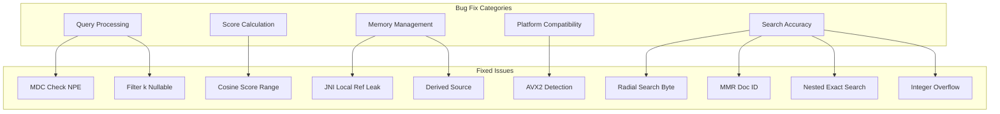

---
tags:
  - indexing
  - k-nn
  - performance
  - search
---

# k-NN Bug Fixes

## Summary

OpenSearch v3.3.0 includes 10 bug fixes for the k-NN plugin addressing issues in query processing, score calculation, memory management, platform compatibility, and search accuracy. These fixes improve stability and correctness for vector search operations.

## Details

### What's New in v3.3.0

This release addresses critical bugs across multiple k-NN components:



### Technical Changes

#### Query Processing Fixes

| Fix | Issue | Impact |
|-----|-------|--------|
| MDC Check NPE | Byte vector queries with filters failed when filter docs > k | Queries now use queryVector length when byteVector is null |
| Filter k Nullable | Filter queries failed due to non-nullable k parameter | k parameter is now nullable to support filter-only queries |

#### Score Calculation Fix

**Cosine Score Range in LuceneOnFaiss**: When memory optimized search was enabled with cosine similarity, scores could exceed 1.0 (expected range [0, 1)). The fix ensures proper score translation from inner product to cosine similarity.

#### Memory Management Fixes

| Fix | Description |
|-----|-------------|
| JNI Local Ref Leak | `Convert2dJavaObjectArrayAndStoreToFloatVector` didn't delete local references, causing memory leaks during indexing |
| Derived Source Deserialization | Non-JSON `_source` fields caused deserialization exceptions leading to red index status |

#### Platform Compatibility Fix

**AVX2 Detection**: Fixed NullPointerException when detecting AVX2 support on platforms other than Linux, Mac, and Windows. The fix handles null values gracefully.

#### Search Accuracy Fixes

| Fix | Description |
|-----|-------------|
| Radial Search for Byte Vectors | Radial search was not working for byte[] vectors with FAISS engine |
| MMR Doc ID | MMR reranking used internal Lucene doc IDs instead of unique doc IDs, causing issues in multi-node clusters |
| Nested Exact Search | Rescoring logic for nested exact search was incorrect |
| Integer Overflow | Distance calculation estimation overflowed for high filter cardinality |

### Usage Example

```json
// Byte vector query with filter (now works correctly)
GET /my-index/_search
{
  "query": {
    "knn": {
      "my_vector": {
        "vector": [1, 2, 3, 4, 5, 6, 7, 8],
        "k": 2,
        "filter": {
          "term": { "color": "red" }
        }
      }
    }
  }
}
```

```json
// Radial search with byte vectors (now supported)
GET /my-index/_search
{
  "query": {
    "knn": {
      "my_vector": {
        "vector": [1, 2, 3, 4, 5, 6, 7, 8],
        "max_distance": 100
      }
    }
  }
}
```

### Migration Notes

- No migration required for these bug fixes
- Users experiencing the fixed issues should upgrade to v3.3.0
- Cosine similarity scores will now be correctly bounded to [0, 1) range

## Limitations

- Derived source feature requires valid JSON documents
- AVX2 optimizations may not be available on unsupported platforms

## References

### Documentation
- [k-NN Documentation](https://docs.opensearch.org/3.0/vector-search/api/knn/): k-NN API reference

### Pull Requests
| PR | Description |
|----|-------------|
| [#2867](https://github.com/opensearch-project/k-NN/pull/2867) | Use queryVector length if present in MDC check |
| [#2882](https://github.com/opensearch-project/k-NN/pull/2882) | Fix derived source deserialization bug on invalid documents |
| [#2892](https://github.com/opensearch-project/k-NN/pull/2892) | Fix invalid cosine score range in LuceneOnFaiss |
| [#2836](https://github.com/opensearch-project/k-NN/pull/2836) | Allows k to be nullable to fix filter bug |
| [#2903](https://github.com/opensearch-project/k-NN/pull/2903) | Fix integer overflow for distance computation estimation |
| [#2912](https://github.com/opensearch-project/k-NN/pull/2912) | Fix AVX2 detection on other platforms |
| [#2905](https://github.com/opensearch-project/k-NN/pull/2905) | Fix byte[] radial search for FAISS |
| [#2911](https://github.com/opensearch-project/k-NN/pull/2911) | Use unique doc ID for MMR rerank |
| [#2916](https://github.com/opensearch-project/k-NN/pull/2916) | Fix local ref leak in JNI |
| [#2921](https://github.com/opensearch-project/k-NN/pull/2921) | Fix rescoring logic for nested exact search |

### Issues (Design / RFC)
- [Issue #2866](https://github.com/opensearch-project/k-NN/issues/2866): Filter ANN Search with Byte[] not working
- [Issue #2880](https://github.com/opensearch-project/k-NN/issues/2880): Derived Source deserialization exception on doc 4xx
- [Issue #2887](https://github.com/opensearch-project/k-NN/issues/2887): Cosine similarity score range issue with memory optimized search
- [Issue #2901](https://github.com/opensearch-project/k-NN/issues/2901): Integer overflow for efficient filtering
- [Issue #2788](https://github.com/opensearch-project/k-NN/issues/2788): AVX2 detection NPE on other platforms
- [Issue #2864](https://github.com/opensearch-project/k-NN/issues/2864): Radial search for byte[] FAISS
- [Issue #2895](https://github.com/opensearch-project/k-NN/issues/2895): Nested exact search rescoring issue

## Related Feature Report

- [Full feature documentation](../../../../features/k-nn/k-nn-bug-fixes.md)
