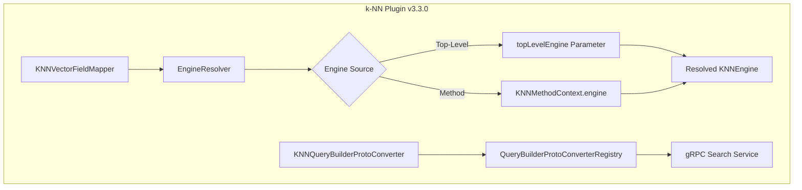

---
tags:
  - domain/search
  - component/server
  - k-nn
  - performance
  - search
---
# k-NN Engine Enhancements

## Summary

OpenSearch v3.3.0 introduces two significant enhancements to the k-NN plugin: a top-level `engine` mapping parameter for simplified vector field configuration, and gRPC transport support for k-NN queries enabling high-performance binary protocol communication.

## Details

### What's New in v3.3.0

#### 1. Top-Level Engine Parameter

The `engine` parameter can now be specified at the top level of the `knn_vector` field mapping, similar to how `space_type` was moved in a previous release. This simplifies the mapping configuration by separating the engine selection from the method definition.

**Before (engine in method):**
```json
{
  "mappings": {
    "properties": {
      "my_vector": {
        "type": "knn_vector",
        "dimension": 4,
        "method": {
          "name": "hnsw",
          "engine": "faiss",
          "parameters": {}
        }
      }
    }
  }
}
```

**After (top-level engine):**
```json
{
  "mappings": {
    "properties": {
      "my_vector": {
        "type": "knn_vector",
        "dimension": 4,
        "engine": "lucene",
        "method": {
          "name": "hnsw",
          "parameters": {}
        }
      }
    }
  }
}
```

#### 2. gRPC Transport Support for k-NN Queries

The k-NN plugin now integrates with OpenSearch's gRPC transport layer through the `transport-grpc-spi` interface. This enables k-NN queries to be executed via gRPC, providing performance benefits over REST API.

### Technical Changes

#### Architecture Changes



#### New Components

| Component | Description |
|-----------|-------------|
| `KNNEngine.UNDEFINED` | New enum value representing unset engine state |
| `TOP_LEVEL_PARAMETER_ENGINE` | Constant for the top-level engine field name |
| `KNNQueryBuilderProtoConverter` | Converts Protocol Buffer k-NN queries to OpenSearch query builders |
| `QueryBuilderProtoConverterRegistry` | SPI registry for query converter extensions |

#### New Configuration

| Setting | Description | Default |
|---------|-------------|---------|
| `engine` (top-level) | Specifies the k-NN engine at field mapping level | `undefined` (resolved to `faiss`) |

#### Engine Resolution Logic

The `EngineResolver` now handles multiple engine specification scenarios:

1. **Top-level only**: Uses the top-level engine value
2. **Method only**: Uses the method-level engine value
3. **Both specified (same)**: Accepts if values match
4. **Both specified (different)**: Throws `MapperParsingException`
5. **Neither specified**: Defaults to `FAISS`

### Usage Example

**Simple mapping with top-level engine:**
```json
PUT test-index
{
  "settings": {
    "index": {
      "knn": true
    }
  },
  "mappings": {
    "properties": {
      "vector1": {
        "type": "knn_vector",
        "dimension": 4,
        "space_type": "l2",
        "engine": "lucene"
      }
    }
  }
}
```

**gRPC k-NN query (Protocol Buffer format):**
```json
{
  "request_body": {
    "query": {
      "knn": {
        "my_vector": {
          "vector": [1.0, 2.0, 3.0],
          "k": 10
        }
      }
    }
  }
}
```

### Migration Notes

- Existing mappings with `engine` in the `method` section continue to work
- New mappings can use either top-level or method-level engine specification
- If both are specified, they must have the same value
- The feature requires OpenSearch v3.2.0+ for cluster compatibility

## Limitations

- Top-level engine parameter requires minimum version v3.2.0
- gRPC k-NN queries are experimental and require the `transport-grpc` plugin
- When using 4x compression, only Lucene engine is supported
- Training operations require FAISS engine regardless of top-level setting

## References

### Documentation
- [k-NN Vector Documentation](https://docs.opensearch.org/3.0/field-types/supported-field-types/knn-vector/): Official k-NN vector field documentation
- [gRPC Search API](https://docs.opensearch.org/3.0/api-reference/grpc-apis/search/): gRPC Search API documentation

### Pull Requests
| PR | Description |
|----|-------------|
| [#2736](https://github.com/opensearch-project/k-NN/pull/2736) | Added engine as a top-level optional parameter while creating vector field |
| [#2833](https://github.com/opensearch-project/k-NN/pull/2833) | Migrate k-NN plugin to use GRPC transport-grpc SPI interface |

### Issues (Design / RFC)
- [Issue #2534](https://github.com/opensearch-project/k-NN/issues/2534): Make engine top level field mapping parameter
- [Issue #2816](https://github.com/opensearch-project/k-NN/issues/2816): Add GRPC support for k-NN queries

## Related Feature Report

- Full feature documentation
