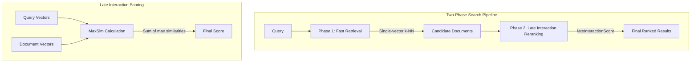

# Late Interaction

## Summary

OpenSearch 3.3.0 introduces the `lateInteractionScore` function in the k-NN plugin, enabling ColBERT-style late interaction scoring for enhanced search relevance. This feature allows token-level matching between query and document vectors, providing more precise semantic search results compared to traditional single-vector approaches.

## Details

### What's New in v3.3.0

The `lateInteractionScore` function is a new Painless script function that calculates document relevance using multi-vector representations. It implements the MaxSim (Maximum Similarity) scoring mechanism used by late interaction models like ColBERT and ColPali.

### Technical Changes

#### Architecture Changes



#### New Components

| Component | Description |
|-----------|-------------|
| `KNNPainlessScriptUtils` | Utility class providing late interaction scoring functions for Painless scripts |
| `lateInteractionScore` | Function that calculates MaxSim score between query and document multi-vectors |

#### Function Signatures

```java
// Default space type (L2)
float lateInteractionScore(List<List<Number>> queryVectors, String docFieldName, Map<String, Object> doc)

// Custom space type
float lateInteractionScore(List<List<Number>> queryVectors, String docFieldName, Map<String, Object> doc, String spaceType)
```

#### Supported Space Types

| Space Type | Description |
|------------|-------------|
| `l2` | Euclidean distance (default) |
| `innerproduct` | Inner product / dot product |
| `cosinesimil` | Cosine similarity |

### Usage Example

```json
GET my_index/_search
{
  "query": {
    "script_score": {
      "query": { "match_all": {} },
      "script": {
        "source": "lateInteractionScore(params.query_vectors, 'my_vector', params._source, params.space_type)",
        "params": {
          "query_vectors": [[1.0, 0.0], [0.0, 1.0]],
          "space_type": "cosinesimil"
        }
      }
    }
  }
}
```

### How It Works

1. **Multi-vector representation**: Both queries and documents are represented as multiple vectors (one per token/patch)
2. **MaxSim calculation**: For each query vector, find the maximum similarity with any document vector
3. **Score aggregation**: Sum all maximum similarities to produce the final document score

```
Score = Σ max(similarity(q_i, d_j)) for all query vectors q_i
```

### Migration Notes

To use late interaction scoring:

1. Store document multi-vectors in an `object` field with `enabled: false`
2. Generate query multi-vectors at search time using a late interaction model (e.g., ColBERT, ColPali)
3. Use `script_score` query with `lateInteractionScore` function

## Limitations

- Multi-vectors must be stored in document `_source` (not as k-NN vectors)
- Requires external model for generating multi-vector embeddings
- L1 and LINF space types are not supported
- Performance depends on the number of vectors per document

## References

### Documentation
- [Documentation](https://docs.opensearch.org/latest/query-dsl/specialized/script-score/#late-interaction-score): Official late interaction score documentation

### Blog Posts
- [Blog: Boost search relevance with late interaction models](https://opensearch.org/blog/boost-search-relevance-with-late-interaction-models/): Detailed explanation of late interaction models
- [Blog: Explore OpenSearch 3.3](https://opensearch.org/blog/explore-opensearch-3-3/): Release announcement

### Pull Requests
| PR | Description |
|----|-------------|
| [k-NN#2909](https://github.com/opensearch-project/k-NN/pull/2909) | Add lateInteractionFunction |

### Issues (Design / RFC)
- [Issue k-NN#2706](https://github.com/opensearch-project/k-NN/issues/2706): RFC for MultiVector Field Type for Late-interaction Score
- [Issue OpenSearch#18091](https://github.com/opensearch-project/OpenSearch/issues/18091): Feature request for late interaction models support

## Related Feature Report

- [Full feature documentation](../../../../features/k-nn/late-interaction.md)
