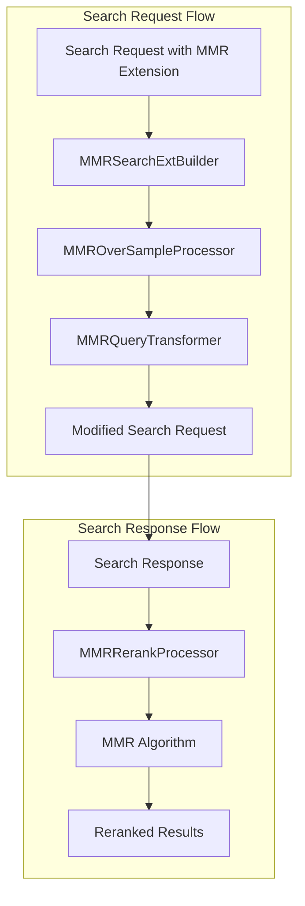

---
tags:
  - domain/search
  - component/server
  - k-nn
  - neural-search
  - search
---
# Maximal Marginal Relevance (MMR)

## Summary

OpenSearch 3.3 introduces native Maximal Marginal Relevance (MMR) support for k-NN and neural queries. MMR is a reranking algorithm that balances relevance and diversity in search results, helping users see a range of results rather than multiple near-duplicates. This feature eliminates the need for external custom pipelines and reduces latency by implementing MMR directly within OpenSearch.

## Details

### What's New in v3.3.0

- Native MMR support for k-NN queries using `knn_vector` fields
- Native MMR support for neural queries with semantic fields
- System-generated search pipeline processors for automatic oversampling and reranking
- Extensible query transformer architecture for plugin integration
- Cross-cluster search support with explicit vector field configuration

### Technical Changes

#### Architecture Changes



#### New Components

| Component | Description |
|-----------|-------------|
| `MMRSearchExtBuilder` | Search extension builder for parsing MMR parameters from query |
| `MMROverSampleProcessor` | System-generated request processor that modifies query to oversample candidates |
| `MMRRerankProcessor` | System-generated response processor that reranks results using MMR algorithm |
| `MMRQueryTransformer` | Interface for transforming queries for MMR (extensible by plugins) |
| `MMRKnnQueryTransformer` | Transformer implementation for k-NN queries |
| `MMRNeuralQueryTransformer` | Transformer implementation for neural queries (in neural-search plugin) |
| `MMRRerankContext` | Context object passed between processors containing MMR configuration |
| `MMRVectorFieldInfo` | DTO for vector field metadata resolution |

#### New Configuration

| Setting | Description | Default |
|---------|-------------|---------|
| `cluster.search.enabled_system_generated_factories` | Cluster setting to enable MMR processors | `[]` |

MMR query extension parameters:

| Parameter | Description | Default |
|-----------|-------------|---------|
| `diversity` | Trade-off between relevance (0) and diversity (1) | `0.5` |
| `candidates` | Number of candidates to oversample for MMR | `3 × query_size` |
| `vector_field_path` | Path to vector field (required for cross-cluster search) | Auto-resolved |
| `vector_field_data_type` | Vector data type (`float`, `byte`) | Auto-resolved |
| `vector_field_space_type` | Distance metric (`l2`, `cosinesimil`, etc.) | Auto-resolved |

### Usage Example

#### Enable MMR Processors

```json
PUT _cluster/settings
{
  "persistent": {
    "cluster.search.enabled_system_generated_factories": [
      "mmr_over_sample_factory",
      "mmr_rerank_factory"
    ]
  }
}
```

#### k-NN Query with MMR

```json
GET /my-index/_search
{
  "size": 10,
  "query": {
    "knn": {
      "my_vector_field": {
        "vector": [1.0, 2.0, 3.0],
        "k": 10
      }
    }
  },
  "ext": {
    "mmr": {
      "diversity": 0.5,
      "candidates": 30
    }
  }
}
```

#### Neural Query with MMR

```json
GET /my-nlp-index/_search
{
  "size": 3,
  "query": {
    "neural": {
      "product_description": {
        "query_text": "Red apple"
      }
    }
  },
  "ext": {
    "mmr": {
      "candidates": 10,
      "diversity": 0.4
    }
  }
}
```

### Performance Benchmarks

Benchmark results on OpenSearch 3.3 with 3 × r6g.2xlarge data nodes:

**Vector Search (cohere-1m dataset):**

| k | Query Size | MMR Candidates | k-NN p50 (ms) | k-NN + MMR p50 (ms) | Δ (%) |
|---|------------|----------------|---------------|---------------------|-------|
| 10 | 10 | 30 | 8.09 | 10.83 | +33.9% |
| 10 | 10 | 50 | 8.09 | 11.76 | +45.4% |
| 10 | 10 | 100 | 8.09 | 15.81 | +95.5% |

**Neural Search (Quora dataset):**

| k | Query Size | MMR Candidates | Neural p50 (ms) | Neural + MMR p50 (ms) | Δ (%) |
|---|------------|----------------|-----------------|----------------------|-------|
| 10 | 10 | 30 | 112.03 | 119.57 | +6.7% |
| 10 | 10 | 50 | 112.03 | 122.56 | +9.4% |
| 10 | 10 | 100 | 112.03 | 130.52 | +16.5% |

## Limitations

- MMR currently supports only k-NN queries and neural queries using `knn_vector` fields
- Does not support `bool` or `hybrid` queries (planned for future releases)
- Semantic fields with chunking enabled (multiple vectors per document) are not supported
- Cross-cluster search requires explicit vector field configuration
- Nested fields containing vectors are not supported

## References

### Documentation
- [Documentation: System-generated search processors](https://docs.opensearch.org/latest/search-plugins/search-pipelines/system-generated-search-processors/)
- [Documentation: Semantic field type](https://docs.opensearch.org/latest/field-types/supported-field-types/semantic/)

### Blog Posts
- [Blog: Improving vector search diversity through native MMR](https://opensearch.org/blog/improving-vector-search-diversity-through-native-mmr/)

### Pull Requests
| PR | Description |
|----|-------------|
| [k-NN #2868](https://github.com/opensearch-project/k-NN/pull/2868) | Support native Maximal Marginal Relevance |
| [neural-search #1567](https://github.com/opensearch-project/neural-search/pull/1567) | Support native MMR for neural query |

### Issues (Design / RFC)
- [Issue k-NN #2804](https://github.com/opensearch-project/k-NN/issues/2804): Feature request for native MMR support
- [Issue neural-search #1481](https://github.com/opensearch-project/neural-search/issues/1481): Feature request for MMR in neural-search

## Related Feature Report

- Full feature documentation
