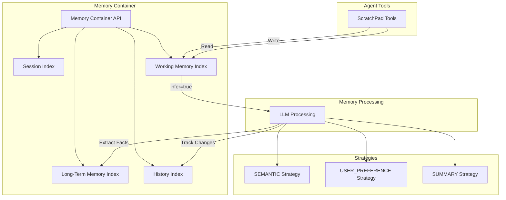

# Agentic Memory and ScratchPad

## Summary

OpenSearch v3.3.0 introduces Agentic Memory as a GA (Generally Available) feature in ML Commons, providing a comprehensive persistent memory system for AI agents. This release includes major refactoring of the memory architecture, new ScratchPad tools for agent state management, session management APIs, and improved fact extraction prompts. The feature enables AI agents to maintain context across conversations, extract knowledge, and build understanding over time using OpenSearch's search and storage infrastructure.

## Details

### What's New in v3.3.0

This release marks the GA launch of Agentic Memory with several key enhancements:

1. **ScratchPad Tools**: New `WriteToScratchPadTool` and `ReadFromScratchPadTool` for intermediate state management
2. **Memory Architecture Refactoring**: Complete restructuring of the agentic memory system
3. **Session Management API**: New API for creating and managing conversation sessions
4. **Feature Enabled by Default**: Agentic memory is now enabled by default for GA
5. **Improved Fact Extraction**: Enhanced prompts with XML-based structure and JSON enforcement

### Technical Changes

#### Architecture Overview



#### New Components

| Component | Description |
|-----------|-------------|
| `WriteToScratchPadTool` | Tool for agents to write intermediate thoughts and results to a persistent scratchpad |
| `ReadFromScratchPadTool` | Tool for agents to read from their scratchpad, including persistent notes |
| `CreateSessionAction` | New action for creating conversation sessions with custom or auto-generated IDs |
| `MemoryProcessingService` | Refactored service for handling memory extraction and processing |

#### New Configuration

| Setting | Description | Default |
|---------|-------------|---------|
| `plugins.ml_commons.agentic_memory_enabled` | Enable/disable agentic memory feature | `true` (GA) |
| `delete_all_memories` | Parameter to control memory deletion when deleting container | `false` |

#### API Changes

**Create Session API**
```json
POST _plugins/_ml/memory_containers/{container_id}/memories/sessions
{
  "session_id": "custom-session-id",  // Optional: auto-generated if not provided
  "summary": "Session description",
  "metadata": {
    "key1": "value1"
  },
  "namespace": {
    "user_id": "bob"
  }
}
```

**ScratchPad Tools Configuration**
```json
{
  "tools": [
    {
      "type": "ReadFromScratchPadTool",
      "name": "ReadFromScratchPadTool",
      "parameters": {
        "persistent_notes": "Initial instructions for the agent..."
      }
    },
    {
      "type": "WriteToScratchPadTool",
      "name": "WriteToScratchPadTool"
    }
  ]
}
```

### Usage Example

**Creating a Research Agent with ScratchPad**
```json
POST _plugins/_ml/agents/_register
{
  "name": "RAG Agent",
  "type": "conversational",
  "description": "Research agent with scratchpad",
  "llm": {
    "model_id": "{{model_id}}",
    "parameters": {
      "max_iteration": 50,
      "system_prompt": "You are a research assistant with access to a persistent scratchpad..."
    }
  },
  "memory": {
    "type": "conversation_index"
  },
  "tools": [
    {"type": "SearchIndexTool"},
    {"type": "ListIndexTool"},
    {"type": "IndexMappingTool"},
    {
      "type": "ReadFromScratchPadTool",
      "parameters": {
        "persistent_notes": "Remember to use ListIndexTool first..."
      }
    },
    {"type": "WriteToScratchPadTool"}
  ]
}
```

### Migration Notes

- The agentic memory feature is now enabled by default (`plugins.ml_commons.agentic_memory_enabled: true`)
- Existing memory implementations should continue to work; the refactoring maintains backward compatibility
- New `delete_all_memories` parameter provides control over cascade deletion behavior

## Limitations

- ScratchPad is session-scoped; data does not persist across different agent sessions unless explicitly stored in long-term memory
- Long-term memory extraction is asynchronous; design for eventual consistency
- PII is excluded from long-term memory records by default

## Related PRs

| PR | Description |
|----|-------------|
| [#4192](https://github.com/opensearch-project/ml-commons/pull/4192) | Add WriteToScratchPad and ReadFromScratchPad tools |
| [#4218](https://github.com/opensearch-project/ml-commons/pull/4218) | Refactor Agentic Memory |
| [#4246](https://github.com/opensearch-project/ml-commons/pull/4246) | Add create session API; add message id to working memory; fix update api |
| [#4201](https://github.com/opensearch-project/ml-commons/pull/4201) | Add updated time to message |
| [#4240](https://github.com/opensearch-project/ml-commons/pull/4240) | Enable agentic memory feature by default for GA |
| [#4238](https://github.com/opensearch-project/ml-commons/pull/4238) | Add parameter to control delete memories when delete container |
| [#4282](https://github.com/opensearch-project/ml-commons/pull/4282) | Improve semantic fact extraction prompt and add JSON enforcement |
| [#4288](https://github.com/opensearch-project/ml-commons/pull/4288) | Improve user preference extraction prompt with XML-based structure |

## References

- [Agentic Memory APIs Documentation](https://github.com/opensearch-project/ml-commons/blob/main/docs/tutorials/agentic_memory/agentic_memory_apis.md)
- [Agentic Memory Tutorial](https://github.com/opensearch-project/ml-commons/blob/main/docs/tutorials/agentic_memory/agentic_memory_tutorial.md)
- [OpenSearch as an Agentic Memory Solution Blog](https://opensearch.org/blog/opensearch-as-an-agentic-memory-solution-building-context-aware-agents-using-persistent-memory/)
- [Issue #4239](https://github.com/opensearch-project/ml-commons/issues/4239): Related feature request
- [Issue #4193](https://github.com/opensearch-project/ml-commons/issues/4193): Add updated time to message request

## Related Feature Report

- [Full feature documentation](../../../../features/ml-commons/agentic-memory.md)
