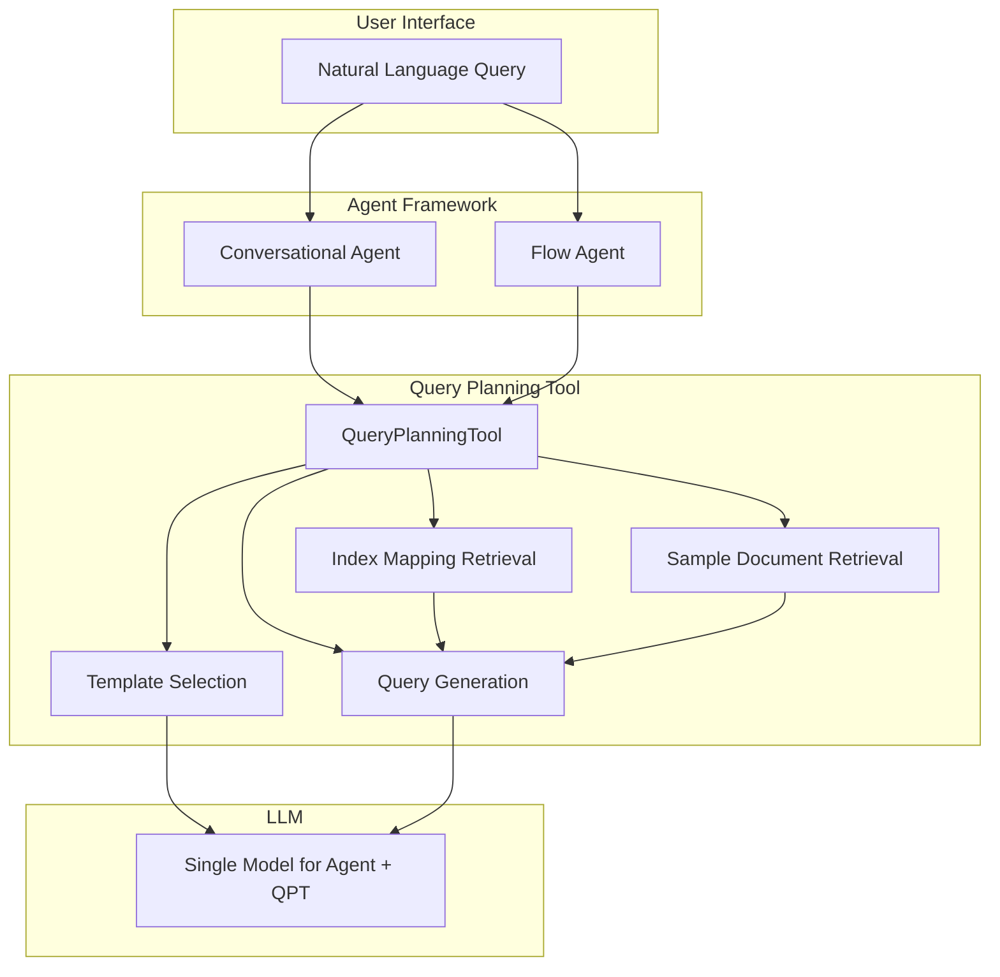

---
tags:
  - domain/ml
  - component/server
  - indexing
  - ml
  - neural-search
  - search
---
# Agentic Search

## Summary

OpenSearch v3.3.0 introduces significant enhancements to Agentic Search, enabling conversational agent support, improved query planning with neural search capabilities, and the ability to use a single model for both the agent and the Query Planning Tool. These changes make agentic search more powerful and easier to configure.

## Details

### What's New in v3.3.0

1. **Conversational Agent Support**: The QueryPlanningTool now works with conversational agents, enabling multi-turn interactions and context-aware query generation.

2. **Neural/Semantic Search Support**: Enhanced prompt templates now include rules for neural and semantic search, allowing the Query Planning Tool to generate neural queries when appropriate.

3. **Unified Model Configuration**: A single LLM model can now be used for both the conversational agent and the Query Planning Tool, simplifying configuration.

4. **Automatic Index Mapping and Sample Document Retrieval**: The tool now automatically fetches index mappings and sample documents to improve query generation accuracy.

5. **Feature Flag Enabled by Default**: The `plugins.ml_commons.agentic_search_enabled` setting now defaults to `true`.

### Technical Changes

#### Architecture Changes



#### New Components

| Component | Description |
|-----------|-------------|
| `stripAgentContextParameters()` | Filters out agent-specific metadata (`_chat_history`, `_tools`, `_interactions`, `tool_configs`) to enable model reuse |
| `getIndexMappingAsync()` | Asynchronously retrieves index mappings for query generation |
| `getSampleDocAsync()` | Retrieves and truncates sample documents to provide context for query generation |

#### New Configuration

| Setting | Description | Default |
|---------|-------------|---------|
| `query_planner_system_prompt` | Custom system prompt for query planning | Default DSL generation prompt |
| `query_planner_user_prompt` | Custom user prompt for query planning | Default with question, mapping, sample doc |
| `template_selection_system_prompt` | Custom system prompt for template selection | Default template selection prompt |
| `template_selection_user_prompt` | Custom user prompt for template selection | Default with inputs |
| `embedding_model_id` | Model ID for neural search queries | Optional |

#### Prompt Template Enhancements

New rules added to the query planning prompt:
- **Neural/Semantic Search Rules**: Guidelines for when and how to use neural queries
- **Date Rules**: Proper handling of date ranges and date math
- **Text Operators**: Guidelines for OR vs AND operators and `minimum_should_match`

### Usage Example

#### Register a Single Model for Both Agent and QPT

```json
POST /_plugins/_ml/models/_register
{
  "name": "My OpenAI model",
  "function_name": "remote",
  "connector": {
    "name": "OpenAI connector",
    "protocol": "http",
    "parameters": {
      "model": "gpt-4"
    },
    "credential": {
      "openAI_key": "<API_KEY>"
    },
    "actions": [
      {
        "action_type": "predict",
        "method": "POST",
        "url": "https://api.openai.com/v1/chat/completions",
        "headers": {
          "Authorization": "Bearer ${credential.openAI_key}"
        },
        "request_body": "{ \"model\": \"${parameters.model}\", \"messages\": [{\"role\":\"developer\",\"content\":\"${parameters.system_prompt}\"},{\"role\":\"user\",\"content\":\"${parameters.user_prompt}\"}]${parameters.tool_configs:-}}"
      }
    ]
  }
}
```

#### Create Conversational Agent with QueryPlanningTool

```json
POST /_plugins/_ml/agents/_register
{
  "name": "Agentic Search Agent",
  "type": "conversational",
  "llm": {
    "model_id": "<model_id>",
    "parameters": {
      "embedding_model_id": "<embedding_model_id>"
    }
  },
  "memory": {
    "type": "conversation_index"
  },
  "parameters": {
    "_llm_interface": "openai/v1/chat/completions"
  },
  "tools": [
    {"type": "ListIndexTool"},
    {"type": "IndexMappingTool"},
    {"type": "QueryPlanningTool"}
  ]
}
```

#### Execute Agentic Search

```json
POST /my_index/_search?search_pipeline=my_pipeline
{
  "query": {
    "agentic": {
      "query_text": "Find research papers about robotics from last 2 years"
    }
  }
}
```

### Migration Notes

- The `plugins.ml_commons.agentic_search_enabled` feature flag has been removed; agentic search is now always enabled
- Model connectors should use `system_prompt` and `user_prompt` parameter names (the tool maps `query_planner_system_prompt` and `query_planner_user_prompt` internally)
- When registering agents with QueryPlanningTool, the `model_id` from the agent's LLM configuration is automatically applied to the tool if not explicitly specified

## Limitations

- Neural search queries require an `embedding_model_id` to be provided
- Sample documents are truncated to 250 characters per field to manage prompt size
- The tool requires both `question` and `index_name` parameters

## References

### Documentation
- [Agentic Search Documentation](https://docs.opensearch.org/latest/vector-search/ai-search/agentic-search/index/): Setup guide
- [ML Commons Agents](https://docs.opensearch.org/3.0/ml-commons-plugin/agents-tools/agents/index/): Agent framework documentation

### Blog Posts
- [Blog: Introducing agentic search in OpenSearch](https://opensearch.org/blog/introducing-agentic-search-in-opensearch-transforming-data-interaction-through-natural-language/): Official announcement

### Pull Requests
| PR | Description |
|----|-------------|
| [ml-commons#4203](https://github.com/opensearch-project/ml-commons/pull/4203) | Support Query Planner Tool with Conversational Agent |
| [ml-commons#4262](https://github.com/opensearch-project/ml-commons/pull/4262) | Use same model for Agent and QPT |

## Related Feature Report

- Full feature documentation
