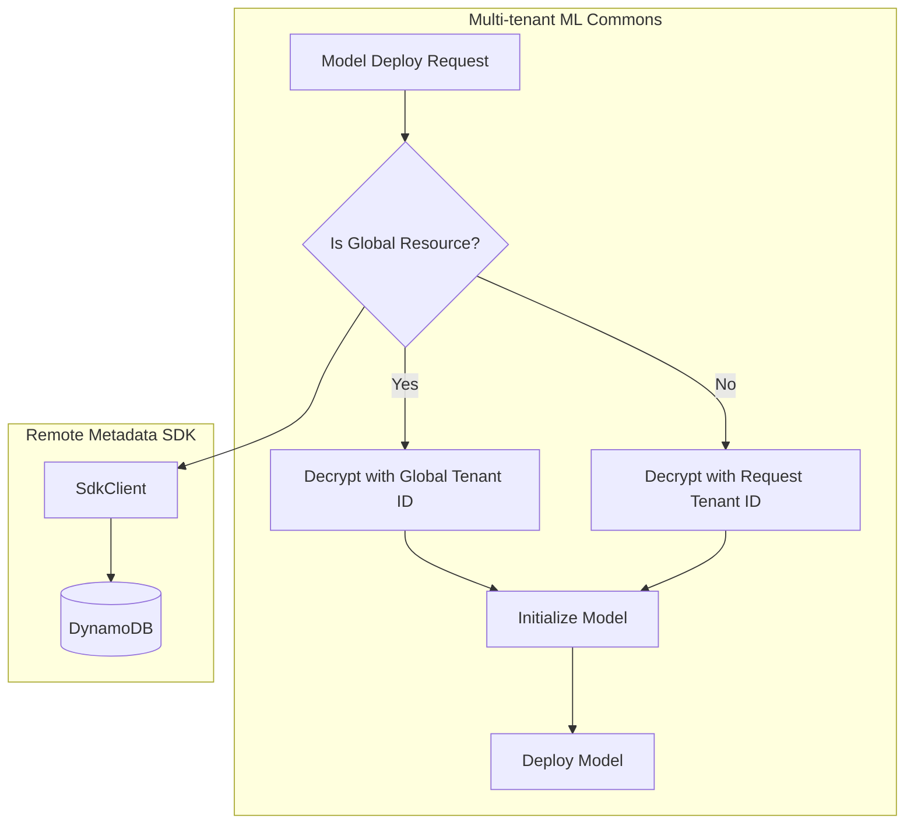

---
tags:
  - ml
  - performance
---

# Global Resource Support

## Summary

Global resource support enables ML Commons resources (connectors, models, and agents) to be shared across all tenants in a multi-tenant environment. This feature allows administrators to create resources that any tenant can access, while maintaining proper credential decryption using a designated global tenant ID.

## Details

### What's New in v3.3.0

This release introduces the ability to designate ML resources as "global" resources that can be accessed by any tenant. When a resource is marked as global, credential decryption uses the configured global tenant ID instead of the requesting tenant's ID, enabling shared access to external services.

### Technical Changes

#### Architecture Changes



#### New Components

| Component | Description |
|-----------|-------------|
| `isGlobalResource()` | SdkClient method to check if a resource is global |
| `initModelAsync()` | Async model initialization supporting global resource checks |
| `REMOTE_METADATA_GLOBAL_TENANT_ID` | Setting for global tenant ID configuration |
| `REMOTE_METADATA_GLOBAL_RESOURCE_CACHE_TTL` | Setting for global resource cache TTL |

#### New Configuration

| Setting | Description | Default |
|---------|-------------|---------|
| `plugins.ml-commons.global_tenant_id` | Tenant ID used for global resource credential decryption | - |
| `plugins.ml-commons.global_resource_cache_ttl` | Cache TTL for global resource lookups | - |

#### API Changes

The `Predictable` interface now includes an async initialization method:

```java
// New async initialization method
default CompletionStage<Boolean> initModelAsync(
    MLModel model, 
    Map<String, Object> params, 
    Encryptor encryptor
) {
    throw new IllegalStateException("Method is not implemented");
}
```

The `RemoteModel` class uses the SDK client to determine if a resource is global before decrypting credentials:

```java
sdkClient.isGlobalResource(MLIndex.MODEL.getIndexName(), model.getModelId())
    .thenCompose(isGlobalResource -> {
        String decryptTenantId = Boolean.TRUE.equals(isGlobalResource)
            ? REMOTE_METADATA_GLOBAL_TENANT_ID.get(settings)
            : model.getTenantId();
        // Decrypt with appropriate tenant ID
    });
```

### Usage Example

Configure global tenant ID in `opensearch.yml`:

```yaml
plugins.ml-commons.global_tenant_id: "_global_tenant"
plugins.ml-commons.global_resource_cache_ttl: "300s"
```

When deploying a model that references a global connector, the system automatically:
1. Checks if the connector is a global resource via `SdkClient.isGlobalResource()`
2. Uses the global tenant ID for credential decryption if global
3. Uses the requesting tenant's ID otherwise

### Migration Notes

- Existing multi-tenant deployments should configure `global_tenant_id` before creating global resources
- The `GetConfigTransportAction` now uses `SdkClient` for config retrieval, supporting remote metadata storage

## Limitations

- Global resources require the remote metadata SDK with DynamoDB support
- The `global_tenant_id` setting must be configured at node startup (NodeScope, Final)
- Cache TTL configuration is also immutable after startup

## References

### Documentation
- [Multi-tenancy Documentation](https://docs.opensearch.org/3.0/security/multi-tenancy/multi-tenancy-config/): OpenSearch multi-tenancy configuration
- [PR #4003](https://github.com/opensearch-project/ml-commons/pull/4003): Main implementation
- [Remote Metadata SDK](https://github.com/opensearch-project/opensearch-remote-metadata-sdk): SDK for remote metadata storage

### Pull Requests
| PR | Description |
|----|-------------|
| [#4003](https://github.com/opensearch-project/ml-commons/pull/4003) | Add global resource support |

## Related Feature Report

- [Full feature documentation](../../../../features/ml-commons/ml-commons-global-resource-support.md)
