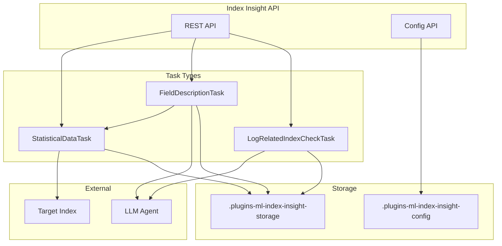

# Index Insight

## Summary

Index Insight is a new feature in ML Commons that provides centralized, AI-powered analysis of OpenSearch indices. It helps downstream AI features (Query Assistant, T2Viz, AD Suggestion) better understand index structure and semantics by generating statistical data, field descriptions, and log-related index checks using LLM integration.

## Details

### What's New in v3.3.0

This release introduces the Index Insight feature as a centralized API for extracting and caching insights about OpenSearch indices. The feature addresses the limitation of providing only index schema and occasional document samples to LLMs by creating a purpose-built mechanism for comprehensive index understanding.

### Technical Changes

#### Architecture



#### New Components

| Component | Description |
|-----------|-------------|
| `IndexInsight` | Core data model for storing insight results |
| `IndexInsightConfig` | Configuration model for enabling/disabling the feature |
| `AbstractIndexInsightTask` | Base class for all insight task implementations |
| `StatisticalDataTask` | Collects mapping, data distribution, and sample documents |
| `FieldDescriptionTask` | Generates LLM-based field descriptions |
| `LogRelatedIndexCheckTask` | Determines if index is log-related with trace/message fields |
| `IndexInsightTool` | Agent tool wrapper for index insight actions |

#### New Configuration

| Setting | Description | Default |
|---------|-------------|---------|
| `plugins.ml_commons.index_insight_feature_enabled` | Enable/disable index insight feature | `false` |

#### New System Indices

| Index | Purpose |
|-------|---------|
| `.plugins-ml-index-insight-config` | Stores feature configuration |
| `.plugins-ml-index-insight-storage` | Stores generated insights |

#### API Endpoints

| Method | Endpoint | Description |
|--------|----------|-------------|
| `PUT` | `/_plugins/_ml/index_insight_config` | Enable/disable index insight |
| `GET` | `/_plugins/_ml/index_insight_config` | Get current configuration |
| `GET` | `/_plugins/_ml/insights/{index}/{task_type}` | Get insight for an index |

### Usage Example

1. Enable Index Insight:
```json
PUT /_plugins/_ml/index_insight_config
{
    "is_enable": true
}
```

2. Configure the LLM agent for field descriptions:
```json
POST /_plugins/_ml/agents/_register
{
  "name": "GENERAL_TOOL",
  "type": "flow",
  "tools": [
    {
      "type": "MLModelTool",
      "description": "A general tool to answer any question",
      "parameters": {
        "model_id": "<model_id>"
      }
    }
  ]
}

PUT /.plugins-ml-config/_doc/os_index_insight_agent
{
    "type": "os_index_insight_agent",
    "configuration": {
        "agent_id": "<agent_id>"
    }
}
```

3. Get index insight:
```json
GET /_plugins/_ml/insights/my-index/STATISTICAL_DATA
```

Response:
```json
{
    "index_insight": {
        "index_name": "my-index",
        "content": "{\"important_column_and_distribution\":{...},\"example_docs\":[...]}",
        "status": "COMPLETED",
        "task_type": "STATISTICAL_DATA",
        "last_updated_time": 1754888310420
    }
}
```

4. Use as an agent tool:
```json
POST /_plugins/_ml/agents/_register
{
  "name": "flow agent with index insight tool",
  "type": "flow",
  "tools": [
    {
      "type": "IndexInsightTool",
      "name": "IndexInsightTool",
      "description": "Get index details including statistical data, field descriptions, and log-related checks"
    }
  ]
}
```

### Task Types

| Task Type | Description | Prerequisites | Uses LLM |
|-----------|-------------|---------------|----------|
| `STATISTICAL_DATA` | Index mapping, data distribution, sample documents | None | Optional (for filtering) |
| `FIELD_DESCRIPTION` | LLM-generated descriptions for each field | `STATISTICAL_DATA` | Yes |
| `LOG_RELATED_INDEX_CHECK` | Determines if index is log/trace related | None | Yes |

### Caching Behavior

- Insights are cached in `.plugins-ml-index-insight-storage`
- Cache key: SHA-256 hash of `{index_name}_{task_type}`
- Update interval: 24 hours (configurable via `INDEX_INSIGHT_UPDATE_INTERVAL`)
- Generation timeout: 3 minutes (configurable via `INDEX_INSIGHT_GENERATING_TIMEOUT`)
- Pattern matching: Supports wildcard patterns for similar indices

## Limitations

- Feature is disabled by default; requires explicit enablement
- LLM-based tasks require a configured agent in ML config
- Only admin users can modify index insight configuration
- Large indices may experience longer generation times for statistical data

## References

### Pull Requests
| PR | Description |
|----|-------------|
| [#4088](https://github.com/opensearch-project/ml-commons/pull/4088) | Add Index Insight Feature |

### Issues (Design / RFC)
- [Issue #3993](https://github.com/opensearch-project/ml-commons/issues/3993): RFC: Index insight: A feature to enhance indices related AI features

## Related Feature Report

- [Full feature documentation](../../../../features/ml-commons/index-insight.md)
