# MCP Connector - Streamable HTTP Support

## Summary

OpenSearch v3.3.0 introduces Streamable HTTP transport for MCP (Model Context Protocol) connectors, replacing the deprecated SSE (Server-Sent Events) transport. This update enables more efficient, stateless communication with external MCP servers and simplifies the MCP server architecture within OpenSearch.

## Details

### What's New in v3.3.0

- **New `mcp_streamable_http` protocol**: A new connector protocol type for connecting to external MCP servers using Streamable HTTP transport
- **Streamable HTTP MCP Server**: OpenSearch's built-in MCP server now uses Streamable HTTP at `/_plugins/_ml/mcp/stream` endpoint, replacing the SSE-based approach
- **Stateless Architecture**: The new implementation uses `McpStatelessAsyncServer` instead of session-based `McpAsyncServer`, eliminating the need for session management
- **MCP Java SDK 0.12.1**: Updated to the latest MCP Java SDK version with Streamable HTTP support
- **SSE Deprecation**: The previous SSE-based MCP server (`/_plugins/_ml/mcp/sse`) is deprecated in favor of Streamable HTTP

### Technical Changes

#### Architecture Changes

```mermaid
graph TB
    subgraph "v3.3.0 - Streamable HTTP"
        Client1[MCP Client] -->|POST| StreamEndpoint["/_plugins/_ml/mcp/stream"]
        StreamEndpoint --> StatelessServer[McpStatelessAsyncServer]
        StatelessServer --> ToolsRegistry[MCP Tools Registry]
        ToolsRegistry --> Tools[OpenSearch Tools]
    end
    
    subgraph "v3.0.0 - SSE (Deprecated)"
        Client2[MCP Client] -->|GET| SSEEndpoint["/_plugins/_ml/mcp/sse"]
        SSEEndpoint --> SessionMgr[Session Manager]
        SessionMgr --> AsyncServer[McpAsyncServer]
        AsyncServer --> Tools2[OpenSearch Tools]
    end
```



#### New Components

| Component | Description |
|-----------|-------------|
| `McpStatelessServerHolder` | Singleton holder for stateless MCP server instance |
| `OpenSearchMcpStatelessServerTransportProvider` | Transport provider for Streamable HTTP |
| `TransportMcpServerAction` | Transport action for handling MCP requests |
| `RestMcpServerAction` | REST handler for `/_plugins/_ml/mcp/stream` endpoint |
| `MLMcpServerRequest` | Request class for MCP server operations |
| `MLMcpServerResponse` | Response class with `acknowledged`, `mcp_response`, and `error` fields |

#### Removed Components

| Component | Reason |
|-----------|--------|
| `McpAsyncServerHolder` | Replaced by `McpStatelessServerHolder` |
| `OpenSearchMcpServerTransportProvider` | Replaced by stateless transport provider |
| `TransportMcpMessageAction` | No longer needed with stateless architecture |
| `TransportMcpMessageDispatchedAction` | Session dispatch no longer required |
| `RestMcpConnectionMessageStreamingAction` | Replaced by `RestMcpServerAction` |
| `MLMcpMessageRequest` | Replaced by `MLMcpServerRequest` |

#### New Configuration

| Setting | Description | Default |
|---------|-------------|---------|
| `plugins.ml_commons.mcp_server_enabled` | Enable MCP server functionality | `false` |

#### API Changes

**New MCP Server Endpoint (Streamable HTTP)**

```
POST /_plugins/_ml/mcp/stream
Content-Type: application/json

{
  "jsonrpc": "2.0",
  "id": 1,
  "method": "initialize",
  "params": {
    "protocolVersion": "2024-11-05",
    "capabilities": {}
  }
}
```

**New MCP Connector Protocol**

```json
POST /_plugins/_ml/connectors/_create
{
  "name": "External MCP Server (Streamable HTTP)",
  "description": "Connect to MCP server using Streamable HTTP",
  "version": "1",
  "protocol": "mcp_streamable_http",
  "parameters": {
    "endpoint": "http://mcp-server:8080/mcp/"
  }
}
```

### Usage Example

#### Creating a Streamable HTTP MCP Connector

```json
POST /_plugins/_ml/connectors/_create
{
  "name": "My MCP Server",
  "description": "Connect to external MCP server via Streamable HTTP",
  "version": "1",
  "protocol": "mcp_streamable_http",
  "parameters": {
    "endpoint": "http://localhost:8080/mcp/"
  }
}
```

#### Using the New MCP Server Endpoint

```json
// Initialize
POST /_plugins/_ml/mcp/stream
{
  "jsonrpc": "2.0",
  "id": 1,
  "method": "initialize",
  "params": {
    "protocolVersion": "2024-11-05",
    "capabilities": {}
  }
}

// List tools
POST /_plugins/_ml/mcp/stream
{
  "jsonrpc": "2.0",
  "id": 2,
  "method": "tools/list"
}

// Call a tool
POST /_plugins/_ml/mcp/stream
{
  "jsonrpc": "2.0",
  "id": 3,
  "method": "tools/call",
  "params": {
    "name": "ListIndexTool",
    "arguments": {
      "indices": []
    }
  }
}
```

### Migration Notes

1. **Update MCP Connectors**: Change `protocol` from `mcp` to `mcp_streamable_http` for new connectors
2. **Update Client Endpoints**: Change from `/_plugins/_ml/mcp/sse` to `/_plugins/_ml/mcp/stream`
3. **Remove Session Management**: Streamable HTTP is stateless; no session IDs required
4. **Update MCP Clients**: Ensure MCP clients support Streamable HTTP transport (MCP SDK 0.12.1+)

## Limitations

- SSE transport is deprecated and will be removed in a future release
- Streamable HTTP requires MCP clients that support the 2024-11-05 protocol version
- The `mcp_server_enabled` setting must be enabled to use the MCP server functionality

## Related PRs

| PR | Description |
|----|-------------|
| [#4169](https://github.com/opensearch-project/ml-commons/pull/4169) | [MCP Connector] MCP Connectors for streamable HTTP |
| [#4162](https://github.com/opensearch-project/ml-commons/pull/4162) | [MCP Server] Support Streamable HTTP and deprecate SSE in MCP server |

## References

- [Issue #1319](https://github.com/tkykenmt/opensearch-feature-explorer/issues/1319): MCP Connector feature tracking
- [MCP Server APIs Documentation](https://docs.opensearch.org/3.0/ml-commons-plugin/api/mcp-server-apis/index/)
- [Connecting to External MCP Server](https://docs.opensearch.org/3.0/ml-commons-plugin/agents-tools/mcp/mcp-connector/)
- [Using MCP Tools](https://docs.opensearch.org/3.0/ml-commons-plugin/agents-tools/mcp/index/)

## Related Feature Report

- [Full MCP feature documentation](../../../features/ml-commons/ml-commons-mcp.md)
