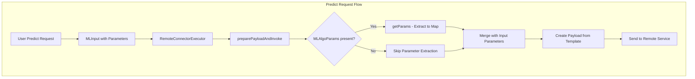

---
tags:
  - ml
---

# ML Commons Connector Enhancements

## Summary

This release introduces two key enhancements to the ML Commons connector framework: parameter passing support for predict operations via remote connectors and improved code organization by moving `HttpClientFactory` to the common module. These changes enable more flexible remote model invocations and better code reusability across ML Commons components.

## Details

### What's New in v3.3.0

#### Parameter Passing for Predict via Remote Connector

Previously, when invoking the predict API with `text_embedding` function, user-defined parameters from the predict call were not fully propagated through the connector to the remote endpoint. This enhancement ensures that parameters supplied in the predict request are correctly merged into the connector's `request_body` template and included in the outgoing request.

#### HttpClientFactory Relocation

The `MLHttpClientFactory` class has been moved from the `ml-algorithms` module to the `common` module, making it accessible to other components such as skills. This refactoring also includes:
- Simplified code using `ThreadContextAccess.doPrivileged()` instead of `AccessController.doPrivileged()`
- Improved private IP validation logic
- Better logging format using parameterized messages

### Technical Changes

#### Architecture Changes



#### New Components

| Component | Description |
|-----------|-------------|
| `RemoteConnectorExecutor.getParams()` | New static method that extracts `MLAlgoParams` to a `Map<String, String>` for parameter substitution |
| `MLHttpClientFactory` (relocated) | HTTP client factory now in `common` module for broader accessibility |

#### Code Changes

The `RemoteConnectorExecutor` interface now includes logic to extract parameters from `MLInput.getParameters()`:

```java
MLAlgoParams algoParams = mlInput.getParameters();
if (algoParams != null) {
    Map<String, String> parametersMap = getParams(mlInput);
    parameters.putAll(parametersMap);
}
```

The `getParams()` method serializes `MLAlgoParams` to JSON and converts it to a parameter map:

```java
static Map<String, String> getParams(MLInput mlInput) throws IOException {
    XContentBuilder builder = XContentFactory.jsonBuilder();
    mlInput.getParameters().toXContent(builder, ToXContent.EMPTY_PARAMS);
    builder.flush();
    String json = builder.toString();
    Map<String, Object> tempMap = StringUtils.MAPPER.readValue(json, Map.class);
    return getParameterMap(tempMap);
}
```

### Usage Example

#### Connector with Parameter Placeholders

```json
POST /_plugins/_ml/connectors/_create
{
  "name": "SageMaker Sparse Embedding Connector",
  "description": "Connector with parameter support",
  "version": 1,
  "protocol": "aws_sigv4",
  "parameters": {
    "region": "us-west-2",
    "service_name": "sagemaker"
  },
  "credential": {
    "access_key": "<ACCESS_KEY>",
    "secret_key": "<SECRET_KEY>"
  },
  "actions": [
    {
      "action_type": "predict",
      "method": "POST",
      "url": "https://runtime.sagemaker.us-west-2.amazonaws.com/endpoints/<endpoint>/invocations",
      "headers": {
        "content-type": "application/json"
      },
      "request_body": "{ \"input\": ${parameters.input}, \"parameters\": {\"sparse_embedding_format\": \"${parameters.sparse_embedding_format}\" }}"
    }
  ]
}
```

#### Predict Request with Parameters

```json
POST /_plugins/_ml/_predict/text_embedding/<model_id>
{
  "text_docs": ["hello world"],
  "parameters": {
    "sparse_embedding_format": "TOKEN_ID"
  }
}
```

The `sparse_embedding_format` parameter is now correctly passed through to the remote endpoint.

### Migration Notes

- No breaking changes; existing connectors continue to work
- To use parameter passing, update connector `request_body` templates to include parameter placeholders (e.g., `${parameters.sparse_embedding_format}`)
- Components using `MLHttpClientFactory` should update imports from `org.opensearch.ml.engine.httpclient` to `org.opensearch.ml.common.httpclient`

## Limitations

- Parameter passing requires the connector's `request_body` template to include appropriate placeholders
- Parameters must be serializable to JSON via `toXContent()`
- If a parameter placeholder is not filled and `skip_validating_missing_parameters` is `false`, the request will fail validation

## References

### Documentation
- [Connector Blueprints Documentation](https://docs.opensearch.org/3.0/ml-commons-plugin/remote-models/blueprints/): Official connector configuration guide
- [Connectors Documentation](https://docs.opensearch.org/3.0/ml-commons-plugin/remote-models/connectors/): Connector overview and examples

### Pull Requests
| PR | Description |
|----|-------------|
| [#4121](https://github.com/opensearch-project/ml-commons/pull/4121) | Parameter Passing for Predict via Remote Connector |
| [#4175](https://github.com/opensearch-project/ml-commons/pull/4175) | Move HttpClientFactory to common to expose to other components |

### Issues (Design / RFC)
- [Issue #4105](https://github.com/opensearch-project/ml-commons/issues/4105): Feature request for parameter passing

## Related Feature Report

- [Full feature documentation](../../../../features/ml-commons/ml-commons-connector.md)
