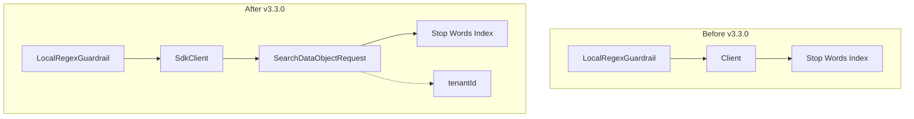

# ML Commons Multi-tenancy

## Summary

This release adds multi-tenancy support to the LocalRegexGuardrail component in ML Commons. The change enables guardrails to work correctly in multi-tenant environments where multiple tenants share a single OpenSearch instance, ensuring proper tenant isolation when validating model inputs and outputs against stop words.

## Details

### What's New in v3.3.0

The LocalRegexGuardrail component now supports multi-tenancy through the integration of the SDK client (`SdkClient`) for performing search requests. This allows guardrails to properly isolate stop word validation per tenant.

### Technical Changes

#### Architecture Changes



#### Modified Components

| Component | Change | Description |
|-----------|--------|-------------|
| `Guardrail` | Interface updated | `init()` method now accepts `SdkClient` and `tenantId` parameters |
| `LocalRegexGuardrail` | Multi-tenancy support | Uses `SdkClient` for tenant-aware stop word searches |
| `ModelGuardrail` | Interface updated | Stores `SdkClient` and `tenantId` for future use |
| `MLGuard` | Constructor updated | Passes `SdkClient` and `tenantId` to guardrails |
| `MLModelManager` | Integration | Passes tenant context when setting up guardrails |

#### API Changes

The `Guardrail.init()` method signature changed:

```java
// Before
void init(NamedXContentRegistry xContentRegistry, Client client);

// After
void init(NamedXContentRegistry xContentRegistry, Client client, SdkClient sdkClient, String tenantId);
```

#### New Dependencies

| Dependency | Purpose |
|------------|---------|
| `SdkClient` | Remote metadata client for tenant-aware operations |
| `SearchDataObjectRequest` | Tenant-aware search request builder |
| `SdkClientUtils` | Utility for wrapping search completion callbacks |

### Usage Example

When registering a model with guardrails in a multi-tenant environment, the guardrails automatically inherit the tenant context:

```json
POST /_plugins/_ml/models/_register?deploy=true
{
  "name": "Model with Guardrails",
  "function_name": "remote",
  "connector_id": "<connector_id>",
  "guardrails": {
    "type": "local_regex",
    "input_guardrail": {
      "stop_words": [
        {
          "index_name": "stop_words_index",
          "source_fields": ["title"]
        }
      ],
      "regex": [".*prohibited.*"]
    }
  }
}
```

The tenant ID is automatically propagated from the model's tenant context to the guardrail's stop word validation.

### Migration Notes

- No configuration changes required for existing single-tenant deployments
- Multi-tenant deployments will automatically benefit from tenant isolation
- Stop word indices should be properly configured with tenant-aware access controls

## Limitations

- Only `LocalRegexGuardrail` has been updated for multi-tenancy in this release
- `ModelGuardrail` stores tenant context but does not yet use it for validation

## References

### Documentation
- [Guardrails Documentation](https://docs.opensearch.org/3.0/ml-commons-plugin/remote-models/guardrails/): Official guardrails configuration guide

### Pull Requests
| PR | Description |
|----|-------------|
| [#4120](https://github.com/opensearch-project/ml-commons/pull/4120) | Support multi-tenancy for LocalRegexGuardrail |

### Issues (Design / RFC)
- [Issue #4119](https://github.com/opensearch-project/ml-commons/issues/4119): Feature request for multi-tenancy support in Guardrails

## Related Feature Report

- [Full feature documentation](../../../../features/ml-commons/ml-commons-multi-tenancy.md)
