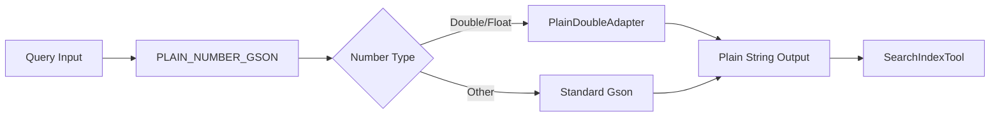

# ML Commons Tools Enhancements

## Summary

OpenSearch v3.3.0 introduces several enhancements to ML Commons tools, including enabling the Execute Tool API by default, improved JSON number serialization in SearchIndexTool, and standardized setting naming conventions. These changes improve usability and consistency for agent-based workflows.

## Details

### What's New in v3.3.0

#### Execute Tool API Enabled by Default

The `plugins.ml_commons.execute_tools_enabled` setting now defaults to `true`, making the Execute Tool API available out-of-the-box without requiring manual configuration.

| Setting | Old Default | New Default |
|---------|-------------|-------------|
| `plugins.ml_commons.execute_tools_enabled` | `false` | `true` |

This change allows users to immediately use the Execute Tool API for running tools independently of agents.

#### PlainNumberAdapter for SearchIndexTool

A new `PlainNumberAdapter` has been added to improve JSON serialization of numeric values in SearchIndexTool queries. This addresses issues with scientific notation in query parameters.



Key improvements:
- Avoids binary float artifacts using `BigDecimal.valueOf`
- Strips trailing zeros and writes integers when safe
- Handles `NaN` and `Infinity` by writing `null`
- Ensures no scientific notation in output (e.g., `1e30` becomes `1000000000000000000000000000000`)

#### Setting Name Standardization

All ML Commons settings now use a consistent naming convention with the `plugins.ml_commons.` prefix defined as a constant `ML_PLUGIN_SETTING_PREFIX`.

### Technical Changes

#### New Components

| Component | Description |
|-----------|-------------|
| `PlainDoubleAdapter` | Custom Gson TypeAdapter for Double serialization without scientific notation |
| `PlainFloatAdapter` | Custom Gson TypeAdapter for Float serialization without scientific notation |
| `PLAIN_NUMBER_GSON` | Pre-configured Gson instance with number adapters registered |

#### Configuration Changes

| Setting | Description | Default |
|---------|-------------|---------|
| `plugins.ml_commons.execute_tools_enabled` | Enable/disable Execute Tool API | `true` |

### Usage Example

With the Execute Tool API now enabled by default, you can directly execute tools:

```json
POST /_plugins/_ml/tools/SearchIndexTool/_execute
{
  "parameters": {
    "input": "{\"index\": \"my-index\", \"query\": {\"range\": {\"price\": {\"gte\": 0.001}}}}"
  }
}
```

The PlainNumberAdapter ensures that numeric values like `0.001` are serialized correctly without scientific notation.

### Migration Notes

- No migration required - changes are backward compatible
- The Execute Tool API is now enabled by default; to disable, set `plugins.ml_commons.execute_tools_enabled: false`

## Limitations

- `PlainDoubleAdapter` and `PlainFloatAdapter` write `null` for `NaN` and `Infinity` values
- The adapters are only applied to SearchIndexTool query processing

## References

### Documentation
- [SearchIndexTool Documentation](https://docs.opensearch.org/3.0/ml-commons-plugin/agents-tools/tools/search-index-tool/)
- [ML Commons Cluster Settings](https://docs.opensearch.org/3.0/ml-commons-plugin/cluster-settings/)

### Pull Requests
| PR | Description |
|----|-------------|
| [#4296](https://github.com/opensearch-project/ml-commons/pull/4296) | Enable execute tool feature flag by default |
| [#4133](https://github.com/opensearch-project/ml-commons/pull/4133) | Add PlainNumberAdapter and corresponding tests for Gson in SearchIndexTool |
| [#4215](https://github.com/opensearch-project/ml-commons/pull/4215) | Change the setting name to same naming convention with others |

## Related Feature Report

- [Full feature documentation](../../../../features/ml-commons/ml-commons-tools.md)
