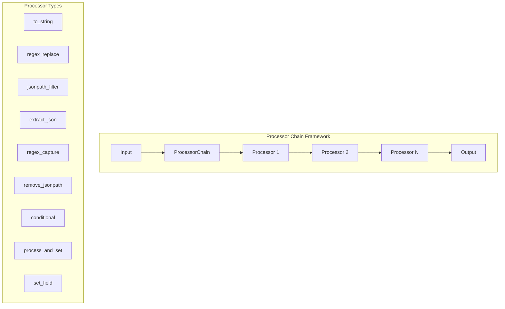

---
tags:
  - domain/ml
  - component/server
  - ml
---
# ML Inference Processors

## Summary

OpenSearch v3.3.0 introduces significant enhancements to ML Inference Processors, including output transformation support with mean/max pooling for multi-vector models, passthrough post-process function for Map responses, and a new processor chain framework for flexible output processing from ML models and tools.

## Details

### What's New in v3.3.0

#### 1. Output Transformation Support (PR #4236)

Adds support for output transformations in ML Inference Ingest Processor, enabling automatic pooling of multi-vector outputs from models like Copali.

**New Transformation Functions:**
- `.meanPooling()` - Averages vectors across all dimensions
- `.maxPooling()` - Takes maximum value per dimension

**Usage:**
```json
PUT /_ingest/pipeline/copali_embedding_pipeline
{
  "processors": [
    {
      "ml_inference": {
        "model_id": "<copali_model_id>",
        "input_map": [
          {
            "inputText": "text_field"
          }
        ],
        "output_map": [
          {
            "embedding.meanPooling()": "embeddings"
          }
        ]
      }
    }
  ]
}
```

The transformation is applied automatically when the output field name contains the suffix. The base field name (without suffix) is used for the actual field storage.

#### 2. Passthrough Post-Process Function (PR #4111)

Adds support for handling Map responses from connectors without transformation. When a connector returns a Map response, the passthrough function preserves the structure as-is.

**Changes:**
- `AbstractConnector.parseResponse()` now handles Map response types
- `MLInferenceIngestProcessor` supports passthrough for direct Map output

#### 3. Processor Chain Framework (PR #4093, #4260)

Introduces a new processor chain framework for processing outputs from ML models and tools using chainable processors. This enables complex output transformations without requiring Painless scripts.

**Built-in Processors:**

| Processor | Description |
|-----------|-------------|
| `to_string` | Converts input to string format |
| `regex_replace` | Performs regex-based text replacement |
| `jsonpath_filter` | Filters JSON using JsonPath expressions |
| `extract_json` | Extracts JSON objects/arrays from text |
| `regex_capture` | Captures text using regex groups |
| `remove_jsonpath` | Removes elements at specified JsonPath |
| `conditional` | Applies different processors based on conditions |
| `process_and_set` | Processes input and sets to a field |
| `set_field` | Sets a field to a specific value |

**Architecture:**



**Example - Agent with Output Processors:**
```json
POST _plugins/_ml/agents/_register
{
  "name": "Test Agent",
  "type": "flow",
  "tools": [
    {
      "type": "ListIndexTool",
      "parameters": {
        "output_processors": [
          {
            "type": "regex_replace",
            "pattern": "(?m)^(?!row,health,status).*?,.*?,.*?,\\.plugins[^\\n]*\\n",
            "replacement": ""
          },
          {
            "type": "regex_replace",
            "pattern": "(?m)^row,|^\\d+,",
            "replacement": ""
          }
        ]
      }
    }
  ]
}
```

### Technical Changes

#### New Components

| Component | Description |
|-----------|-------------|
| `OutputTransformations` | Utility class for output transformations (mean/max pooling) |
| `MLProcessor` | Interface for processor chain processors |
| `AbstractMLProcessor` | Base class for processor implementations |
| `MLConditionalProcessor` | Conditional branching processor |
| `MLExtractJsonProcessor` | JSON extraction processor |
| `MLJsonPathFilterProcessor` | JsonPath filtering processor |
| `MLProcessAndSetProcessor` | Process and set field processor |
| `MLRegexCaptureProcessor` | Regex capture processor |
| `MLRegexReplaceProcessor` | Regex replacement processor |
| `MLRemoveJsonPathProcessor` | JsonPath removal processor |
| `MLSetFieldProcessor` | Field setting processor |
| `MLToStringProcessor` | String conversion processor |
| `@Processor` | Annotation for processor class loading |

#### New Configuration

| Setting | Description | Default |
|---------|-------------|---------|
| `output_processors` | Array of processor configurations for tool output | Optional |
| `type` | Processor type (e.g., `regex_replace`, `jsonpath_filter`) | Required |
| `pattern` | Regex pattern for regex-based processors | Required for regex processors |
| `replacement` | Replacement string for regex_replace | Required for regex_replace |

### Migration Notes

- Existing ML Inference Processor configurations continue to work without changes
- Output transformations are opt-in via field name suffixes
- Processor chain is configured via `output_processors` parameter in tool definitions

## Limitations

- Output transformations require nested array structure for pooling operations
- All vectors must have the same dimension for pooling
- Processor chain is currently available for agent tools, not ingest processors

## References

### Documentation
- [ML Inference Ingest Processor Documentation](https://docs.opensearch.org/latest/ingest-pipelines/processors/ml-inference/)
- [ML Inference Search Request Processor Documentation](https://docs.opensearch.org/latest/search-plugins/search-pipelines/ml-inference-search-request/)
- [ML Inference Search Response Processor Documentation](https://docs.opensearch.org/latest/search-plugins/search-pipelines/ml-inference-search-response/)

### Pull Requests
| PR | Description |
|----|-------------|
| [#4111](https://github.com/opensearch-project/ml-commons/pull/4111) | Add ml-commons passthrough post process function |
| [#4236](https://github.com/opensearch-project/ml-commons/pull/4236) | Add output transformation support with mean pooling |
| [#4093](https://github.com/opensearch-project/ml-commons/pull/4093) | Add processor chain and support for model and tool |
| [#4260](https://github.com/opensearch-project/ml-commons/pull/4260) | Refactor and add more validation to processor chain |

### Issues (Design / RFC)
- [Issue #4235](https://github.com/opensearch-project/ml-commons/issues/4235): Processor chain feature request

## Related Feature Report

- Full feature documentation
