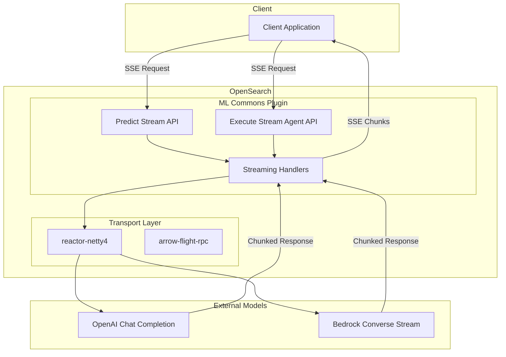

# Streaming APIs

## Summary

OpenSearch 3.3.0 introduces experimental streaming APIs for ML Commons, enabling real-time incremental response delivery for AI model predictions and agent executions. Instead of waiting for complete responses, users can receive data chunks as they become available, significantly improving user experience for LLM interactions with lengthy outputs.

## Details

### What's New in v3.3.0

Two new streaming API endpoints are introduced:

| API | Endpoint | Description |
|-----|----------|-------------|
| Predict Stream | `POST /_plugins/_ml/models/{model_id}/_predict/stream` | Stream model prediction responses |
| Execute Stream Agent | `POST /_plugins/_ml/agents/{agent_id}/_execute/stream` | Stream agent execution responses |

### Technical Changes

#### Architecture Changes



#### New Components

| Component | Description |
|-----------|-------------|
| `MLPredictionStreamTaskAction` | Transport action for streaming model predictions |
| `MLExecuteStreamTaskAction` | Transport action for streaming agent executions |
| `StreamingHandler` | Base interface for handling streaming responses |
| `StreamingHandlerFactory` | Factory for creating appropriate streaming handlers |
| `HttpStreamingHandler` | Handler for HTTP-based streaming (OpenAI) |
| `BedrockStreamingHandler` | Handler for Amazon Bedrock Converse Stream |
| `StreamPredictActionListener` | Action listener for streaming predictions |
| `StreamingWrapper` | Wrapper class for agent streaming support |

#### New Configuration

| Setting | Description | Default |
|---------|-------------|---------|
| `plugins.ml_commons.stream_enabled` | Enable/disable streaming feature | `false` |
| `opensearch.experimental.feature.transport.stream.enabled` | Enable experimental transport streaming | `false` |
| `http.type` | HTTP transport type (`reactor-netty4` or `reactor-netty4-secure`) | - |

#### Required Plugins

The streaming APIs require these plugins to be installed:

```bash
bin/opensearch-plugin install transport-reactor-netty4
bin/opensearch-plugin install arrow-flight-rpc
```

#### Supported Model Types

| Model Type | LLM Interface Parameter |
|------------|------------------------|
| OpenAI Chat Completion | `openai/v1/chat/completions` |
| Amazon Bedrock Converse Stream | `bedrock/converse/claude` |

### Usage Example

#### Enable Streaming

```json
PUT _cluster/settings
{
  "persistent": {
    "plugins.ml_commons.stream_enabled": true
  }
}
```

#### Predict Stream Request

```json
POST /_plugins/_ml/models/<model_id>/_predict/stream
{
  "parameters": {
    "messages": [
      {"role": "system", "content": "You are a helpful assistant."},
      {"role": "user", "content": "Explain quantum computing in simple terms."}
    ],
    "_llm_interface": "openai/v1/chat/completions"
  }
}
```

#### Execute Stream Agent Request

```json
POST /_plugins/_ml/agents/<agent_id>/_execute/stream
{
  "parameters": {
    "question": "How many indices are in my cluster?"
  }
}
```

#### Response Format (Server-Sent Events)

```
data: {"inference_results":[{"output":[{"name":"response","dataAsMap":{"content":"Quantum","is_last":false}}]}]}

data: {"inference_results":[{"output":[{"name":"response","dataAsMap":{"content":" computing","is_last":false}}]}]}

data: {"inference_results":[{"output":[{"name":"response","dataAsMap":{"content":"","is_last":true}}]}]}
```

### Response Fields

| Field | Type | Description |
|-------|------|-------------|
| `inference_results` | Array | Contains streaming response data |
| `inference_results.output` | Array | Output objects for each result |
| `inference_results.output.name` | String | Output field name (`response`, `memory_id`, `parent_interaction_id`) |
| `inference_results.output.dataAsMap.content` | String | Text content chunk from model |
| `inference_results.output.dataAsMap.is_last` | Boolean | `true` for final chunk |

### Migration Notes

1. Install required plugins (`transport-reactor-netty4`, `arrow-flight-rpc`)
2. Configure `opensearch.yml` with streaming settings
3. Add JVM options for Arrow Flight compatibility
4. Enable feature flag via cluster settings
5. Register models with appropriate `_llm_interface` parameter

## Limitations

- **Experimental**: Feature depends on experimental `transport-reactor-netty4` plugin
- **Limited Model Support**: Only OpenAI Chat Completion and Bedrock Converse Stream supported
- **Agent Type**: Execute Stream Agent API only supports conversational agents
- **Security Configuration**: Requires specific HTTP type configuration for security-enabled clusters

## References

### Documentation
- [Predict Stream API Documentation](https://docs.opensearch.org/latest/ml-commons-plugin/api/train-predict/predict-stream/)
- [Execute Stream Agent API Documentation](https://docs.opensearch.org/latest/ml-commons-plugin/api/agent-apis/execute-stream-agent/)

### Blog Posts
- [Blog: Introducing real-time streaming for AI models and agents](https://opensearch.org/blog/introducing-real-time-streaming-for-ai-models-and-agents-in-opensearch/)

### Pull Requests
| PR | Description |
|----|-------------|
| [ml-commons#4187](https://github.com/opensearch-project/ml-commons/pull/4187) | [FEATURE] Predict Stream - adds model prediction streaming |
| [ml-commons#4212](https://github.com/opensearch-project/ml-commons/pull/4212) | [FEATURE] Agent Execute Stream - adds agent execution streaming |

### Issues (Design / RFC)
- [Issue ml-commons#3630](https://github.com/opensearch-project/ml-commons/issues/3630): RFC for Remote Model Inference Streaming

## Related Feature Report

- [Full feature documentation](../../../../features/ml-commons/streaming-apis.md)
