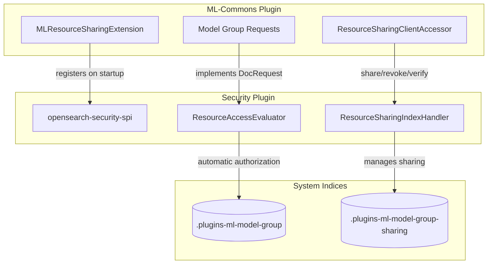

---
tags:
  - dashboards
  - ml
  - security
---

# Resource Access Control

## Summary

OpenSearch v3.3.0 extends the Resource Access Control framework with two major additions: ML-Commons plugin onboarding for model groups and a new Resource Access Management Dashboard in OpenSearch Dashboards. These changes enable ML model group owners to share their resources using the centralized authorization framework, and provide a user-friendly UI for managing resource sharing across all plugin-defined resources.

## Details

### What's New in v3.3.0

This release includes two key components:

1. **ML-Commons Model Group Onboarding**: The ML-Commons plugin now integrates with the Security plugin's centralized resource access control framework for model groups, replacing the legacy `filter_by_backend_role` approach.

2. **Resource Access Management Dashboard**: A new UI in OpenSearch Dashboards allows users to view and manage sharing settings for their accessible resources without requiring backend plugin integration.

### Technical Changes

#### ML-Commons Integration



##### New Components

| Component | Description |
|-----------|-------------|
| `ResourceSharingClientAccessor` | Singleton accessor for `ResourceSharingClient` in ML-Commons |
| `ML_MODEL_GROUP_RESOURCE_TYPE` | Resource type constant: `"ml-model-group"` |
| `DocRequest` interface | Implemented by `MLModelGroupGetRequest`, `MLModelGroupDeleteRequest`, `MLUpdateModelGroupRequest` |

##### Index Mapping Changes

The `ml_model_group` index mapping is updated to schema version 4 with a new field:

```json
{
  "_meta": {
    "schema_version": 4
  },
  "properties": {
    "all_shared_principals": {
      "type": "keyword"
    }
  }
}
```

This field enables DLS-based automatic filtering of model groups based on user access.

##### Modified Transport Actions

All model group-related transport actions now pass the action name to `validateModelGroupAccess()`:

| Transport Action | Action Name |
|-----------------|-------------|
| `GetModelGroupTransportAction` | `MLModelGroupGetAction.NAME` |
| `DeleteModelGroupTransportAction` | `MLModelGroupDeleteAction.NAME` |
| `TransportUpdateModelGroupAction` | `MLUpdateModelGroupAction.NAME` |
| `SearchModelGroupTransportAction` | Uses `ResourceSharingClient.getAccessibleResourceIds()` |

#### Security Dashboards Plugin Integration

```mermaid
graph TB
    subgraph Dashboard["OpenSearch Dashboards"]
        RAM[Resource Access Management App]
        RSP[ResourceSharingPanel Component]
        API[Dashboard API Routes]
    end
    
    subgraph Security["Security Plugin Backend"]
        TYPES[/api/resource/types]
        LIST[/api/resource/list]
        SHARE[/api/resource/share]
    end
    
    RAM --> RSP
    RSP --> API
    API -->|GET| TYPES
    API -->|GET| LIST
    API -->|PUT/PATCH| SHARE
```

##### New Dashboard Application

| Setting | Value |
|---------|-------|
| App ID | `resource_access_management` |
| Route | `/app/resource_access_management` |
| Feature Flag | `resource_sharing.enabled` |

##### Dashboard API Routes

| Route | Method | Backend API | Description |
|-------|--------|-------------|-------------|
| `/api/resource/types` | GET | `/_plugins/_security/api/resource/types` | List registered resource types |
| `/api/resource/list` | GET | `/_plugins/_security/api/resource/list` | List accessible resources by type |
| `/api/resource/view` | GET | `/_plugins/_security/api/resource/share` | Get sharing info for specific resource |
| `/api/resource/share` | PUT | `/_plugins/_security/api/resource/share` | Share a resource |
| `/api/resource/update_sharing` | PATCH | `/_plugins/_security/api/resource/share` | Update sharing (add/revoke) |

##### UI Components

The `ResourceSharingPanel` component (850+ lines) provides:

- Type selector dropdown for resource types
- Table view of accessible resources with owner, tenant, and sharing info
- Share/Update Access modal for managing permissions
- Support for users, roles, and backend_roles at different access levels
- Expandable rows showing detailed sharing configuration

### Configuration

#### ML-Commons

No additional configuration required. When the Security plugin's resource sharing feature is enabled, ML-Commons automatically uses the centralized authorization framework.

#### Security Dashboards Plugin

```yaml
# opensearch_dashboards.yml
opensearch_security.resource_sharing.enabled: true
```

### Usage Example

**Sharing a Model Group via Dashboard:**

1. Navigate to `/app/resource_access_management`
2. Select "Ml Model Group" from the type dropdown
3. Find your model group in the table
4. Click "Share" or "Update Access"
5. Add access levels with users/roles/backend_roles
6. Click "Share" to save

**Programmatic Access (ML-Commons):**

```java
// Access is automatically evaluated by Security Filter
// when DocRequest interface is implemented

MLModelGroupGetRequest request = MLModelGroupGetRequest.builder()
    .modelGroupId("my-model-group-id")
    .build();

// Security plugin evaluates access based on:
// - request.index() -> ML_MODEL_GROUP_INDEX
// - request.id() -> modelGroupId
// - request.type() -> ML_MODEL_GROUP_RESOURCE_TYPE
```

### Migration Notes

- Existing model groups continue to work with legacy `backend_roles` field
- New sharing via the Resource Access Control framework is additive
- To migrate existing sharing, use the Security plugin's migration API:
  ```
  POST /_plugins/_security/api/resources/migrate
  ```

## Limitations

- Resource Access Management Dashboard only appears when `resource_sharing.enabled: true`
- ML-Commons is the first plugin to onboard; other plugins will follow in future releases
- The `all_shared_principals` field must be maintained for DLS filtering to work correctly

## References

### Blog Posts
- [Blog: Introducing resource sharing](https://opensearch.org/blog/introducing-resource-sharing-a-new-access-control-model-for-opensearch/): Official announcement

### Pull Requests
| PR | Repository | Description |
|----|------------|-------------|
| [#3715](https://github.com/opensearch-project/ml-commons/pull/3715) | ml-commons | Onboards ML-Model-Group to centralized resource access control |
| [#2304](https://github.com/opensearch-project/security-dashboards-plugin/pull/2304) | security-dashboards-plugin | Adds Resource Access Management Dashboard |

### Issues (Design / RFC)
- [Issue #3890](https://github.com/opensearch-project/ml-commons/issues/3890): Onboard ML plugin to Centralized Resource AuthZ framework
- [Issue #2303](https://github.com/opensearch-project/security-dashboards-plugin/issues/2303): Resource Access Management Dashboard feature request
- [Issue #4500](https://github.com/opensearch-project/security/issues/4500): Resource Permissions and Sharing (main tracking issue)

## Related Feature Report

- [Full feature documentation](../../../../features/security/security-resource-access-control-framework.md)
