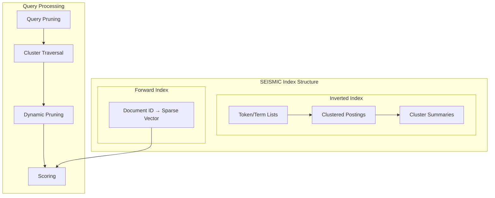

# SEISMIC Sparse ANN

## Summary

OpenSearch 3.3 introduces SEISMIC (Spilled Clustering of Inverted Lists with Summaries for Maximum Inner Product Search), a new approximate nearest neighbor (ANN) algorithm for sparse vectors. This algorithm delivers faster query latency than traditional BM25 while maintaining the semantic understanding of neural sparse models, enabling billion-scale search applications with sub-12ms query times.

## Details

### What's New in v3.3.0

SEISMIC is a sparse ANN algorithm specifically designed for neural sparse search workloads. It fundamentally changes what's possible in large-scale search by achieving:

- **4x faster** than BM25 queries
- **10x faster** than standard neural sparse search
- **90%+ recall** compared to exact search methods
- **Sub-12ms average latency** at billion-scale

### Technical Changes

#### Architecture Changes



#### New Components

| Component | Description |
|-----------|-------------|
| `SparseAnnCodec` | Custom Lucene codec for SEISMIC index structure |
| `SparsePostingsConsumer` | Processes terms and posting lists with clustering |
| `SparseDocValuesConsumer` | Handles sparse vectors as binary doc values |
| `PostingClustering` | Implements SEISMIC clustering algorithm |
| `ClusteredPostingsLuceneWriter` | Persists clustered posting structure |
| `PostingWithClustersScorer` | Query scorer implementing SEISMIC algorithm |
| `PostingsReader` | Reads clustered postings from cache or Lucene store |

#### New Configuration

| Setting | Description | Default |
|---------|-------------|---------|
| `index.sparse` | Enable sparse ANN index | `false` |
| `method.name` | Algorithm name | `seismic` |
| `n_postings` | Max posting list length (λ) | `4000` |
| `cluster_ratio` | Ratio for cluster count calculation | `0.1` |
| `summary_prune_ratio` | Summary vector pruning ratio (α) | `0.4` |
| `approximate_threshold` | Document threshold for SEISMIC activation | `1000000` |
| `quantization_ceiling_search` | Max float value for search quantization | `3.0` |
| `quantization_ceiling_ingest` | Max float value for ingest quantization | `3.0` |

#### Query Parameters

| Parameter | Description | Default |
|-----------|-------------|---------|
| `top_n` | Number of query tokens to examine | `10` |
| `k` | Number of nearest neighbors to return | Required |
| `heap_factor` | Recall vs QPS trade-off factor | `1.0` |
| `filter` | Pre-filtering boolean query | Optional |

### Usage Example

#### Create Index

```json
PUT sparse-vector-index
{
  "settings": {
    "index": {
      "sparse": true
    }
  },
  "mappings": {
    "properties": {
      "sparse_embedding": {
        "type": "sparse_vector",
        "method": {
          "name": "seismic",
          "parameters": {
            "n_postings": 160,
            "cluster_ratio": 0.075,
            "summary_prune_ratio": 0.4,
            "approximate_threshold": 1000000
          }
        }
      }
    }
  }
}
```

#### Ingest Documents

```json
PUT sparse-vector-index/_doc/1
{
  "sparse_embedding": {
    "1000": 0.1,
    "2000": 0.5
  }
}
```

#### Query with Raw Vectors

```json
GET sparse-vector-index/_search
{
  "query": {
    "neural_sparse": {
      "sparse_embedding": {
        "query_tokens": {
          "1000": 5.5
        },
        "method_parameters": {
          "heap_factor": 1.0,
          "top_n": 10,
          "k": 10
        }
      }
    }
  }
}
```

#### Query with Natural Language

```json
GET sparse-vector-index/_search
{
  "query": {
    "neural_sparse": {
      "sparse_embedding": {
        "query_text": "search query text",
        "model_id": "<model_id>",
        "method_parameters": {
          "k": 10,
          "top_n": 10,
          "heap_factor": 1.0
        }
      }
    }
  }
}
```

### Migration Notes

1. **Index Setting**: Set `index.sparse: true` in index settings
2. **Field Type**: Use `sparse_vector` field type with `method.name: seismic`
3. **Force Merge**: Run force merge after ingestion for optimal performance
4. **Memory Planning**: Plan ~1 GB memory per 1M documents

### Best Practices

- **Segment Size**: Set approximate threshold to 5M documents and force merge to 5-10M documents per segment
- **Memory**: Allocate sufficient JVM heap for forward index caching
- **Hybrid Mode**: Segments below threshold use standard neural sparse query

## Limitations

- Cannot combine sparse ANN fields with k-NN fields in the same index (codec limitation)
- Requires force merge for optimal query performance
- Memory-intensive: ~53 GB per data node for 8.8M documents
- Best suited for datasets with 1M+ documents

## References

### Documentation
- [Neural Sparse Search Documentation](https://docs.opensearch.org/3.0/vector-search/ai-search/neural-sparse-search/)
- [SEISMIC Paper](https://dl.acm.org/doi/10.1145/3626772.3657769): Efficient Inverted Indexes for Approximate Retrieval over Learned Sparse Representations

### Blog Posts
- [Blog: Scaling neural sparse search to billions of vectors](https://opensearch.org/blog/scaling-neural-sparse-search-to-billions-of-vectors-with-approximate-search/)

### Pull Requests
| PR | Description |
|----|-------------|
| [#1502](https://github.com/opensearch-project/neural-search/pull/1502) | Add basic classes for SEISMIC algorithm |
| [#1528](https://github.com/opensearch-project/neural-search/pull/1528) | Clustering algorithms & field mapper |
| [#1536](https://github.com/opensearch-project/neural-search/pull/1536) | Circuit breaker and memory stats |
| [#1537](https://github.com/opensearch-project/neural-search/pull/1537) | Add codec |
| [#1539](https://github.com/opensearch-project/neural-search/pull/1539) | Add query |
| [#1553](https://github.com/opensearch-project/neural-search/pull/1553) | Ingestion interface |
| [#1554](https://github.com/opensearch-project/neural-search/pull/1554) | Index thread quantity setting API |
| [#1557](https://github.com/opensearch-project/neural-search/pull/1557) | Query interface |
| [#1559](https://github.com/opensearch-project/neural-search/pull/1559) | WarmUp and clearCache IT |
| [#1562](https://github.com/opensearch-project/neural-search/pull/1562) | Remaining integration tests |
| [#1565](https://github.com/opensearch-project/neural-search/pull/1565) | Change default circuit breaker limit to 10% |
| [#1580](https://github.com/opensearch-project/neural-search/pull/1580) | Dynamic max float value for byte quantization |
| [#1581](https://github.com/opensearch-project/neural-search/pull/1581) | Change path of index_thread_qty API |

### Issues (Design / RFC)
- [RFC #1335](https://github.com/opensearch-project/neural-search/issues/1335): Sparse ANN Algorithm: Seismic
- [Design #1390](https://github.com/opensearch-project/neural-search/issues/1390): Approximate Sparse Nearest-Neighbor Search in OpenSearch

## Related Feature Report

- [Full feature documentation](../../../features/neural-search/seismic-sparse-ann.md)
