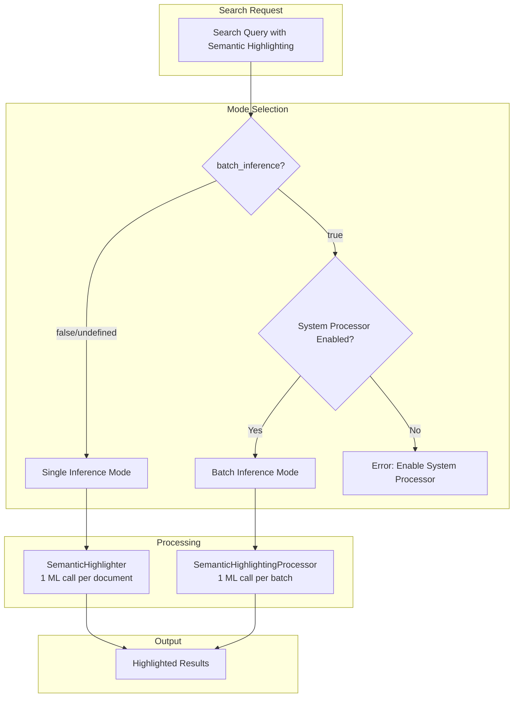

# Semantic Highlighting Batch Inference

## Summary

OpenSearch 3.3.0 introduces batch processing for semantic highlighting with remote models, reducing ML inference calls from N (one per document) to 1 per search query. This enhancement delivers 100–1,300% performance improvements depending on document length and result set size, while maintaining full backward compatibility with existing queries.

## Details

### What's New in v3.3.0

Semantic highlighting was introduced in OpenSearch 3.0 to identify and emphasize semantically relevant passages in search results using ML models. In v3.3.0, batch inference support enables processing multiple documents in a single ML call for remote models (e.g., Amazon SageMaker endpoints).

### Technical Changes

#### Architecture Changes



#### New Components

| Component | Description |
|-----------|-------------|
| `SemanticHighlightingProcessor` | System-generated search response processor for batch inference |
| `SemanticHighlightingFactory` | Factory that auto-detects semantic highlighting in requests |
| `HighlightConfig` | Immutable configuration for semantic highlighting options |
| `HighlightContextBuilder` | Builds execution context from validated configuration |
| `HighlightResultApplier` | Applies batch highlighting results to search hits |
| `BatchExecutor` | Handles multi-batch execution for large result sets |

#### New Configuration

| Setting | Description | Default |
|---------|-------------|---------|
| `batch_inference` | Enable batch processing for remote models | `false` |
| `max_inference_batch_size` | Maximum documents per batch | `100` |
| `search.pipeline.enabled_system_generated_factories` | Cluster setting to enable system processors | `[]` |

### Usage Example

#### Step 1: Enable System-Generated Pipelines

```json
PUT /_cluster/settings
{
  "persistent": {
    "search.pipeline.enabled_system_generated_factories": ["semantic-highlighter"]
  }
}
```

#### Step 2: Search with Batch Inference

```json
POST /neural-search-index/_search
{
  "size": 10,
  "query": {
    "neural": {
      "embedding": {
        "query_text": "treatments for neurodegenerative diseases",
        "model_id": "<text-embedding-model-id>",
        "k": 10
      }
    }
  },
  "highlight": {
    "fields": {
      "text": {
        "type": "semantic"
      }
    },
    "options": {
      "model_id": "<semantic-highlighting-model-id>",
      "batch_inference": true
    }
  }
}
```

### Performance Benchmarks

Testing on MultiSpanQA dataset with Amazon SageMaker GPU endpoint (ml.g5.xlarge):

| k | Clients | Doc Length | P50 Without Batch (ms) | P50 With Batch (ms) | Improvement |
|---|---------|------------|------------------------|---------------------|-------------|
| 10 | 1 | Long | 209 | 123 | 70% |
| 10 | 8 | Short | 610 | 101 | 504% |
| 50 | 1 | Short | 760 | 82 | 827% |
| 50 | 8 | Short | 3,162 | 219 | **1,344%** |

Key findings:
- Short documents benefit more (up to 1,344% improvement) as they fit within model token limits
- Larger result sets (k=50) show more dramatic improvements
- Throughput increases up to 490% with batch processing

### Migration Notes

Existing queries continue to work without changes. To enable batch processing:

1. Deploy a remote semantic highlighting model (e.g., on Amazon SageMaker)
2. Enable the system processor via cluster settings
3. Add `batch_inference: true` to highlight options

## Limitations

- Batch inference only supported for **remote models** (REMOTE function type)
- Local models continue to use single inference mode
- Long documents exceeding model token limits (512 tokens) may require chunked processing

## References

### Documentation
- [Documentation](https://docs.opensearch.org/3.0/tutorials/vector-search/semantic-highlighting-tutorial/): Semantic highlighting tutorial
- [SageMaker Blueprint](https://github.com/opensearch-project/ml-commons/blob/main/docs/remote_inference_blueprints/standard_blueprints/sagemaker_semantic_highlighter_standard_blueprint.md): Amazon SageMaker semantic highlighter blueprint

### Blog Posts
- [Blog](https://opensearch.org/blog/batch-processing-semantic-highlighting-in-opensearch-3-3/): Batch Processing Semantic Highlighting in OpenSearch 3.3

### Pull Requests
| PR | Description |
|----|-------------|
| [neural-search#1520](https://github.com/opensearch-project/neural-search/pull/1520) | Add semantic highlighting response processor with batch inference support |

### Issues (Design / RFC)
- [Issue #1516](https://github.com/opensearch-project/neural-search/issues/1516): Batch Inference Support for Semantic Highlighting

## Related Feature Report

- [Full feature documentation](../../../features/neural-search/semantic-highlighting.md)
