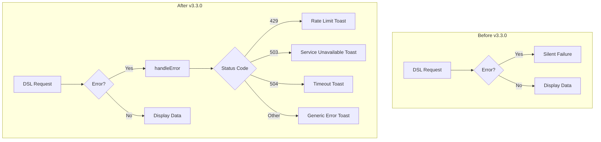

---
tags:
  - dashboards
  - observability
---

# Observability Fixes

## Summary

This release includes bug fixes for the OpenSearch Dashboards Observability plugin, focusing on improved error handling in Trace Analytics and test infrastructure fixes. The changes ensure users receive informative error messages instead of silent failures, and fix Jest test configuration issues.

## Details

### What's New in v3.3.0

Two key improvements were made to the dashboards-observability plugin:

1. **Toast Error Handling for Traces**: Enhanced error handling to always display informative toast messages when trace analytics requests fail, replacing previous silent failures.

2. **Test Infrastructure Fixes**: Fixed Jest test configuration to properly resolve OpenSearch Dashboards module paths, enabling tests to run successfully.

### Technical Changes

#### Error Handling Architecture



#### New Components

| Component | Description |
|-----------|-------------|
| `handleError()` | Centralized error handler that parses various error formats and displays appropriate toast messages |
| `safeJsonParse()` | Safe JSON parsing utility for error response bodies |
| Jest path mappings | Module resolution configuration for OpenSearch Dashboards core paths |

#### Error Status Code Handling

| Status Code | Error Type | User Message |
|-------------|------------|--------------|
| 429 | Rate Limit / Circuit Breaker | "Too many requests. The system is currently overloaded, please try again later." |
| 503 | Service Unavailable | "Service temporarily unavailable. The system might be under maintenance or overloaded." |
| 504 | Gateway Timeout | "Request timed out. The operation took too long to complete." |
| 500 | Too Many Buckets | "Too many buckets in aggregation. Try using a shorter time range..." |

### Usage Example

**Error Toast Display** (automatic):
```typescript
// Errors are now automatically caught and displayed
try {
  const response = await handleDslRequest(http, {}, query, mode);
} catch (error) {
  // handleError() is called internally, displaying appropriate toast
}
```

**Server-side Error Response** (improved):
```typescript
// Server now returns structured error responses
return response.custom({
  statusCode: error.statusCode || 400,
  body: {
    message: error.message || error.reason || 'Unknown error occurred',
    error: error.response || error.body || error,
  },
});
```

### Migration Notes

No migration required. These are internal improvements that enhance user experience automatically.

## Limitations

- Error messages are generic and may not provide specific troubleshooting steps for all error types
- The 25-second timeout toast is triggered independently of the actual request timeout

## References

### Documentation
- [Trace Analytics](https://docs.opensearch.org/3.3/observing-your-data/trace/index/): Trace Analytics overview
- [Trace Analytics plugin for OpenSearch Dashboards](https://docs.opensearch.org/3.3/observing-your-data/trace/ta-dashboards/): Dashboard plugin documentation

### Pull Requests
| PR | Description |
|----|-------------|
| [#2463](https://github.com/opensearch-project/dashboards-observability/pull/2463) | [Traces] Toast Error handling - Improved error display for trace analytics |
| [#2492](https://github.com/opensearch-project/dashboards-observability/pull/2492) | Test fixes - Fixed Jest configuration for module resolution |

## Related Feature Report

- [Full feature documentation](../../../../features/observability/trace-analytics-bug-fixes.md)
