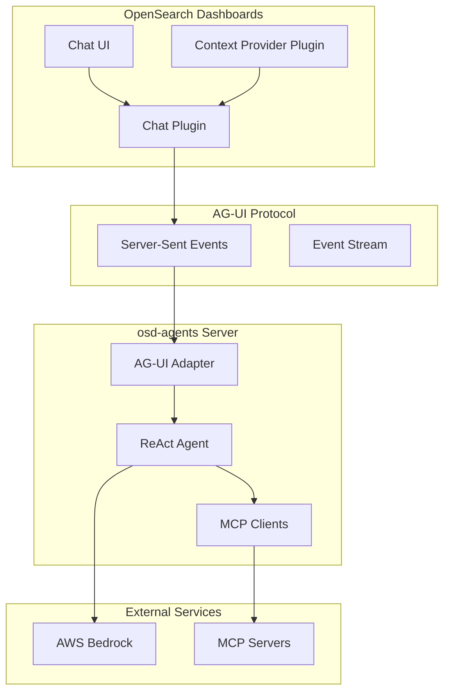

---
tags:
  - dashboards
  - ml
---

# OpenSearch Dashboards AI Chat

## Summary

OpenSearch Dashboards v3.3.0 introduces an experimental AI-powered chat interface that enables conversational data exploration. This feature includes two new plugins (Chat and Context Provider) and a reference ReAct agent implementation (osd-agents), allowing users to interact with their data using natural language while maintaining context awareness across dashboard interactions.

## Details

### What's New in v3.3.0

This release introduces a complete AI assistant framework for OpenSearch Dashboards:

1. **Chat Plugin** (`src/plugins/chat`): AI-powered chat interface integrated into the Dashboards header
2. **Context Provider Plugin** (`src/plugins/context_provider`): React hooks for automatic context capture
3. **osd-agents Package** (`packages/osd-agents`): AG-UI compliant ReAct agent with AWS Bedrock integration

### Technical Changes

#### Architecture



#### New Components

| Component | Description |
|-----------|-------------|
| Chat Plugin | AI chat interface with streaming support, tool calling, and graph visualization |
| Context Provider Plugin | React hooks (`usePageContext`, `useDynamicContext`, `useAssistantAction`) for context capture |
| osd-agents | ReAct agent implementation with LangGraph, AWS Bedrock, and MCP integration |
| AG-UI Adapter | Protocol adapter for AG-UI compliant communication |
| TextMessageManager | Manages text message lifecycle with tool call interruption support |

#### New Configuration

| Setting | Description | Default |
|---------|-------------|---------|
| `chat.enabled` | Enable the Chat plugin | `false` |
| `AG_UI_PORT` | Port for AG-UI server | `3000` |
| `AWS_REGION` | AWS region for Bedrock | `us-west-2` |
| `AWS_PROFILE` | AWS profile for authentication | `default` |

### Key Features

#### Chat Plugin Features
- Real-time streaming chat responses via Server-Sent Events (SSE)
- Tool execution with visual feedback and result rendering
- Conversation management with thread isolation
- Graph visualization capabilities for time series data
- Integration with OpenSearch Dashboards navigation and theming

#### Context Provider Features
- `usePageContext()`: Auto-captures URL state with zero configuration
- `useDynamicContext()`: Captures React state and user interactions
- `useAssistantAction()`: Registers tools the AI can execute
- `useAssistantPrompts()`: Slash command support for quick actions
- Text selection monitoring for context capture

#### ReAct Agent Features
- AG-UI protocol compliance for standardized agent interactions
- ReAct pattern (Reasoning + Acting) with LangGraph state machine
- Dynamic tool discovery via Model Context Protocol (MCP)
- Dual operation modes: CLI for development, HTTP server for integration
- AWS Bedrock integration with Claude models

### Usage Example

```typescript
// Register a tool the AI can execute
import { useAssistantAction } from '@osd/context-provider';

export function useRefreshTool() {
  useAssistantAction({
    name: 'refresh_data',
    description: 'Refresh the current data display',
    parameters: { type: 'object', properties: {} },
    handler: async () => {
      await refreshData();
      return { success: true, message: 'Data refreshed' };
    },
  });
}

// Capture page context automatically
import { usePageContext } from '@osd/context-provider';

export function MyApp() {
  usePageContext(); // Auto-captures URL state
  return <div>Your App UI...</div>;
}
```

### Running the Agent

```bash
# Start the AG-UI server
cd packages/osd-agents
npm install
export AWS_REGION=us-west-2
export AWS_PROFILE=default
npm run start:ag-ui

# Enable chat in OpenSearch Dashboards
# Add to opensearch_dashboards.yml:
# chat.enabled: true
```

### Migration Notes

This is a new experimental feature. To enable:
1. Set `chat.enabled: true` in `opensearch_dashboards.yml`
2. Deploy and configure the osd-agents server
3. Configure MCP servers in `configuration/mcp_config.json`
4. Ensure AWS Bedrock access with Claude model permissions

## Limitations

- **Experimental Status**: Not production-ready, API stability not guaranteed
- **AWS Bedrock Required**: Requires AWS Bedrock access with Claude model permissions
- **MCP Server Configuration**: MCP servers must be configured and accessible before agent starts
- **Single-threaded**: One agent conversation at a time
- **Limited Testing**: Comprehensive testing is ongoing

## References

### Documentation
- [AG-UI Protocol](https://docs.ag-ui.com/introduction): Agent UI protocol specification
- [Model Context Protocol](https://modelcontextprotocol.io/): MCP specification

### Pull Requests
| PR | Description |
|----|-------------|
| [#10600](https://github.com/opensearch-project/OpenSearch-Dashboards/pull/10600) | Add experimental AI Chat and Context Provider plugins |
| [#10612](https://github.com/opensearch-project/OpenSearch-Dashboards/pull/10612) | AG-UI compliant LangGraph ReAct agent implementation |
| [#10624](https://github.com/opensearch-project/OpenSearch-Dashboards/pull/10624) | Mark context provider and chat as experimental |

### Issues (Design / RFC)
- [RFC #10585](https://github.com/opensearch-project/OpenSearch-Dashboards/issues/10585): AI Assistant Framework for OpenSearch Dashboards
- [RFC #10571](https://github.com/opensearch-project/OpenSearch-Dashboards/issues/10571): Context Design and Page Tools Architecture

## Related Feature Report

- [Full feature documentation](../../../features/opensearch-dashboards/opensearch-dashboards-ai-chat.md)
