---
tags:
  - domain/core
  - component/dashboards
  - dashboards
  - ml
---
# OpenSearch Dashboards Banner Extensibility

## Summary

This release refactors the Banner Plugin's extensibility model by moving banner management from `injectedMetadata.getPlugins()` to the Chrome Service. This architectural change decouples the banner plugin from core implementation details, enabling cleaner extensibility and allowing alternative banner implementations without hardcoded plugin ID dependencies.

## Details

### What's New in v3.3.0

The banner plugin previously accessed its configuration by filtering `injectedMetadata.getPlugins()` for the hardcoded 'banner' plugin ID. This created tight coupling between core and plugin implementation. The refactor introduces a new Chrome Service API for banner management.

### Technical Changes

#### Architecture Changes

```mermaid
graph TB
    subgraph Before["Before (v3.2.0)"]
        InjectedMetadata[InjectedMetadata]
        Header1[Header Component]
        BannerPlugin1[Banner Plugin]
        
        InjectedMetadata -->|getPlugins filter 'banner'| Header1
        Header1 -->|hardcoded mount point| BannerPlugin1
    end
    
    subgraph After["After (v3.3.0)"]
        ChromeService[Chrome Service]
        Header2[Header Component]
        BannerPlugin2[Banner Plugin]
        HeaderBanner[HeaderBanner Component]
        
        BannerPlugin2 -->|setGlobalBanner| ChromeService
        ChromeService -->|globalBanner$| Header2
        Header2 --> HeaderBanner
    end
```



#### New Components

| Component | Description |
|-----------|-------------|
| `ChromeGlobalBanner` | New interface defining the global banner structure with a `component` property |
| `HeaderBanner` | New React component extracted from Header for banner rendering |
| `globalBanner$` | New BehaviorSubject in ChromeService for reactive banner state |

#### New Chrome Service API

| Method | Description |
|--------|-------------|
| `getGlobalBanner$()` | Returns an Observable of the current global banner state |
| `setGlobalBanner(banner?)` | Sets or clears the global banner component |

#### Configuration Changes

The banner plugin now registers via Chrome Service instead of relying on metadata filtering:

```typescript
// Before (v3.2.0)
// Core checked injectedMetadata.getPlugins() for 'banner' plugin
const bannerPluginConfig = injectedMetadata
  ?.getPlugins()
  ?.find((plugin) => plugin.id === 'banner')?.config;

// After (v3.3.0)
// Plugin registers directly with Chrome Service
core.chrome.setGlobalBanner({
  component: React.createElement(GlobalBanner, { http: core.http }),
});
```

### Usage Example

Plugins can now set custom banners via the Chrome Service:

```typescript
// In your plugin's start() method
public async start(core: CoreStart): Promise<MyPluginStart> {
  // Set a global banner
  core.chrome.setGlobalBanner({
    component: React.createElement(MyCustomBanner, { 
      message: 'Important announcement' 
    }),
  });

  return {};
}

// To clear the banner
core.chrome.setGlobalBanner(undefined);
```

### Migration Notes

For plugin developers who were relying on the banner plugin's previous architecture:

1. **No action required** for standard banner plugin users - the plugin handles registration automatically
2. **Custom banner implementations** should now use `chrome.setGlobalBanner()` instead of relying on plugin ID filtering
3. The `#pluginGlobalBanner` DOM element ID has been replaced with `.globalBanner` CSS class

### Files Changed

| File | Change |
|------|--------|
| `src/core/public/chrome/chrome_service.tsx` | Added `ChromeGlobalBanner` interface, `globalBanner$` BehaviorSubject, and new API methods |
| `src/core/public/chrome/ui/header/header.tsx` | Replaced `injectedMetadata` prop with `globalBanner$` Observable |
| `src/core/public/chrome/ui/header/header_banner.tsx` | New component for banner rendering |
| `src/plugins/banner/public/plugin.ts` | Updated to use `chrome.setGlobalBanner()` |
| `src/plugins/banner/public/index.scss` | Changed `#pluginGlobalBanner` to `.globalBanner` |
| `src/core/public/rendering/rendering_service.tsx` | Removed `injectedMetadata` dependency |
| `src/core/public/rendering/app_containers.tsx` | Updated to use `globalBanner$` for layout adjustments |

## Limitations

- Only one global banner can be active at a time (last `setGlobalBanner` call wins)
- Banner state is not persisted across page reloads (plugin must re-register on start)

## References

### Pull Requests
| PR | Description |
|----|-------------|
| [#10324](https://github.com/opensearch-project/OpenSearch-Dashboards/pull/10324) | Refactor Banner Extensibility Model via Chrome Service |

### Issues (Design / RFC)
- [Issue #10223](https://github.com/opensearch-project/OpenSearch-Dashboards/issues/10223): Banner extensibility model refactor proposal
- [Issue #9990](https://github.com/opensearch-project/OpenSearch-Dashboards/issues/9990): Meta issue tracking banner plugin development

## Related Feature Report

- [Full feature documentation](../../../../features/opensearch-dashboards/opensearch-dashboards-banner-plugin.md)
