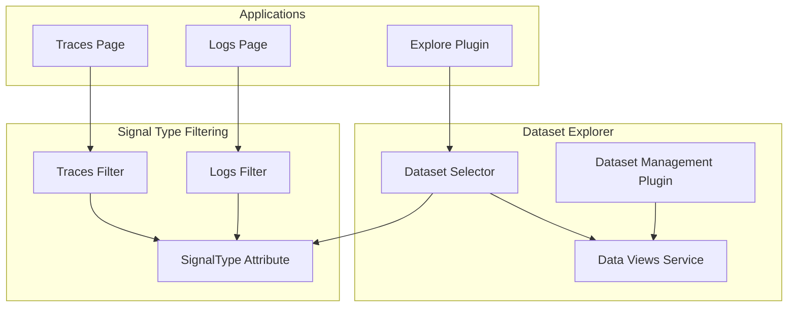

---
tags:
  - domain/core
  - component/dashboards
  - dashboards
  - observability
---
# OpenSearch Dashboards Dataset Explorer

## Summary

OpenSearch Dashboards v3.3.0 introduces the Dataset Explorer, a new feature that enhances how users select and manage datasets in the Explore application. This release adds configurable dataset type filtering, a new SignalType attribute for data views, and a new dataset management plugin that provides a dedicated UI for managing datasets.

## Details

### What's New in v3.3.0

The Dataset Explorer feature introduces several key enhancements:

1. **Configurable Dataset Types**: Applications can now configure which dataset types are available in the dataset selector UI
2. **SignalType Attribute**: A new `signalType` attribute for DataView/IndexPattern to filter datasets by signal type (logs, metrics, traces)
3. **Dataset Management Plugin**: A new plugin (`dataset_management`) for managing datasets, gated behind a feature flag
4. **Improved Dataset Selection**: Enhanced dataset selector with filtering capabilities based on signal type

### Technical Changes

#### Architecture Changes



#### New Components

| Component | Description |
|-----------|-------------|
| `SignalType` | Enum defining signal types: `logs`, `metrics`, `traces` |
| `DatasetSelect` | Enhanced dataset selector component with `onFilter` prop |
| `DetailedDataset` | Extended Dataset interface with `signalType` property |
| `dataset_management` | New plugin for dataset management UI |
| `getFlavorFromAppId` | Helper to extract flavor from app ID |

#### New Configuration

| Setting | Description | Default |
|---------|-------------|---------|
| `datasetManagement.enabled` | Enable dataset management plugin | `false` |
| `datasetManagement.aliasedAsIndexPattern` | Label datasets as index patterns | `true` |
| `explore.supportedTypes` | Configure supported dataset types in Explore | `['INDEXES', 'INDEX_PATTERN']` |

#### API Changes

The `DataView` and `IndexPattern` interfaces now include a `signalType` property:

```typescript
export interface IIndexPattern {
  // ... existing properties
  signalType?: string;  // 'logs' | 'metrics' | 'traces'
}
```

### Usage Example

```typescript
// Configure dataset selector to filter by signal type
const DatasetSelectWidget = () => {
  const flavorId = useFlavorId();
  
  const onFilter = useCallback((detailedDataset: DetailedDataset) => {
    if (flavorId === ExploreFlavor.Traces) {
      return detailedDataset.signalType === SignalType.Traces;
    }
    return detailedDataset.signalType !== SignalType.Traces;
  }, [flavorId]);

  return (
    <DatasetSelect
      onSelect={handleDatasetSelect}
      supportedTypes={supportedTypes}
      onFilter={onFilter}
    />
  );
};
```

### Migration Notes

- Enable the dataset management plugin by setting `datasetManagement.enabled: true` in `opensearch_dashboards.yml`
- Existing index patterns will have `signalType` as `undefined` and will be treated as non-traces datasets
- To use traces-specific datasets, create index patterns with `signalType: 'traces'`

## Limitations

- Dataset management plugin is behind a feature flag and disabled by default
- SignalType filtering only distinguishes between traces and non-traces datasets currently
- UI for setting signalType during dataset creation is not yet available (must be set via API)

## References

### Blog Posts
- [OpenSearch 3.3 Release Blog](https://opensearch.org/blog/explore-opensearch-3-3/)

### Pull Requests
| PR | Description |
|----|-------------|
| [#10355](https://github.com/opensearch-project/OpenSearch-Dashboards/pull/10355) | Update for datasets, redirection, and accordion timeline |
| [#10379](https://github.com/opensearch-project/OpenSearch-Dashboards/pull/10379) | Allow apps to configure available types in the dataset explorer |
| [#10491](https://github.com/opensearch-project/OpenSearch-Dashboards/pull/10491) | Introduce dataset SignalType |
| [#10554](https://github.com/opensearch-project/OpenSearch-Dashboards/pull/10554) | Dataset type and management |

## Related Feature Report

- [Full feature documentation](../../../../features/opensearch-dashboards/opensearch-dashboards-dataset-explorer.md)
