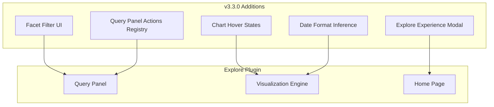

# OpenSearch Dashboards Explore

## Summary

OpenSearch 3.3.0 delivers significant enhancements to the Explore plugin, introducing facet filtering for quick data narrowing, an explore experience modal for first-time users, query panel extensibility through a new actions registry, improved chart interactions with mouse hover states, and intelligent date format inference for time-based visualizations. These changes make Explore the default experience when enabled, automatically configuring related UI settings for a cohesive modern interface.

## Details

### What's New in v3.3.0

#### Facet Filtering
Facets provide quick access to commonly understood fields for filtering search data. Three default facet fields are introduced:
- `serviceName`
- `span.attributes.http@status_code`
- `status.code`

Users can click facet values to instantly narrow down their search results without writing complex queries.

#### Explore Experience Modal
A welcome modal appears when users first land on the homepage, introducing the new Explore experience. Features include:
- One-time display with saved object config tracking
- Fallback to local storage for read-only users
- Configurable via `home.disableExperienceModal: false` in `opensearch_dashboards.yml`
- Enhanced UI with i18n support

#### Auto-Enable Related Features
When Explore is enabled, the following settings are automatically activated:
```yaml
data.savedQueriesNewUI.enabled: true
opensearchDashboards.branding:
  useExpandedHeader: false
uiSettings:
  overrides:
    "theme:version": "v9"
    "home:useNewHomePage": true
    "query:enhancements:enabled": true
```

#### Query Panel Actions Registry
External plugins can now register custom actions to the query panel through a new `queryPanelActionsRegistry`. This enables extensibility for plugin-specific functionality in the Explore interface.

#### Visualization Enhancements
- **Mouse hover states**: Line charts now display interactive hover states for better data point identification
- **Intelligent date format inference**: Axis labels and tooltips automatically adapt date formats based on data granularity (seconds, minutes, hours, days, months, years)
- **Axis label alignment fix**: Resolved issue where first scale marks near axis intersection caused label displacement

#### Query Panel Improvements
- Query panel now displays even when no datasets exist, allowing users to select or create datasets directly
- Improved UX for new users who haven't created index patterns yet

### Technical Changes

#### Architecture Changes



#### New Components

| Component | Description |
|-----------|-------------|
| `FacetFilter` | UI component for facet-based filtering with default fields |
| `ExploreExperienceModal` | Welcome modal for first-time users |
| `queryPanelActionsRegistry` | Registry service for external plugin actions |
| `buildTemporalAxisFormatting` | Utility for inferring date formats based on data granularity |
| `TabContentErrorGuard` | Error boundary for tab-specific query failures |

#### New Configuration

| Setting | Description | Default |
|---------|-------------|---------|
| `home.disableExperienceModal` | Disable the explore experience modal | `false` |

### Bug Fixes

| Issue | Fix |
|-------|-----|
| ScopedHistory navigation error | Fixed stale references in VisualizationBuilder singleton on plugin unmount |
| Refresh button not running query | Allowed Refresh to properly execute queries |
| Active tab not preserved | Tab state now persists when saving and loading explore objects |
| Explore in Patterns tab | Removed Explore from Patterns tab to avoid confusion |

### Usage Example

```yaml
# Enable Explore experience in opensearch_dashboards.yml
explore.enabled: true

# Optionally disable the welcome modal
home.disableExperienceModal: true
```

```typescript
// Register custom action to query panel (plugin code)
explorePlugin.queryPanelActionsRegistry.register({
  id: 'my-custom-action',
  label: 'My Action',
  onClick: (context) => {
    // Custom action logic
  }
});
```

### Migration Notes

- Explore experience automatically enables related UI settings when activated
- Existing Discover users will see the welcome modal once when first accessing the homepage
- The modal state is tracked via saved objects (or local storage for read-only users)

## Limitations

- Facet fields are currently limited to three default observability fields
- Custom facet field configuration is not yet available
- Query panel actions registry is primarily for internal plugin use

## References

### Documentation
- [Explore Plugin README](https://github.com/opensearch-project/OpenSearch-Dashboards/blob/main/src/plugins/explore/README.md): Plugin documentation
- [OpenSearch Dashboards Documentation](https://docs.opensearch.org/latest/dashboards/): Official documentation

### Blog Posts
- [OpenSearch 3.3 Release Blog](https://opensearch.org/blog/explore-opensearch-3-3/): Official release announcement

### Pull Requests
| PR | Description |
|----|-------------|
| [#10362](https://github.com/opensearch-project/OpenSearch-Dashboards/pull/10362) | Introduce facet filter |
| [#10412](https://github.com/opensearch-project/OpenSearch-Dashboards/pull/10412) | Introduce tab content error guard |
| [#10425](https://github.com/opensearch-project/OpenSearch-Dashboards/pull/10425) | Infer axis date format |
| [#10432](https://github.com/opensearch-project/OpenSearch-Dashboards/pull/10432) | Update default columns and facets |
| [#10443](https://github.com/opensearch-project/OpenSearch-Dashboards/pull/10443) | Revert AI mode default |
| [#10450](https://github.com/opensearch-project/OpenSearch-Dashboards/pull/10450) | Add link to detail page in expanded row |
| [#10526](https://github.com/opensearch-project/OpenSearch-Dashboards/pull/10526) | Add query panel actions registry |
| [#10557](https://github.com/opensearch-project/OpenSearch-Dashboards/pull/10557) | Show query panel without datasets |
| [#10560](https://github.com/opensearch-project/OpenSearch-Dashboards/pull/10560) | Add mouse hover state for line charts |
| [#10588](https://github.com/opensearch-project/OpenSearch-Dashboards/pull/10588) | Auto-enable related flags with Explore |
| [#10607](https://github.com/opensearch-project/OpenSearch-Dashboards/pull/10607) | Add explore experience modal |
| [#10622](https://github.com/opensearch-project/OpenSearch-Dashboards/pull/10622) | Enhance explore modal UI |
| [#10369](https://github.com/opensearch-project/OpenSearch-Dashboards/pull/10369) | Fix ScopedHistory navigation error |
| [#10370](https://github.com/opensearch-project/OpenSearch-Dashboards/pull/10370) | Allow Refresh to run query |
| [#10388](https://github.com/opensearch-project/OpenSearch-Dashboards/pull/10388) | Preserve active tab on save/load |
| [#10391](https://github.com/opensearch-project/OpenSearch-Dashboards/pull/10391) | Remove Explore from Patterns tab |

## Related Feature Report

- [Full feature documentation](../../../../features/opensearch-dashboards/explore.md)
