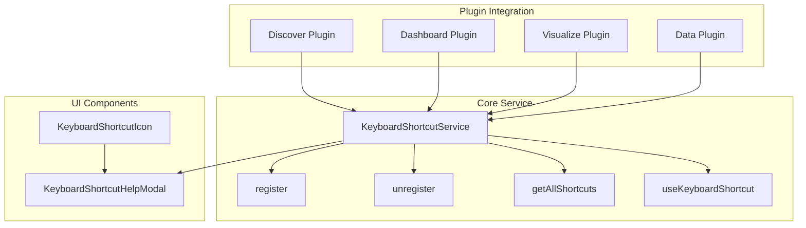

---
tags:
  - domain/core
  - component/dashboards
  - dashboards
  - search
---
# OpenSearch Dashboards Keyboard Shortcuts

## Summary

OpenSearch Dashboards v3.3.0 introduces a comprehensive keyboard shortcuts system that enables users to navigate and interact with the application more efficiently. This feature includes a configurable shortcuts service, a help modal for discoverability, React hooks for plugin integration, and pre-registered shortcuts for common navigation and actions.

## Details

### What's New in v3.3.0

This release introduces the keyboard shortcuts feature as a new capability in OpenSearch Dashboards:

- **Configurable Keyboard Shortcuts Service**: A core service that manages shortcut registration, execution, and lifecycle
- **Help Modal**: An interactive modal (triggered by `Shift+/`) displaying all available shortcuts grouped by category
- **React Hook Integration**: `useKeyboardShortcut` hook for easy shortcut registration in React components
- **Pre-registered Navigation Shortcuts**: Built-in shortcuts for navigating to Discover, Dashboard, and Visualizations
- **Query Editor Shortcuts**: Shortcuts for opening date picker, refreshing results, and commenting lines
- **Cypress E2E Tests**: Comprehensive end-to-end testing for the keyboard shortcuts functionality

### Technical Changes

#### Architecture



#### New Components

| Component | Description |
|-----------|-------------|
| `KeyboardShortcutService` | Core service managing shortcut registration and event handling |
| `KeyboardShortcutHelpModal` | Modal component displaying all registered shortcuts |
| `KeyboardShortcutIcon` | Navigation icon that triggers the help modal |
| `useKeyboardShortcut` | React hook for registering shortcuts with automatic cleanup |
| `KeyStringParser` | Utility for parsing and displaying key combinations |

#### New Configuration

| Setting | Description | Default |
|---------|-------------|---------|
| `opensearchDashboards.keyboardShortcuts.enabled` | Enable/disable keyboard shortcuts feature | `true` |

#### Pre-registered Shortcuts

| Shortcut | Action | Category |
|----------|--------|----------|
| `Shift+/` | Show keyboard shortcuts help | Navigation |
| `g d` | Go to Discover | Navigation |
| `g b` | Go to Dashboard | Navigation |
| `g v` | Go to Visualization | Navigation |
| `Shift+t` | Open Date Picker | Open |
| `Shift+r` | Refresh Results | Query |
| `Cmd+/` (Mac) / `Ctrl+/` (Win) | Comment/uncomment line in Query Editor | Editing |
| `Shift+Option+/` (Mac) / `Shift+Alt+/` (Win) | Block comment in Query Editor | Editing |

### Usage Example

#### Registering a Shortcut in a Plugin

```typescript
// In plugin start method
if (core.keyboardShortcut) {
  core.keyboardShortcut.register({
    id: 'my-action',
    pluginId: 'myPlugin',
    name: 'My Action',
    category: 'custom',
    keys: 'cmd+shift+m',
    execute: () => {
      // Action to perform
      console.log('Shortcut triggered!');
    },
  });
}
```

#### Using the React Hook

```typescript
import { useOpenSearchDashboards } from '../../../opensearch_dashboards_react/public';

function MyComponent() {
  const { services } = useOpenSearchDashboards();
  
  const handleSave = useCallback(() => {
    // Save action
  }, []);

  services.keyboardShortcut?.useKeyboardShortcut({
    id: 'save',
    pluginId: 'myPlugin',
    name: 'Save',
    category: 'editing',
    keys: 'cmd+s',
    execute: handleSave,
  });

  return <div>My Component</div>;
}
```

#### Enabling Keyboard Shortcuts

```yaml
# opensearch_dashboards.yml
opensearchDashboards.keyboardShortcuts.enabled: true
```

### Migration Notes

- Keyboard shortcuts are enabled by default in v3.3.0
- To disable, set `opensearchDashboards.keyboardShortcuts.enabled: false` in configuration
- Plugins can register custom shortcuts using the `keyboardShortcut` service from `CoreStart`
- The help modal is accessible via `Shift+/` or by clicking the keyboard icon in the left navigation

## Limitations

- Shortcuts may conflict with browser or OS-level shortcuts
- Sequence shortcuts (like `g d`) require keys to be pressed within a short time window
- Shortcuts are only active when keyboard shortcuts are enabled in configuration
- Navigation shortcuts require a workspace to be selected

## References

### Documentation
- [Dev Tools Console - Keyboard Shortcuts](https://docs.opensearch.org/3.0/dashboards/dev-tools/run-queries/): Documentation on keyboard shortcuts in Dev Tools

### Pull Requests
| PR | Description |
|----|-------------|
| [#10409](https://github.com/opensearch-project/OpenSearch-Dashboards/pull/10409) | Add keyboard shortcuts configuration option |
| [#10455](https://github.com/opensearch-project/OpenSearch-Dashboards/pull/10455) | Add useKeyboardShortcut hook for React components |
| [#10466](https://github.com/opensearch-project/OpenSearch-Dashboards/pull/10466) | Add keyboard shortcut help modal with interactive icon |
| [#10509](https://github.com/opensearch-project/OpenSearch-Dashboards/pull/10509) | Register shortcuts for OSD (Discover, Dashboard, Visualization) |
| [#10543](https://github.com/opensearch-project/OpenSearch-Dashboards/pull/10543) | Add Cypress tests and enable shortcuts by default |
| [#10545](https://github.com/opensearch-project/OpenSearch-Dashboards/pull/10545) | Enable shortcuts to comment lines in Query Editor |

## Related Feature Report

- Full feature documentation
