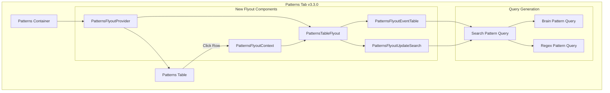

---
tags:
  - domain/core
  - component/dashboards
  - dashboards
  - search
---
# OpenSearch Dashboards Patterns Tab

## Summary

OpenSearch Dashboards v3.3.0 enhances the Patterns tab within the Explore plugin with a new flyout panel for detailed pattern inspection, "search with pattern" functionality to filter logs by specific patterns, and Calcite query engine compatibility. These improvements enable users to analyze log patterns more effectively and quickly drill down into matching events.

## Details

### What's New in v3.3.0

This release introduces three key enhancements to the Patterns tab:

1. **Patterns Flyout Panel** - A new detail flyout that opens when clicking on a pattern row, displaying pattern information, event count, and a paginated events table
2. **Search with Pattern** - A button in the flyout that redirects users to the Logs tab with a pre-constructed query filtering for the selected pattern
3. **Calcite Compatibility** - Workarounds for Calcite query engine issues, including updated delimiter handling and improved highlighting logic

### Technical Changes

#### Architecture Changes



#### New Components

| Component | Description |
|-----------|-------------|
| `PatternsFlyoutProvider` | React context provider managing flyout state |
| `PatternsFlyoutContext` | Context for sharing flyout state across components |
| `PatternsTableFlyout` | Main flyout component displaying pattern details |
| `PatternsFlyoutEventTable` | Paginated table showing events matching the pattern |
| `PatternsFlyoutUpdateSearch` | Button component for "search with pattern" functionality |

#### New Configuration

| Setting | Description | Default |
|---------|-------------|---------|
| `EVENT_TABLE_PAGE_SIZE` | Number of events per page in flyout | `10` |

#### API Changes

New utility functions for pattern query generation:

```typescript
// Create query to search for documents matching a pattern
createSearchPatternQuery(query, patternsField, usingRegexPatterns, patternString)

// Create query with pagination for events table
createSearchPatternQueryWithSlice(query, patternsField, usingRegexPatterns, patternString, timeField, pageSize, pageOffset)

// Brain pattern query with Calcite-compatible mode
brainPatternQuery(queryBase, patternsField)
// Returns: `${queryBase} | patterns \`${patternsField}\` method=brain mode=label | stats count() as pattern_count...`
```

### Usage Example

```ppl
# View patterns for a log field
source = opensearch_dashboards_sample_data_logs
| patterns `message` method=brain mode=label
| stats count() as pattern_count, take(`message`, 1) as sample_logs by patterns_field
| sort - pattern_count

# Search with pattern (generated by flyout)
source = opensearch_dashboards_sample_data_logs
| patterns `message` method=brain mode=label
| where patterns_field = '<token1> - - [<token2>] "GET <token3> HTTP/<token4>"'
```

### Calcite Compatibility

The Patterns tab now handles Calcite query engine differences:

- **Delimiter Changes**: Updated from `<*>` to `<token1>`, `<token2>`, etc.
- **Highlighting Logic**: Modified to support both V2 and Calcite delimiter formats
- **Error Handling**: Added error callout when expected schema is not found
- **Query Mode**: Changed from `mode=aggregation` to `mode=label` for Calcite compatibility

### Migration Notes

No migration required. The changes are backward compatible with both V2 and Calcite query engines.

## Limitations

- "Search with pattern" functionality may have issues with high-cardinality fields under Calcite due to backend pattern matching behavior
- Events table pagination fetches data on each page change (no client-side caching)
- Flyout requires valid pattern data; displays error callout if data is unavailable

## References

### Documentation
- [PPL Documentation](https://docs.opensearch.org/3.0/search-plugins/sql/ppl/index/): Piped Processing Language reference
- [OpenSearch Dashboards Repository](https://github.com/opensearch-project/OpenSearch-Dashboards)

### Blog Posts
- [Explore OpenSearch 3.3 Blog](https://opensearch.org/blog/explore-opensearch-3-3/): Release announcement

### Pull Requests
| PR | Description |
|----|-------------|
| [#10464](https://github.com/opensearch-project/OpenSearch-Dashboards/pull/10464) | Patterns tab flyout implementation |
| [#10489](https://github.com/opensearch-project/OpenSearch-Dashboards/pull/10489) | Search with pattern functionality and events table |
| [#10535](https://github.com/opensearch-project/OpenSearch-Dashboards/pull/10535) | Calcite compatibility workarounds |

## Related Feature Report

- Full feature documentation
