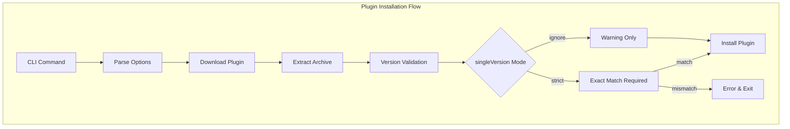

---
tags:
  - dashboards
---

# OpenSearch Dashboards Plugin Compatibility

## Summary

This release introduces enhanced plugin version compatibility controls for OpenSearch Dashboards through a new `--single-version` CLI flag. Administrators can now choose between `strict` mode (requiring exact version match) and `ignore` mode (allowing version mismatches with warnings), providing flexibility for development and testing scenarios while maintaining production safety.

## Details

### What's New in v3.3.0

The plugin installation CLI (`opensearch-dashboards-plugin install`) now supports a `--single-version` flag that controls how version compatibility is validated between plugins and OpenSearch Dashboards.

### Technical Changes

#### Architecture Changes



#### New Components

| Component | Description |
|-----------|-------------|
| `--single-version` flag | CLI option to set version validation mode |
| `assertVersion()` update | Enhanced version checking with mode support |
| semver integration | Uses semver library for precise version comparison |

#### New Configuration

| Setting | Description | Default |
|---------|-------------|---------|
| `--single-version` | Version validation mode: `strict` or `ignore` | `strict` |

### Usage Example

```bash
# Default strict mode - requires exact version match
bin/opensearch-dashboards-plugin install <plugin-url>

# Explicit strict mode
bin/opensearch-dashboards-plugin install --single-version strict <plugin-url>

# Ignore mode - allows version mismatch with warning
bin/opensearch-dashboards-plugin install --single-version ignore <plugin-url>
```

#### Behavior by Mode

**Strict Mode (default)**:
- Requires exact version match between plugin and OpenSearch Dashboards
- Fails installation if versions differ (even minor/patch versions)
- Recommended for production environments

**Ignore Mode**:
- Allows installation regardless of version mismatch
- Logs warning if major versions differ
- Useful for development, testing, or connecting to managed services

### Migration Notes

- Existing installations are unaffected; default behavior remains `strict`
- For development environments connecting to different versions, use `--single-version ignore`
- The `opensearchDashboards` special version value continues to bypass all version checks

## Limitations

- The `ignore` mode only warns on major version differences; minor/patch mismatches are silently allowed
- Plugin functionality is not guaranteed when using `ignore` mode with mismatched versions
- Server-side plugin manifest parsing still uses exact version matching

## References

### Documentation
- [Managing OpenSearch Dashboards plugins](https://docs.opensearch.org/3.0/install-and-configure/install-dashboards/plugins/): Official documentation on plugin management

### Blog Posts
- [Introduction to OpenSearch Dashboard Plugins](https://opensearch.org/blog/dashboards-plugins-intro/): Blog post on plugin architecture

### Pull Requests
| PR | Description |
|----|-------------|
| [#10273](https://github.com/opensearch-project/OpenSearch-Dashboards/pull/10273) | Enhanced plugin version compatibility with strict/ignore modes |

## Related Feature Report

- [Full feature documentation](../../../../features/opensearch-dashboards/opensearch-dashboards-plugin-compatibility.md)
